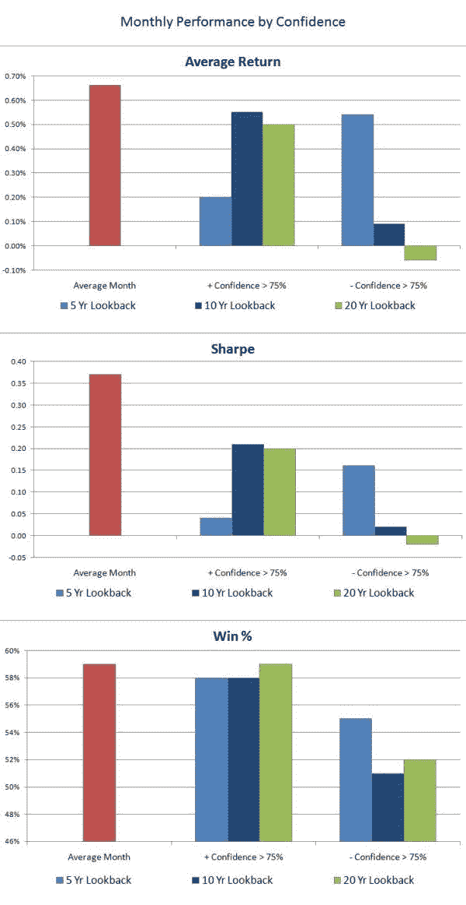
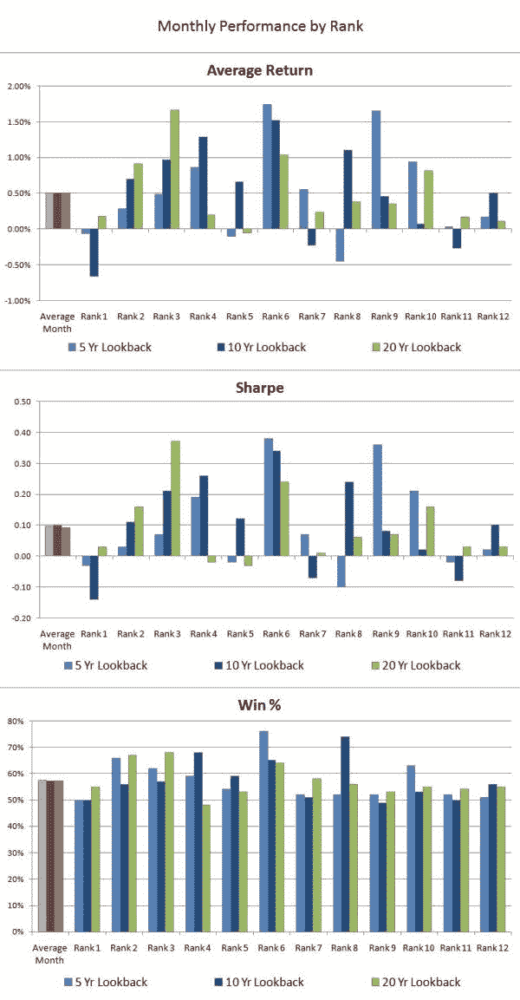

<!--yml
category: 未分类
date: 2024-05-12 18:46:24
-->

# Monthly and Quarterly Seasonality Using the Time Machine Test (Part 1) | CSSA

> 来源：[https://cssanalytics.wordpress.com/2009/10/06/monthly-and-quarterly-seasonality-using-the-time-machine-test-part-1/#0001-01-01](https://cssanalytics.wordpress.com/2009/10/06/monthly-and-quarterly-seasonality-using-the-time-machine-test-part-1/#0001-01-01)

***Note:** to receive an early bird discount on the upcoming DV Indicators package email us at* [*dvindicators@gmail.com*](mailto:dvindicators@gmail.com) *—**those who have emailed us already for the DVTrsi are already automatically eligible.***

Continuing with our look at seasonality-based strategies, we decided to  investigate how well monthly and quarterly strategies would perform in a realistic time machine test. For newbies, a time machine test means that we will use a learning algorithm programmed with specific rules and start back at the beginning of the dataset and trade out of sample. This is the most objective experiment as historical backtests are fraught with hindsight bias–or Monday morning quarterback bias to be cheeky. Strategies that pass a time machine test will be far more likely to work in real life than static backtests or “systems.”

So on to the first test: lets look for months or quarters with 95% statistical confidence > or <0 using the t-statistic.  Essentially we want to find extremely consistent positive or negative months historically . Oops, not many takers on that one, using longer lookbacks (greater than 5 years of historical data) ***we have almost no months or quarters passing this screen***.  This is our first clue that monthly and quarterly seasonality is ***very noisy***—and personally, I am likely to discard any such strategy off the bat if it fails this test. There are too many good effects worth trading, there is little point focusing on strategies that cannot be confidently differentiated from zero. So lets settle for 75% confidence for now–which is adequate for financial markets. Below is a test of selecting months that have t-scores>0 with 75% confidence or greater, ie they are supposed to be higher than 0, and hopefully better than the average month. In addition we included selecting months that have t-scores<0 with 75% confidence or greater, meaning they should be negative or hopefully worse than the average month. Here we see that we require 10 or 20 year lookback periods for evaluation to improve the effect (which makes sense given the smaller sample size), and that the strategy is successful only at identifying poor performing months. In fact, selecting the months with high t-scores actually underperformed the average. Quarterly performance in contrast fared much better, and strangely enough favored shorter lookbacks to identify the top quarter—more on this phenomenon in our next post.  However, to identify the worst quarter, a 20-year lookback was the most successful, likely coinciding with the effect for finding the worst month. The fact that the results were so sensitive to the lookback period dramatically weakens any results or conclusions that can be derived.

We also used a ranking methodology incorporating the DVR—which is the Sharpe Ratio x the linearity of the equity curve. The noise inherent in trying to identify the best and worst ranked months or quarters is quite visible in the graph. There is not a clear relationship. So far the lesson seems to be that monthly and quarterly seasonality is a very slim effect—and while pundits often present backtests that show some remarkably good results such as the January effect or selling over the summertime and early fall, there is little evidence to support that this is easy money. Keep in mind, our time machine does not have the benefit of hindsight, so it is like a real life trader in that sense. Our time machine did select the best/worst and most consistent calendar effects, and likely the historical figures seemed to contain a remarkably obvious persistence of one month or quarter to outperform/underperform. ***In reality, using this method did not produce good consistent results when this information was used for trading.*** In the next post we will take a look at some additional methods to try and tease out seasonality effects………with some very surprising and interesting results. Nonetheless,  the lesson still is to beware of longer term seasonal studies–the only tradeable benefit here seems to be in identifying when to slightly increase exposure for a given quarter, and when to reduce exposure. No long/short strategy using the top and bottom was capable of beating buy and hold.

