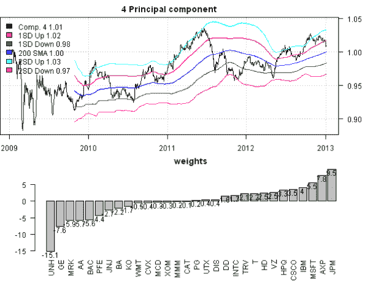

<!--yml
category: 未分类
date: 2024-05-18 14:34:57
-->

# More Principal Components Fun | Systematic Investor

> 来源：[https://systematicinvestor.wordpress.com/2013/01/06/more-principal-components-fun/#0001-01-01](https://systematicinvestor.wordpress.com/2013/01/06/more-principal-components-fun/#0001-01-01)

Today, I want to continue with the [Principal Components](http://en.wikipedia.org/wiki/Principal_component_analysis) theme and show how the [Principal Component Analysis](http://en.wikipedia.org/wiki/Principal_component_analysis) can be used to build portfolios that are not correlated to the market. Most of the content for this post is based on the excellent article, [“Using PCA for spread trading”](http://matlab-trading.blogspot.ca/2012/12/using-pca-for-spread-trading.html) by Jev Kuznetsov.

Let’s start by loading the components of the [Dow Jones Industrial Average index](http://en.wikipedia.org/wiki/Dow_Jones_Industrial_Average) over last 5 years.

```

###############################################################################
# Load Systematic Investor Toolbox (SIT)
# https://systematicinvestor.wordpress.com/systematic-investor-toolbox/
###############################################################################
setInternet2(TRUE)
con = gzcon(url('http://www.systematicportfolio.com/sit.gz', 'rb'))
    source(con)
close(con)

	#*****************************************************************
	# Load historical data
	#****************************************************************** 
	load.packages('quantmod')
	tickers = dow.jones.components()

	data <- new.env()
	getSymbols(tickers, src = 'yahoo', from = '2009-01-01', env = data, auto.assign = T)
	bt.prep(data, align='remove.na')	

```

Next let’s compute the [Principal Components](http://en.wikipedia.org/wiki/Principal_component_analysis) based on the first year of price history.

```

	#*****************************************************************
	# Principal component analysis (PCA), for interesting discussion
	# http://machine-master.blogspot.ca/2012/08/pca-or-polluting-your-clever-analysis.html
	#****************************************************************** 
	prices = last(data$prices, 1000)
		n = len(tickers)  		
	ret = prices / mlag(prices) - 1

	p = princomp(na.omit(ret[1:250,]))

	loadings = p$loadings[]

	# look at the first 4 principal components 	
	components = loadings[,1:4]

	# normalize all selected components to have total weight = 1
	components = components / repRow(colSums(abs(components)), len(tickers))

	# note that first component is market, and all components are orthogonal i.e. not correlated to market
	market = ret[1:250,] %*% rep(1/n,n)
	temp = cbind(market, ret[1:250,] %*% components)
		colnames(temp)[1] = 'Market'	

	round(cor(temp, use='complete.obs',method='pearson'),2)

	# the variance of each component is decreasing
	round(100*sd(temp,na.rm=T),2)

```

```

Correlation:
       Market Comp.1 Comp.2 Comp.3 Comp.4
Market    1.0      1    0.2    0.1      0
Comp.1    1.0      1    0.0    0.0      0
Comp.2    0.2      0    1.0    0.0      0
Comp.3    0.1      0    0.0    1.0      0
Comp.4    0.0      0    0.0    0.0      1

Standard Deviation:
Market Comp.1 Comp.2 Comp.3 Comp.4
   1.8    2.8    1.2    1.0    0.8

```

Please note that the first principal component is highly correlated to the market and all principal components have very low correlation to each other and very low correlation to the market. Also by construction the volatility of principal components is decreasing. An interesting observation that you might want to check yourself: principal components are quite persistent in time (i.e. if you compute both correlations and volatilities using the future prices, for example, 4 years of prices, the principal components maintain their correlation and volatility profiles)

Next, let’s check if any of the principal components are mean-reverting. I will use Augmented Dickey-Fuller test to check if principal components are mean-reverting. (small p-value => stationary i.e. mean-reverting)

```

	#*****************************************************************
	# Find stationary components, Augmented Dickey-Fuller test
	#****************************************************************** 	
	library(tseries)
	equity = bt.apply.matrix(1 + ifna(-ret %*% components,0), cumprod)
		equity = make.xts(equity, index(prices))

	# test for stationarity ( mean-reversion )
	adf.test(as.numeric(equity[,1]))$p.value
	adf.test(as.numeric(equity[,2]))$p.value
	adf.test(as.numeric(equity[,3]))$p.value
	adf.test(as.numeric(equity[,4]))$p.value

```

The Augmented Dickey-Fuller test indicates that the 4th principal component is stationary. Let’s have a closer look at its price history and its composition:

```

	#*****************************************************************
	# Plot securities and components
	#*****************************************************************
	layout(1:2)

	# add Bollinger Bands
	i.comp = 4
	bbands1 = BBands(repCol(equity[,i.comp],3), n=200, sd=1)
	bbands2 = BBands(repCol(equity[,i.comp],3), n=200, sd=2)
	temp = cbind(equity[,i.comp], bbands1[,'up'], bbands1[,'dn'], bbands1[,'mavg'],
				bbands2[,'up'], bbands2[,'dn'])
		colnames(temp) = spl('Comp. 4,1SD Up,1SD Down,200 SMA,2SD Up,2SD Down')

	plota.matplot(temp, main=paste(i.comp, 'Principal component'))

	barplot.with.labels(sort(components[,i.comp]), 'weights')		

```

[](https://systematicinvestor.wordpress.com/wp-content/uploads/2013/01/plot1-small.png)

The price history along with 200 day moving average and 1 and 2 Bollinger Bands are shown on the top pane. The portfolio weights of the 4th principal component are shown on the bottom pane.

So now you have a mean-reverting portfolio that is also uncorrelated to the market. There are many ways you can use this infromation. Please share your ideas and suggestions.

To view the complete source code for this example, please have a look at the [bt.pca.trading.test() function in bt.test.r at github](https://github.com/systematicinvestor/SIT/blob/master/R/bt.test.r).