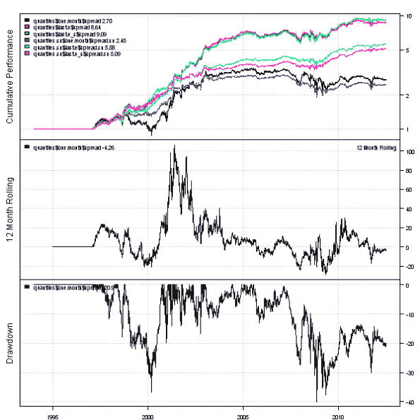
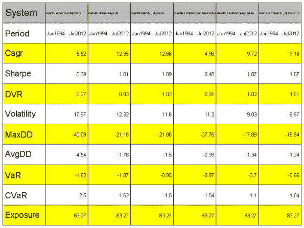
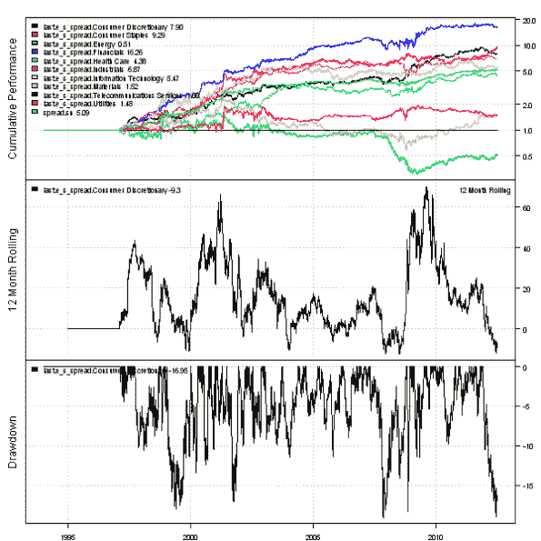

<!--yml
category: 未分类
date: 2024-05-18 14:39:09
-->

# More on Factor Attribution to improve performance of the 1-Month Reversal Strategy | Systematic Investor

> 来源：[https://systematicinvestor.wordpress.com/2012/07/27/more-on-factor-attribution-to-improve-performance-of-the-1-month-reversal-strategy/#0001-01-01](https://systematicinvestor.wordpress.com/2012/07/27/more-on-factor-attribution-to-improve-performance-of-the-1-month-reversal-strategy/#0001-01-01)

In my last post, [Factor Attribution to improve performance of the 1-Month Reversal Strategy](https://systematicinvestor.wordpress.com/2012/07/17/factor-attribution-to-improve-performance-of-the-1-month-reversal-strategy/), I discussed how [Factor Attribution](https://systematicinvestor.wordpress.com/2012/07/04/example-of-factor-attribution/) can be used to boost performance of the [1-Month Reversal Strategy](https://systematicinvestor.wordpress.com/2012/07/13/1-month-reversal-strategy/). Today I want to dig a little dipper and examine this strategy for each sector and also run a sector-neutral back-test.

The initial steps to load historical prices, load Fama/French factors and run Factor Attribution are the same as in the original [post](https://systematicinvestor.wordpress.com/2012/07/17/factor-attribution-to-improve-performance-of-the-1-month-reversal-strategy/), so I will not repeat them here. The complete source code for this example is located in the [bt.fa.sector.one.month.test() function in bt.test.r at github](https://github.com/systematicinvestor/SIT/blob/master/R/bt.test.r) for your reference. The new functionality to create sector and sector-neutral back-tests is located in the bt.make.quintiles.sector() function below:

```

bt.make.quintiles.sector <- function(
	sector,		# sector data
	position.score,	# position.score is a factor to form Quintiles sampled at the period.ends
	data,		# back-test object
	period.ends,	
	n.quantiles = 5,
	start.t = 2,	# first index at which to form Quintiles
	prefix = ''	
) 
{
	#*****************************************************************
	# Re-organize sectors into matrix, assume that sectors are constant in time
	#****************************************************************** 
	temp = factor(sector)
	sector.names = levels(temp)	
		n.sectors = len(sector.names)
	sectors = matrix(unclass(temp), nr=nrow(position.score), nc=ncol(position.score), byrow=T)

	#*****************************************************************
	# Create Quantiles
	#****************************************************************** 
	position.score = coredata(position.score)
	quantiles = weights = position.score * NA			

	for( s in 1:n.sectors) {
		for( t in start.t:nrow(weights) ) {
			index = sectors[t,] == s
			n = sum(index)

			# require at least 3 companies in each quantile
			if(n > 3*n.quantiles) {			
				factor = as.vector(position.score[t, index])
				ranking = ceiling(n.quantiles * rank(factor, na.last = 'keep','first') / count(factor))

				quantiles[t, index] = ranking
				weights[t, index] = 1/tapply(rep(1,n), ranking, sum)[ranking]			
			}
		}
	}
	quantiles = ifna(quantiles,0)

	#*****************************************************************
	# Create Q1-QN spread for each Sector
	#****************************************************************** 
	long = weights * NA
	short = weights * NA
	models = list()

	for( s in 1:n.sectors) {
		long[] = 0
		long[quantiles == 1 & sectors == s] = weights[quantiles == 1 & sectors == s]
		long = long / rowSums(long,na.rm=T)

		short[] = 0
		short[quantiles == n.quantiles & sectors == s] = weights[quantiles == n.quantiles & sectors == s]
		short = short / rowSums(short,na.rm=T)

		data$weight[] = NA
			data$weight[period.ends,] = long - short
		models[[ paste(prefix,'spread.',sector.names[s], sep='') ]]	= bt.run(data, silent = T)	
	}

	#*****************************************************************
	# Create Sector - Neutral Q1-QN spread
	#****************************************************************** 		
	long[] = 0
	long[quantiles == 1] = weights[quantiles == 1]
	long = long / rowSums(long,na.rm=T)

	short[] = 0
	short[quantiles == n.quantiles] = weights[quantiles == n.quantiles]
	short = short / rowSums(short,na.rm=T)

	data$weight[] = NA
		data$weight[period.ends,] = long - short
	models$spread.sn = bt.run(data, silent = T)	

	return(models)
}

```

I have compared below, the overall and sector-neutral versions of the strategy based on the 1 Month returns (one.month) and the Residuals from the Factor Attribution regression (last.e_s). In all cases the Residual strategy outperformed the base one and also the sector-neutral versions have better risk-adjusted coefficients compared to the overall strategy.

[](https://systematicinvestor.wordpress.com/wp-content/uploads/2012/07/plot1-small3.png)

[](https://systematicinvestor.wordpress.com/wp-content/uploads/2012/07/plot2-small3.png)

Next I looked at the each sector performance for both strategies and surprisingly found that Energy, Materials, and Utilities underperformed in both cases and Financials and Consumer Staples did very well in both cases. Looking at the sector back-test charts, I think the Momentum strategy that selects top few sectors each month would do very well. You can try implementing this idea as a homework.

[](https://systematicinvestor.wordpress.com/wp-content/uploads/2012/07/plot3-small1.png)

[](https://systematicinvestor.wordpress.com/wp-content/uploads/2012/07/plot4-small1.png)

To view the complete source code for this example, please have a look at the [bt.fa.sector.one.month.test() function in bt.test.r at github](https://github.com/systematicinvestor/SIT/blob/master/R/bt.test.r).