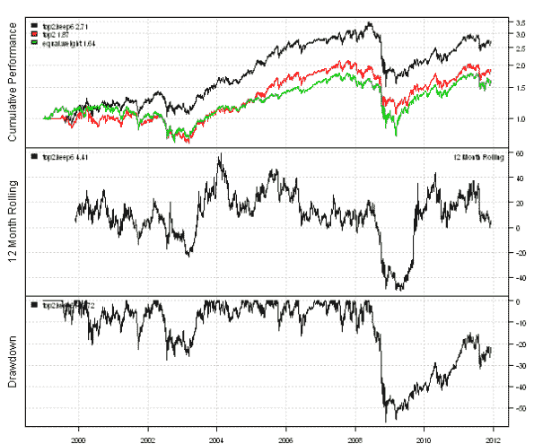
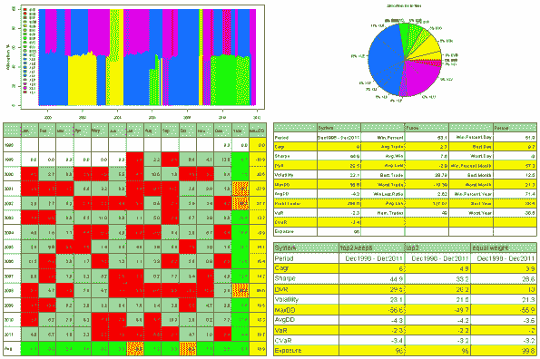
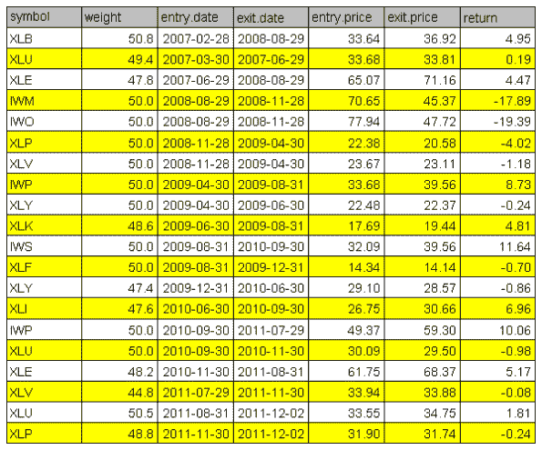

<!--yml
category: 未分类
date: 2024-05-18 14:45:01
-->

# Multi-Asset Backtest : Rotational Trading Strategies | Systematic Investor

> 来源：[https://systematicinvestor.wordpress.com/2011/12/06/multi-asset-backtest-rotational-trading-strategies/#0001-01-01](https://systematicinvestor.wordpress.com/2011/12/06/multi-asset-backtest-rotational-trading-strategies/#0001-01-01)

I want to discuss the implementation of Rotational Trading Strategies using the backtesting library in the [Systematic Investor Toolbox](https://systematicinvestor.wordpress.com/systematic-investor-toolbox/).The Rotational Trading strategy switches investment allocations throughout the time, betting on few top ranked assets. For example, the ranking can be based on relative strength or momentum. A few examples of the Rotational Trading Strategies (or Tactical Asset Allocation) are:

I want to illustrate the Rotational Trading using the strategy introduced at ETF Screen in the [ETF Sector Strategy](http://www.etfscreen.com/sectorstrategy.php) post. Each month, this strategy invests into the top two of the 21 ETFs sorted by their 6 month returns. To reduce the turnover, in subsequent months the ETF positions are kept as long as these ETFs are in the top 6 rank.

Before we can implement this strategy, we need to create two helper routines. First, let’s create a function that will select the top N positions for each period:

```

############################################################################### 
# Select top N for each period
############################################################################### 
ntop <- function
(
	data,		# matrix with observations
	topn = 1, 	# top n
	dirMaxMin = TRUE
) 
{
	out = data
	out[] = NA

	for( i in 1:nrow(data) ) {
		x = coredata(data[i,])
		o = sort.list(x, na.last = TRUE, decreasing = dirMaxMin)
		index = which(!is.na(x))
		x[] = NA

		if(len(index)>0) {
			n = min(topn, len(index))
			x[o[1:n]] = 1/n
		}
		out[i,] = x
	}
	out[is.na(out)] = 0	
	return( out )
}

```

Next, let’s create a function that will select the top N positions for each period and keep them until they drop below KeepN rank:

```

############################################################################### 
# Select top N for each period, and keep them till they drop below keepn rank
############################################################################### 
ntop.keep <- function
(
	data, 		# matrix with observations
	topn = 1, 	# top n
	keepn = 1, 	# keep n
	dirMaxMin = TRUE
) 
{
	out = data
	out[] = NA

	for( i in 1:nrow(data) ) {
		x = coredata(data[i,])
		o = sort.list(x, na.last = TRUE, decreasing = dirMaxMin)
		index = which(!is.na(x))
		x[] = NA

		if(len(index)>0) {
			n = min(topn, len(index))
			x[o[1:n]] = 1

			# keepn logic
			if( i>=2 ) {
				y = coredata(out[(i-1),])	# previous period selection
				n1 = min(keepn, len(index))
				y[-o[1:n1]] = NA	# remove all not in top keepn

				index1 = which(!is.na(y))
				if(len(index1)>0) {
					x[] = NA
					x[index1] = 1	# keep old selection

					for( j in 1:n ) {
						if( sum(x, na.rm = T) == topn ) break
						x[o[j]] = 1
					}
				}
			}
		}		
		out[i,] = x/sum(x, na.rm = T)	
	}
	out[is.na(out)] = 0	
	return( out )
}

```

Now we are ready to implement this strategy using the backtesting library in the [Systematic Investor Toolbox](https://systematicinvestor.wordpress.com/systematic-investor-toolbox/):

```

# Load Systematic Investor Toolbox (SIT)
setInternet2(TRUE)
con = gzcon(url('https://github.com/systematicinvestor/SIT/raw/master/sit.gz', 'rb'))
	source(con)
close(con)

	#*****************************************************************
	# Load historical data
	#****************************************************************** 
	load.packages('quantmod')	
	tickers = spl('XLY,XLP,XLE,XLF,XLV,XLI,XLB,XLK,XLU,IWB,IWD,IWF,IWM,IWN,IWO,IWP,IWR,IWS,IWV,IWW,IWZ')	

	data <- new.env()
	getSymbols(tickers, src = 'yahoo', from = '1970-01-01', env = data, auto.assign = T)
		for(i in ls(data)) data[[i]] = adjustOHLC(data[[i]], use.Adjusted=T)
	bt.prep(data, align='keep.all', dates='1970::2011')

	#*****************************************************************
	# Code Strategies
	#****************************************************************** 
	prices = data$prices  
	n = len(tickers)  

	# find month ends
	month.ends = endpoints(prices, 'months')
		month.ends = month.ends[month.ends > 0]		

	# Equal Weight
	data$weight[] = NA
		data$weight[month.ends,] = ntop(prices, n)[month.ends,]	
		capital = 100000
		data$weight[] = (capital / prices) * data$weight
	equal.weight = bt.run(data, type='share')

	# Rank on 6 month return
	position.score = prices / mlag(prices, 126)	

	# Select Top 2 funds
	data$weight[] = NA
		data$weight[month.ends,] = ntop(position.score[month.ends,], 2)	
		capital = 100000
		data$weight[] = (capital / prices) * bt.exrem(data$weight)		
	top2 = bt.run(data, type='share', trade.summary=T)

	# Seletop Top 2 funds,  and Keep then till they are in 1:6 rank
	data$weight[] = NA
		data$weight[month.ends,] = ntop.keep(position.score[month.ends,], 2, 6)	
		capital = 100000
		data$weight[] = (capital / prices) * bt.exrem(data$weight)		
	top2.keep6 = bt.run(data, type='share', trade.summary=T)

	#*****************************************************************
	# Create Report
	#****************************************************************** 
	plotbt.custom.report(top2.keep6, top2, equal.weight, trade.summary=T)

```

[](https://systematicinvestor.wordpress.com/wp-content/uploads/2011/12/plot1-small.png)

[](https://systematicinvestor.wordpress.com/wp-content/uploads/2011/12/plot2-small.png)

[](https://systematicinvestor.wordpress.com/wp-content/uploads/2011/12/plot3-small.png)

There are many ways to improve this strategy. Here is a sample list of additional ways to consider:

The only boundary is your imagination. I would also recommend to do sensitivity analysis during your strategy development to make sure your are not overfitting the data.

To view the complete source code for this example, please have a look at the [bt.rotational.trading.test() function in bt.test.r at github](https://github.com/systematicinvestor/SIT/blob/master/R/bt.test.r).

For more examples, please have a look at the implementation of the Timing Model as presented in [A Quantitative Approach to Tactical Asset Allocation by M. Faber (2006)](http://www.mebanefaber.com/timing-model/) at the [bt.timing.model.test() function in bt.test.r at github](https://github.com/systematicinvestor/SIT/blob/master/R/bt.test.r).