<!--yml
category: 未分类
date: 2024-05-18 13:44:02
-->

# Multi-Asset Market Regimes | Quantivity

> 来源：[https://quantivity.wordpress.com/2012/11/09/multi-asset-market-regimes/#0001-01-01](https://quantivity.wordpress.com/2012/11/09/multi-asset-market-regimes/#0001-01-01)

An astute reader suggested reproducing the results from a recent article on regime analysis by Kritzman *et al.*, [Regime Shifts: Implications for Dynamic Strategies](http://www.cfapubs.org/doi/abs/10.2469/faj.v68.n3.3) in FAJ (May / June 2012). This is a fun exercise to be conducted over a series of posts, as doing so illustrates several important economic principles and some elegant mathematics.

This post begins by identifying *macroeconomic market regimes arising from multi-asset economic activity*.

One big challenge in analyzing market regimes is *identification*, as they are not directly observable. As an unsupervised statistical learning problem, there is no verifiable “right answer”. Beyond identifying regimes, we also want to know the probability of being in a given regime at any given point in time. Finally, our economic activity is measured via time series.

Fortunately, a standard ML technique exists which possesses these attributes: *hidden Markov model* (HMM). For readers unfamiliar with HMM, here is a brief summary on the theory relevant to our problem. See [Hidden Markov Models for Time Series](http://books.google.com/books?id=LDDzvCsdVs8C) by Zucchini and MacDonald (2009) for more details.

* * *

HMMs are useful because they estimate both unobserved regimes and corresponding probabilities of being in each regime at every point in time. The latter is termed “local decoding”, and expressed as the conditional state probabilities:

   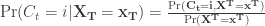

In other words, the probability of being in regime  at time 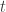 given the observed data 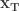.

Where 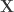 is the observed time-series data and 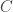 is an unobserved parameter process which conditional probability at time  depends at most on the previous time 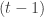, also known as the Markov property:

   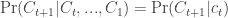

Thus,  is an unobservable Markov chain; because of which the conditional probability at time  nicely reduces to (see equation 5.6 in Zucchini, derived from 4.9):

   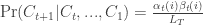

Where  and 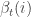 are forward and backward probabilities along the Markov chain  at time  (estimated via iterative maximum likelihood using [expectation maximization](http://en.wikipedia.org/wiki/Expectation%E2%80%93maximization_algorithm)), and 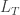 is the likelihood at time .

For those who prefer code, where `val` is observed time series  and `numOfStates` is number of unobserved regimes for :

```

hmmFit <- HMMFit(val, nStates=numOfStates)
fb <- forwardBackward(hmmFit, val)
eu <- exp(fb$Alpha + fb$Beta - fb$LL)

```

Readers with ML background will recognize HMM as an elementary temporal graphical model (see § 6.2 of [Koller and Friedman (2009)](http://books.google.com/books?id=7dzpHCHzNQ4C)).

* * *

With this tiny bit of HMM theory, we can now formulate our regime analysis problem in economic terms and use a bit of R to solve it.

Consider four measures of economic activity: US equities, real gross domestic product (GDP), inflation, and G10 currencies. Posit each measure of economic activity can be characterized at any point in time as being in either one of *two* states: stable with corresponding small downside volatility or contracting with corresponding high volatility. This broadly matches traditional wisdom, namely the macroeconomy is either acting “fairly normal” or is exceptional (either panic or exuberance).

Worth noting is the obvious caveat that this bi-state model oversimplifies reality, in particular ignoring potential distinction between “growth” and “stagnancy” (of potential importance during 1970s and 2010s). Intuition is unclear *a priori* whether a bi- or tri-state model is preferable. A subsequent post will take up this model selection question, as it lacks an easy answer.

Illustrating the conditional probabilities of this model graphically, where a value of 0 indicates 100% likelihood of being in the “normal” regime and value of 1 indicates 100% likelihood of being in “exceptional” regime:

[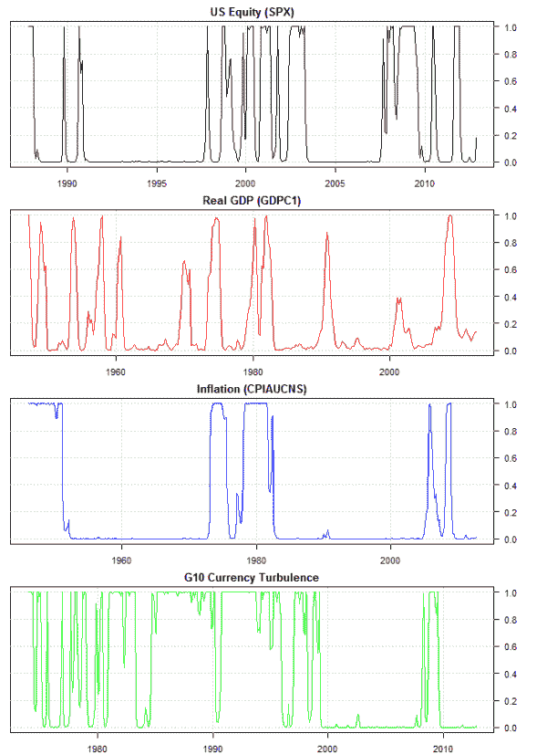](https://quantivity.wordpress.com/wp-content/uploads/2012/11/hmm-regime-state-probs.png)

These regimes match our economic recollection. Equities were normal through much of the 1990s and mid-2000, and in panic the remaining time. GDP growth was exceptionally strong in the mid-1990s, during recovery from dotcom bubble in early 2000s, and during recovery of mortgage bubble in late 2000s; growth during all other times was “normal”. Inflation was high during the late 1970s and flanking the mortgage bubble. Currencies were volatile throughout 1980s and 1990s and then again flanking the mortgage bubble.

These regimes also illustrate just how unusual the mortgage bubble was in historical sense, as it is the only time in the past 30 years during which all four measures of macroeconomic activity were simultaneously in exceptional regime.

* * *

Code to replicate the above results, and quite a bit more to be discussed in subsequent posts.

Note: US equity regime is estimated using daily returns from SPX, rather than equally-weighted basket of S&P 500 sector indices as in the original article. Doing so results in nearly identical equity regime conditional probabilities, hence SPX is chosen in recognition of Occam.

```

library("RHmm")
library("TTR")

displayKritzmanRegimes <- function()
{
  # Display regimes from Kritzman et al. (2012), printing regime
  # statistics and plotting local decoding.

  equityRegime <- getEquityTurbulenceRegime()
  inflationRegime <- getInflationRegime()
  growthRegime <- getGrowthRegime()
  currencyTurbulenceRegime <- getCurrencyTurbulenceRegime()

  print(equityRegime)
  print(inflationRegime)
  print(growthRegime)
  print(currencyTurbulenceRegime)

  plotMarkovRegimes(equityRegime, "Equity (SPX)", plotDensity=F)
  plotMarkovRegimes(inflationRegime, "Inflation (CPIAUCNS)", plotDensity=F)
  plotMarkovRegimes(growthRegime, "Real GDP (GDPC1)", plotDensity=F)
  plotMarkovRegimes(currencyTurbulenceRegime, "G10 Currency Turbulence", 
                    plotDensity=F)

  plotLocalDecodings(list(equityRegimeTurbulence, growthRegime, inflationRegime, 
                          currencyTurbulenceRegime),
                     list("US Equity (SPX)", "Real GDP (GDPC1)", 
                          "Inflation (CPIAUCNS)","G10 Currency Turbulence"),
                     regimeNums=c(2,2,2,2))
}

getEquityTurbulenceRegime <- function(startDate=as.Date("1977-12-01"), 
                                      endDate=Sys.Date(), numOfStates=2)
{
  # Estimate two-state markov (SPX-based) equity regime. In lieu of S&P 500
  # sector indices, use SPX instead.
  #
  # Args:
  #     startDate: date which to begin panel for regime estimation
  #     endDate: end which to end panel for regime estimation
  #     numOfStates: number of hidden states in regime
  # 
  # Returns: hmmFit from HMMFit(), suitable for display with plotMarkovRegime()

  spx <- dROC(getOhlcv(instrumentSymbol="^GSPC", startDate=startDate, 
                              endDate=endDate, quote=c("close")))
  spxTurb <- rollingTurbulence(spx, avgWidth=(250 * 10), 
                                    covarWidth=(250 * 10))
  meanTurb <- apply.monthly(spxTurb, mean)
  estimateMarkovRegimes(meanTurb, numOfStates=numOfStates)
}

getInflationRegime <- function(startDate=as.Date("1946-01-01"), endDate=Sys.Date(),
                               numOfStates=2)
{
  # Estimate two-state markov (CPI-based) inflation regime.
  #
  # Args:
  #     startDate: date which to begin panel for regime estimation
  #     endDate: end which to end panel for regime estimation
  #     numOfStates: number of hidden states in regime
  # 
  # Returns: hmmFit from HMMFit(), suitable for display with plotMarkovRegime()

  val <- 100 *dROC(getFREDData(symbol="CPIAUCNS", startDate=startDate, 
                               endDate=endDate))
  estimateMarkovRegimes(val, numOfStates=numOfStates)
}

getGrowthRegime <- function(startDate=as.Date("1946-01-01"), 
                            endDate=as.Date("2012-12-31"), numOfStates=2)
{
  # Estimate two-state markov (GDP-based) growth regime.
  #
  # Note: Growth regime appears to be bi-modal, and thus need to estimate
  # several times to get convergence on the regime reported by Kritzman.
  #
  # Args:
  #     startDate: date which to begin panel for regime estimation
  #     endDate: end which to end panel for regime estimation
  #     numOfStates: number of hidden states in regime
  # 
  # Returns: hmmFit from HMMFit(), suitable for display with plotMarkovRegime()

  val <- 100 * dROC(getFREDData(symbol="GDPC1", startDate=startDate, 
                                endDate=endDate))
  estimateMarkovRegimes(val, numOfStates=numOfStates)
}

getCurrencyTurbulenceRegime <- function(startDate=as.Date("1971-01-01"), 
                                        endDate=Sys.Date(), 
                                        numOfStates=2)
{
  # Estimate two-state markov (G10-based) currency turbulence regime.
  #
  # Args:
  #     startDate: date which to begin panel for regime estimation
  #     endDate: end which to end panel for regime estimation
  #     numOfStates: number of hidden states in regime
  # 
  # Returns: hmmFit from HMMFit(), suitable for display with plotMarkovRegime()

  g10rates <- getG10Currencies()
  avgg10rates <- xts(100 * rowMeans(dROC(g10rates), na.rm=T), 
                     order.by=last(index(g10rates), -1))
  turbG10rates <- rollingTurbulence(avgg10rates, avgWidth=(250 * 3), 
                                    covarWidth=(250 * 3))
  meanTurbG10rates <- apply.monthly(turbG10rates, mean)

  estimateMarkovRegimes(meanTurbG10rates, numOfStates=numOfStates)
}

estimateMarkovRegimes <- function(val, numOfStates=2)
{
  # Estimate n-state hidden markov model (HMM) for val.
  #
  # Args:
  #     val: series
  #     numOfStates: number of hidden states in HMM
  #
  # Returns: hmmFit from HMMFit(), suitable for display with plotMarkovRegime()

  hmmFit <- HMMFit(val, nStates=numOfStates)
  return (list(val=val, hmmFit=hmmFit))
}

plotLocalDecodings <- function(regimes, symbols, plotDateRange="1900::2012", 
                             regimeNums)
{
  # Plot local decodings for a list of HMM regimes, optionally over a set
  # date range.
  #
  # Args:
  #     regimes: list of regimes, as returned by estimateMarkovRegimes()
  #     symbols: list of human-readable symbols for regimes
  #     plotDateRange: option date over which to plot regime local decodings
  #     regimeNums: index of HMM regime, into regimes, to plot

  oldpar <- par(mfrow=c(1,1))
  on.exit(par(oldpar))

  layout(c(1,2,3,4))

  # generate merge of local decodings
  localList <- lapply(c(1:length(regimes)), function(i) {

    regime <- regimes[[i]]
    fb <- forwardBackward(regime$hmmFit, regime$val)
    eu <- exp(fb$Alpha + fb$Beta - fb$LL)
    local <- xts(eu[,regimeNums[i]], index(regime$val))[plotDateRange]

    plota(local, type='l', plotX=T, col=drawColors[i], main=symbols[i])
  })
}

plotMarkovRegimes <- function(regime, symbol, plotDateRange="1900::2012",
                              plotDensity=T, plotTimeSeries=T)
{
  # Plot markov regimes from HMM: kernel densities and per-regime local decodings.
  #
  # Args:
  #     hmmFit: fit for HMM, as generated by estimateMarkovRegimes()
  #     symbol: human-readable description of series with markov regimes
  #     plotDateRange: contiguous range of time which to plot

  val <- regime$val
  hmmFit <- regime$hmmFit

  # calculate local decoding
  fb <- forwardBackward(hmmFit, val)
  eu <- exp(fb$Alpha + fb$Beta - fb$LL)
  hmmMeans <- hmmFit$HMM$distribution$mean
  hmmSD <- sqrt(hmmFit$HMM$distribution$var)

  # plot kernel density with regime means
  oldpar <- par(mfrow=c(1,1))
  on.exit(par(oldpar))

  if (plotDensity)
  {
    plot(density(val), main=paste("Density with Regime Means:", symbol))
    abline(v=mean(val), lty=2)

    sapply(c(1:length(hmmMeans)), function(i) {
      abline(v=hmmMeans[i], lty=2, col=drawColors[(i+1)])
      curve(dnorm(x, hmmMeans[i], hmmSD[i]), add=T, lty=3,
            col=drawColors[(i+1)])
    })
  }

  # Plot time series of percent change and local decoding for each regime
  if (plotTimeSeries)
  {
    merged <- merge(val, eu)
    layout(c(1:(1+ncol(eu))))

    plota(merged[,1][plotDateRange], type='l', paste("Regime:", symbol), plotX=F)
    sapply(c(1:length(hmmMeans)), function(i) {
      abline(h=hmmMeans[i], lty=2, col=drawColors[(i+1)])
    })
    plota.legend("Percent Change:", drawColors[1], last(merged[,1]))

    sapply(c(1:ncol(eu)), function(i) {

      plota(xts(merged[,(i+1)], index(val))[plotDateRange], type='l', 
            plotX=(i==(ncol(eu))),
            col=drawColors[(i+1)])
      plota.legend(paste0("Event Regime ", i, ":"), drawColors[(i+1)], 
                   last(merged[,(i+1)]))
    })
  }
}

dROC <- function(x, n=1)
{
  # Return discrete rate-of-change (ROC) for a series, without padding
  ROC(x, n, type="discrete", na.pad=F)
}

```