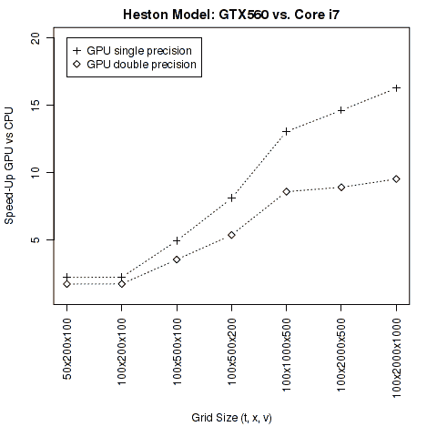

<!--yml
category: 未分类
date: 2024-05-17 23:41:11
-->

# Multi-Dimensional Finite Difference Methods on a GPU – HPC-QuantLib

> 来源：[https://hpcquantlib.wordpress.com/2012/12/27/multi-dimensional-finite-difference-methods-on-a-gpu/#0001-01-01](https://hpcquantlib.wordpress.com/2012/12/27/multi-dimensional-finite-difference-methods-on-a-gpu/#0001-01-01)

One key aspect for the performance of multi-dimensional finite difference methods based on operator splitting is the performance of the underlying tridiagonal system solver [1]. The authors in [2] have analysed different solver strategies and they have reported a speed-up factor of around 15 between GPU and CPU for the best solver strategy (cyclic reduction) on very large systems. CUDA’s sparse matrix library cuSPARSE contains a routine to solve tridiagonal systems based on cyclic reduction. nVIDIA claims a speed-up factor of  around ten compared against Intel’s MKL library [3].

These factors are smaller than the speed-up factors reported for pure Monte-Carlo pricing algorithms. Main reason is that a tridiagonal system solver can not be parallelised by a simple divide and conquer approach like many Monte-Carlo pricing algorithms.

Main classes of the GPU implementation of the Hundsdorfer-Verwer operator splitting scheme are:

1.  **GPUFdmLinearOp**: implements the FdmLinearOp interface and can be initialized from any instance of FdmLinearOp/FdmLinearOpComposite via the *toMatrix()/toMatrixDecomp()* methods.
2.  **GPUTripleBandLinearOp**: GPU based implementation of TripleBandLinearOp. This linear operator can be initialized from any instance of the classes FdmLinearOp/FdmLinearOpComposite via the toMatrix/toMatrixDecomp() methods. The solver for the tridiagonal system is based on cuSPARSE.
3.  **GPUHundsdorferScheme**: GPU based implementation of the Hundsdorfer-Verwer operator splitting scheme.

The code is available [here](http://hpc-quantlib.de/src/gpuopsplitting.zip) and it is based on the latest [QuantLib](http://quantlib.org) version from the [trunk](http://sourceforge.net/p/quantlib/code/HEAD/tree/), [CUDA 4.1](https://developer.nvidia.com/category/zone/cuda-zone) or higher and [Cusp 0.3](http://code.google.com/p/cusp-library/) or higher.  As can be seen from the diagrams above the speed-up factor depends on the problem size. Speed-up factors above ten can only be achieved for very large two-dimensional or for medium-sized three-dimensional problems. The GPU precision is defined in cudatypes.hpp by the typedef for the type “real”.

[1] Karel in ’t Hout, [ADI finite difference schemes for the Heston model with correlation.](http://win.ua.ac.be/%7Ekihout/ADI_Heston_lecture.pdf)

[2] Pablo Quesada-Barriuso, Julián Lamas-Rodríguez, Dora B. Heras, Montserrat Bóo, Francisco Argüello, [Selecting the Best Tridiagonal System Solver Projected on Multi-Core CPU and GPU Platforms.](http://weblidi.info.unlp.edu.ar/worldcomp2011-mirror/pdp8294.pdf)

[3] nVIDIA, [cuSPARSE](https://developer.nvidia.com/cusparse)