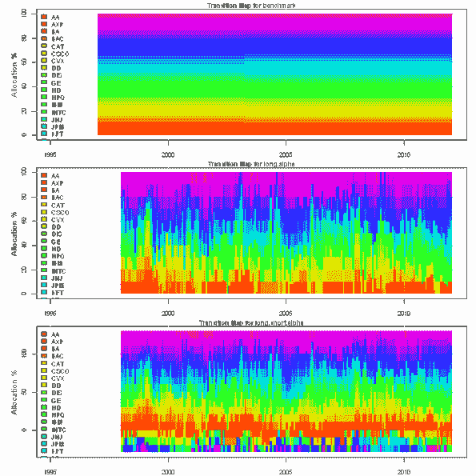
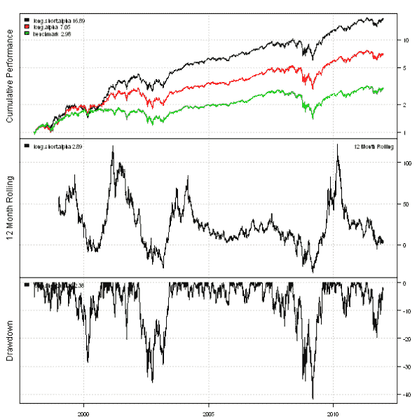
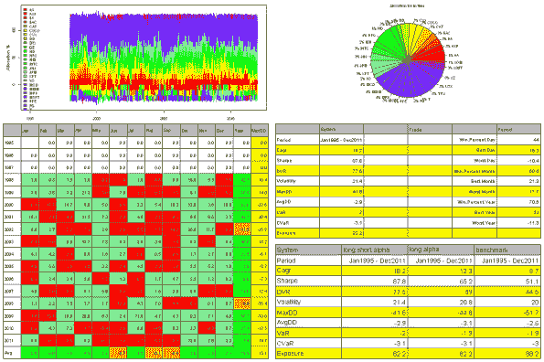
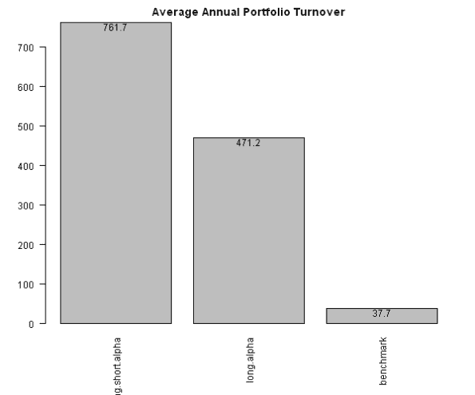

<!--yml
category: 未分类
date: 2024-05-18 14:42:22
-->

# Multiple Factor Model – Building 130/30 Index | Systematic Investor

> 来源：[https://systematicinvestor.wordpress.com/2012/03/06/multiple-factor-model-building-13030-index/#0001-01-01](https://systematicinvestor.wordpress.com/2012/03/06/multiple-factor-model-building-13030-index/#0001-01-01)

[Nico](http://www.rnfc.org/ivey/) brought to my attention the [130/30: The New Long-Only (2008) by A. Lo, P. Patel](http://math.nyu.edu/faculty/avellane/Lo13030.pdf) paper in his comment to the [Multiple Factor Model – Building CSFB Factors](https://systematicinvestor.wordpress.com/2012/02/13/multiple-factor-model-building-csfb-factors/) post. This paper presents a very detailed step by step guide to building 130/30 Index using average CSFB Factors as the alpha model and [MSCI Barra Multi-Factor Risk model](http://www.alacra.com/alacra/help/barra_handbook_US.pdf). Today, I want to adapt this methodology and to show how to build 130/30 Index based on the CSFB Factors we created in the [Multiple Factor Model – Building CSFB Factors](https://systematicinvestor.wordpress.com/2012/02/13/multiple-factor-model-building-csfb-factors/) post and the Risk Model we created in the [Multiple Factor Model – Building Risk Model](https://systematicinvestor.wordpress.com/2012/02/21/multiple-factor-model-building-risk-model/) post.

Let’s start by loading the CSFB factors that we saved at the end of the [Multiple Factor Model – Building CSFB Factors](https://systematicinvestor.wordpress.com/2012/02/13/multiple-factor-model-building-csfb-factors/) post. [If you are missing data.factors.Rdata file, please execute fm.all.factor.test() function first to create and save CSFB factors.] Next, let’s load the multiple factor risk model we saved at the end of the [Multiple Factor Model – Building Risk Model](https://systematicinvestor.wordpress.com/2012/02/21/multiple-factor-model-building-risk-model/) post. [If you are missing risk.model.Rdata file, please execute fm.risk.model.test() function first to create and save multiple factor risk model.] Next, I will compute betas over a two-year rolling window.

```

###############################################################################
# Load Systematic Investor Toolbox (SIT)
# https://systematicinvestor.wordpress.com/systematic-investor-toolbox/
###############################################################################
con = gzcon(url('http://www.systematicportfolio.com/sit.gz', 'rb'))
    source(con)
close(con)

	#*****************************************************************
	# Load data
	#****************************************************************** 
	load.packages('quantmod')	

	# Load CSFB factor data that we saved at the end of the fm.all.factor.test function
	load(file='data.factors.Rdata')
		nperiods = nrow(next.month.ret)
		tickers = colnames(next.month.ret)
		n = len(tickers)

	# Load multiple factor risk model data that we saved at the end of the fm.risk.model.test function	
	load(file='risk.model.Rdata')
		factor.exposures = all.data[,,-1]	
		factor.names = dimnames(factor.exposures)[[3]]
		nfactors = len(factor.names)

	#*****************************************************************
	# Compute Betas: b = cov(r,m) / var(m)
	# The betas are measured on a two-year rolling window
	# http://en.wikipedia.org/wiki/Beta_(finance)
	#****************************************************************** 
	ret = mlag(next.month.ret)
	beta = ret * NA

	# 1/n benchmark portfolio
	benchmark = ntop(ret, n)	
	benchmark.ret = rowSums(benchmark * ret, na.rm=T)

	# estimate betas
	for(t in 24:nperiods) {
		t.index = (t-23):t
		benchmark.var = var( benchmark.ret[t.index], na.rm=T )

		t.count = count(ret[t.index, ])
		t.cov = cov( ifna(ret[t.index,], 0), benchmark.ret[t.index], use='complete.obs' )

		# require at least 20 months of history
		beta[t,] = iif(t.count > 20, t.cov/benchmark.var, NA)
	}

```

To construct efficient portfolio each month, I will solve mean-variance portfolio optimization problem of the following form:

```
Max weight * return - risk.aversion * weight * Covariance * weight 
Sum weight = 1
Sum weight * beta = 1
0 <= weight <= 0.1
```

Please read [The Effects of Risk Aversion on Optimization (2010) by S. Liu, R. Xu](http://www.mscibarra.com/research/articles/2010/The%20Effects%20of%20Risk%20Aversion%20on%20Optimization%20(Feb%202010).pdf) paper for the detailed discussion of this optimization problem.

Please note that I will use risk.aversion = 0.0075 and portfolio beta = 1 as discussed on the page 22 of the [130/30: The New Long-Only (2008) by A. Lo, P. Patel](http://math.nyu.edu/faculty/avellane/Lo13030.pdf) paper. To model portfolio beta constraint, I will use the fact that [portfolio beta is equal to the weighted average of the individual asset betas](http://www.duke.edu/~charvey/Classes/ba350/riskman/riskman.htm).

```

	#*****************************************************************
	# Construct LONG ONLY portfolio using the multiple factor risk model
	#****************************************************************** 
	load.packages('quadprog,corpcor,kernlab')

	weight = NA * next.month.ret
	weights = list()
		weights$benchmark = ntop(beta, n)		
		weights$long.alpha = weight

	for(t in 36:nperiods) {	
		#--------------------------------------------------------------------------
		# Create constraints
		#--------------------------------------------------------------------------
		# set min/max wgts for individual stocks: 0 =< x <= 10/100
		constraints = new.constraints(n, lb = 0, ub = 10/100)

		# wgts must sum to 1 (fully invested)
		constraints = add.constraints(rep(1,n), type = '=', b = 1, constraints)

		#--------------------------------------------------------------------------
		# beta of portfolio is the weighted average of the individual asset betas		
		# http://www.duke.edu/~charvey/Classes/ba350/riskman/riskman.htm
		#--------------------------------------------------------------------------
		constraints = add.constraints(ifna(as.vector(beta[t,]),0), type = '=', b = 1, constraints)

		#--------------------------------------------------------------------------
		# Create factor exposures constraints
		#--------------------------------------------------------------------------	
		# adjust prior constraints, add factor exposures
		constraints = add.variables(nfactors, constraints)

		# BX - X1 = 0
		constraints = add.constraints(rbind(ifna(factor.exposures[t,,], 0), -diag(nfactors)), rep(0, nfactors), type = '=', constraints)

		#--------------------------------------------------------------------------
		# Create Covariance matrix
		# [Qu  0]
		# [ 0 Qf]
		#--------------------------------------------------------------------------
		temp = diag(n)
			diag(temp) = ifna(specific.variance[t,], mean(coredata(specific.variance[t,]), na.rm=T))^2
		cov.temp = diag(n + nfactors)
			cov.temp[1:n,1:n] = temp
		cov.temp[(n+1):(n+nfactors),(n+1):(n+nfactors)] = factor.covariance[t,,]

		#--------------------------------------------------------------------------
		# create input assumptions
		#--------------------------------------------------------------------------
		ia = list()	
		ia$n = nrow(cov.temp)
		ia$annual.factor = 12

		ia$symbols = c(tickers, factor.names)

		ia$cov = cov.temp	

		#--------------------------------------------------------------------------
		# page 9, Risk: We use the Barra default setting, risk aversion value of 0.0075, and
		# AS-CF risk aversion ratio of 1.
		#
		# The Effects of Risk Aversion on Optimization (2010) by S. Liu, R. Xu
		# page 4/5
		#--------------------------------------------------------------------------
		risk.aversion = 0.0075
		ia$cov.temp = ia$cov	

		# set expected return
		alpha = factors.avg$AVG[t,] / 5
		ia$expected.return = c(ifna(coredata(alpha),0), rep(0, nfactors))

		# remove companies that have no beta from optimization
		index = which(is.na(beta[t,]))
		if( len(index) > 0) {
			constraints$ub[index] = 0
			constraints$lb[index] = 0
		}

		# find solution
		sol = solve.QP.bounds(Dmat = 2* risk.aversion * ia$cov.temp, dvec = ia$expected.return, 
					Amat = constraints$A, bvec = constraints$b, 
					meq = constraints$meq, lb = constraints$lb, ub = constraints$ub)

		weights$long.alpha[t,] = sol$solution[1:n]
	}

```

Next, let’s construct 130/30 portfolio. I will restrict portfolio weights to be +/- 10% and will use portfolio construction technique that I documented in the [130/30 Portfolio Construction](https://systematicinvestor.wordpress.com/2011/10/18/13030-porfolio-construction/) post.

```

	#*****************************************************************
	# Construct Long/Short 130:30 portfolio using the multiple factor risk model
	# based on the examples in the aa.long.short.test functions
	#****************************************************************** 
	weights$long.short.alpha = weight

	for(t in 36:nperiods) {	
		#--------------------------------------------------------------------------
		# Create constraints
		#--------------------------------------------------------------------------
		# set min/max wgts for individual stocks: -10/100 =< x <= 10/100
		constraints = new.constraints(n, lb = -10/100, ub = 10/100)

		# wgts must sum to 1 (fully invested)
		constraints = add.constraints(rep(1,n), type = '=', b = 1, constraints)

		#--------------------------------------------------------------------------
		# beta of portfolio is the weighted average of the individual asset betas		
		# http://www.duke.edu/~charvey/Classes/ba350/riskman/riskman.htm
		#--------------------------------------------------------------------------
		constraints = add.constraints(ifna(as.vector(beta[t,]),0), type = '=', b = 1, constraints)

		#--------------------------------------------------------------------------
		# Create factor exposures constraints
		#--------------------------------------------------------------------------	
		# adjust prior constraints, add factor exposures
		constraints = add.variables(nfactors, constraints)

		# BX - X1 = 0
		constraints = add.constraints(rbind(ifna(factor.exposures[t,,], 0), -diag(nfactors)), rep(0, nfactors), type = '=', constraints)

		#--------------------------------------------------------------------------
		# Create 130:30
		# -v.i <= x.i <= v.i, v.i>0, SUM(v.i) = 1.6
		#--------------------------------------------------------------------------		
		# adjust prior constraints, add v.i
		constraints = add.variables(n, constraints)

		# -v.i <= x.i <= v.i
		#   x.i + v.i >= 0
		constraints = add.constraints(rbind(diag(n), matrix(0,nfactors,n)  ,diag(n)), rep(0, n), type = '>=', constraints)
		#   x.i - v.i <= 0
		constraints = add.constraints(rbind(diag(n), matrix(0,nfactors,n), -diag(n)), rep(0, n), type = '<=', constraints)

		# SUM(v.i) = 1.6
		constraints = add.constraints(c(rep(0, n), rep(0, nfactors), rep(1, n)), 1.6, type = '=', constraints)

		#--------------------------------------------------------------------------
		# Create Covariance matrix
		# [Qu  0]
		# [ 0 Qf]
		#--------------------------------------------------------------------------
		temp = diag(n)
			diag(temp) = ifna(specific.variance[t,], mean(coredata(specific.variance[t,]), na.rm=T))^2
		cov.temp = 0*diag(n + nfactors + n)
			cov.temp[1:n,1:n] = temp
		cov.temp[(n+1):(n+nfactors),(n+1):(n+nfactors)] = factor.covariance[t,,]

		#--------------------------------------------------------------------------
		# create input assumptions
		#--------------------------------------------------------------------------
		ia = list()	
		ia$n = nrow(cov.temp)
		ia$annual.factor = 12

		ia$symbols = c(tickers, factor.names, tickers)

		ia$cov = cov.temp	

		#--------------------------------------------------------------------------
		# page 9, Risk: We use the Barra default setting, risk aversion value of 0.0075, and
		# AS-CF risk aversion ratio of 1.
		#
		# The Effects of Risk Aversion on Optimization (2010) by S. Liu, R. Xu
		# page 4/5
		#--------------------------------------------------------------------------
		risk.aversion = 0.0075
		ia$cov.temp = ia$cov

		# set expected return
		alpha = factors.avg$AVG[t,] / 5
		ia$expected.return = c(ifna(coredata(alpha),0), rep(0, nfactors), rep(0, n))

		# remove companies that have no beta from optimization
		index = which(is.na(beta[t,]))
		if( len(index) > 0) {
			constraints$ub[index] = 0
			constraints$lb[index] = 0
		}

		# find solution
		sol = solve.QP.bounds(Dmat = 2* risk.aversion * ia$cov.temp, dvec = ia$expected.return, 
					Amat = constraints$A, bvec = constraints$b, 
					meq = constraints$meq, lb = constraints$lb, ub = constraints$ub)

		weights$long.short.alpha[t,] = sol$solution[1:n]
	}

```

At this point, we created monthly long-only and 130:30 portfolios. Let’s examine their transition maps.

```

	#*****************************************************************
	# Plot Transition Maps
	#****************************************************************** 	
	layout(1:3)
	for(i in names(weights)) plotbt.transition.map(weights[[i]], i)

```

[](https://systematicinvestor.wordpress.com/wp-content/uploads/2012/03/plot1-small.png)

The portfolio weights for the long-only portfolio (long.alpha) sum up to 100% and for the 130:30 portfolio (long.short.alpha) is 130% long and 30% short as expected.

Next let’s create trading strategies based on these portfolios and check their performance.

```

	#*****************************************************************
	# Create strategies
	#****************************************************************** 	
	prices = data$prices
		prices = bt.apply.matrix(prices, function(x) ifna.prev(x))

	# find month ends
	month.ends = endpoints(prices, 'months')

	# create strategies that invest in each qutile
	models = list()

	for(i in names(weights)) {
		data$weight[] = NA
			data$weight[month.ends,] = weights[[i]]
			capital = 100000
			data$weight[] = (capital / prices) * (data$weight)	
		models[[i]] = bt.run(data, type='share', capital=capital)
	}

	#*****************************************************************
	# Create Report
	#****************************************************************** 	
	models = rev(models)

	plotbt.custom.report.part1(models, dates='1998::')
	plotbt.custom.report.part2(models)

```

[](https://systematicinvestor.wordpress.com/wp-content/uploads/2012/03/plot2-small.png)

[](https://systematicinvestor.wordpress.com/wp-content/uploads/2012/03/plot3-small.png)

The 130:30 portfolio works best, producing high returns with smaller drawdowns than long-only and benchmark (1/N) portfolios.

The note of caution: the above results are based on $0 commission rate (i.e. trading is free). Also, I’m using the current Dow Jones index components through out the whole history; hence, introducing [survivorship bias](http://www.investopedia.com/terms/s/survivorshipbias.asp) (i.e. Dow Jones index changed its composition a few times in the last 20 years).

To see how much of the problem is my assumption of $0 commission rate, let’s have a look at the annual portfolio turnovers.

```

	# Plot Portfolio Turnover for each strategy
	layout(1)
	barplot.with.labels(sapply(models, compute.turnover, data), 'Average Annual Portfolio Turnover')

```

[](https://systematicinvestor.wordpress.com/wp-content/uploads/2012/03/plot4-small.png)

The 130:30 portfolio has a pretty high portfolio turnover; therefore, it will not perform as well in the real life as in our backtest.

To view the complete source code for this example, please have a look at the [fm.long.short.test() function in factor.model.test.r at github](https://github.com/systematicinvestor/SIT/blob/master/R/factor.model.test.r).