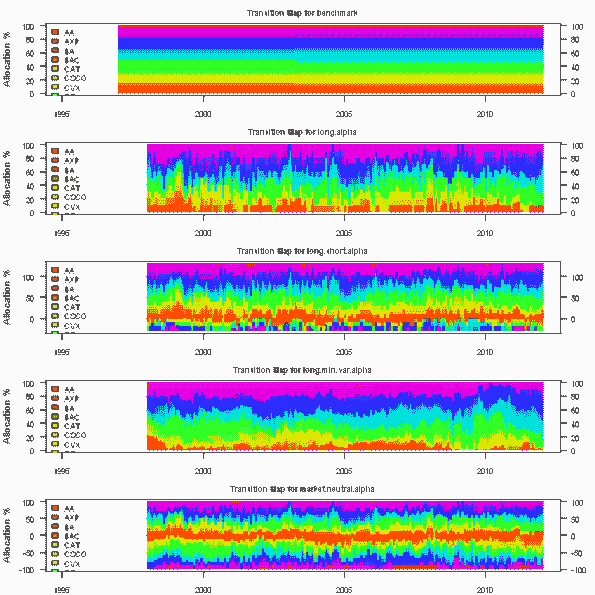
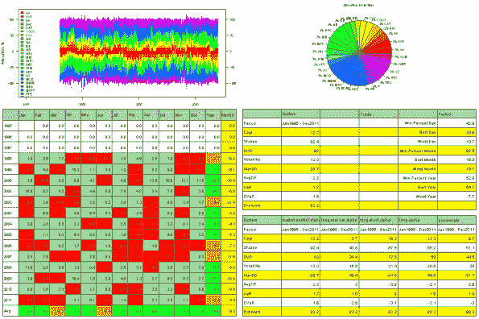

<!--yml
category: 未分类
date: 2024-05-18 14:42:14
-->

# Multiple Factor Model – Building 130/30 Index (Update) | Systematic Investor

> 来源：[https://systematicinvestor.wordpress.com/2012/03/10/multiple-factor-model-building-13030-index-update/#0001-01-01](https://systematicinvestor.wordpress.com/2012/03/10/multiple-factor-model-building-13030-index-update/#0001-01-01)

This is just a quick update to my last post: [Multiple Factor Model – Building 130/30 Index](https://systematicinvestor.wordpress.com/2012/03/06/multiple-factor-model-building-13030-index/). I want to introduce Market-Neutral and Minimum Variance strategies and compare their performance to the 130/30 Index.

I have updated the source code of the [fm.long.short.test() function in factor.model.test.r at github](https://github.com/systematicinvestor/SIT/blob/master/R/factor.model.test.r) to include Market-Neutral and Minimum Variance strategies.

Let’s start by creating a Minimum Variance strategy. I will use the same framework as in the [Multiple Factor Model – Building 130/30 Index](https://systematicinvestor.wordpress.com/2012/03/06/multiple-factor-model-building-13030-index/) post. At each month end, I will solve for a portfolio that has minimum variance, ignoring all alpha information.

```

	#*****************************************************************
	# Construct LONG ONLY minimum variance portfolio using the multiple factor risk model
	#****************************************************************** 
	weights$long.min.var.alpha = weight

	for(t in 36:nperiods) {	
		#--------------------------------------------------------------------------
		# Create constraints
		#--------------------------------------------------------------------------
		# set min/max wgts for individual stocks: 0 =< x <= 10/100
		constraints = new.constraints(n, lb = 0, ub = 10/100)

		# wgts must sum to 1 (fully invested)
		constraints = add.constraints(rep(1,n), type = '=', b = 1, constraints)

		#--------------------------------------------------------------------------
		# Create factor exposures constraints
		#--------------------------------------------------------------------------	
		# adjust prior constraints, add factor exposures
		constraints = add.variables(nfactors, constraints)

		# BX - X1 = 0
		constraints = add.constraints(rbind(ifna(factor.exposures[t,,], 0), -diag(nfactors)), rep(0, nfactors), type = '=', constraints)

		#--------------------------------------------------------------------------
		# Create Covariance matrix
		# [Qu  0]
		# [ 0 Qf]
		#--------------------------------------------------------------------------
		temp = diag(n)
			diag(temp) = ifna(specific.variance[t,], mean(coredata(specific.variance[t,]), na.rm=T))^2
		cov.temp = diag(n + nfactors)
			cov.temp[1:n,1:n] = temp
		cov.temp[(n+1):(n+nfactors),(n+1):(n+nfactors)] = factor.covariance[t,,]

		#--------------------------------------------------------------------------
		# Setup optimizations
		#--------------------------------------------------------------------------	
		# set expected return
		alpha = factors.avg$AVG[t,] / 5
		expected.return = c(ifna(coredata(alpha),0), rep(0, nfactors))

		# remove companies that have no beta from optimization
		index = which(is.na(beta[t,]))
		if( len(index) > 0) {
			constraints$ub[index] = 0
			constraints$lb[index] = 0
		}

		# find solution
		sol = solve.QP.bounds(Dmat = cov.temp, dvec = 0 * expected.return, 
					Amat = constraints$A, bvec = constraints$b, 
					meq = constraints$meq, lb = constraints$lb, ub = constraints$ub)

		weights$long.min.var.alpha[t,] = sol$solution[1:n]

		cat(t, '\n')
	}

```

Next, let’s construct Market-Neutral portfolio. I will restrict portfolio weights to be +/- 10% and will use portfolio construction technique that I documented in the [130/30 Portfolio Construction](https://systematicinvestor.wordpress.com/2011/10/18/13030-porfolio-construction/) post.

```

	#*****************************************************************
	# Construct Market-Neutral portfolio 100:100 with beta=0 using the multiple factor risk model
	# based on the examples in the aa.long.short.test functions
	#****************************************************************** 
	weights$market.neutral.alpha = weight

	for(t in 36:nperiods) {	
		#--------------------------------------------------------------------------
		# Split x into x.long and x.short, x_long and x_short >= 0
		# SUM(x.long) - SUM(x.short) = 0
		#--------------------------------------------------------------------------			
		# x.long and x.short >= 0
		# x.long <= 0.1 
		# x.short <= 0.1 
		constraints = new.constraints(2*n, lb = 0, ub = c(rep(0.1,n), rep(0.1,n)))

		# SUM (x.long - x.short) = 0
		constraints = add.constraints(c(rep(1,n), -rep(1,n)), 0, type = '=', constraints)		

		# SUM (x.long + x.short) = 2
		constraints = add.constraints(c(rep(1,n), rep(1,n)), 2, type = '=', constraints)		

		#--------------------------------------------------------------------------
		# beta of portfolio is the weighted average of the individual asset betas		
		# http://www.duke.edu/~charvey/Classes/ba350/riskman/riskman.htm
		#--------------------------------------------------------------------------
		temp = ifna(as.vector(beta[t,]),0)
		constraints = add.constraints(c(temp, -temp), type = '=', b = 0, constraints)

		#--------------------------------------------------------------------------
		# Create factor exposures constraints
		#--------------------------------------------------------------------------	
		# adjust prior constraints, add factor exposures
		constraints = add.variables(nfactors, constraints)

		# BX - X1 = 0
		temp = ifna(factor.exposures[t,,], 0)
		constraints = add.constraints(rbind(temp, -temp, -diag(nfactors)), rep(0, nfactors), type = '=', constraints)

		#--------------------------------------------------------------------------
		# Add binary constraints	
		#--------------------------------------------------------------------------	
		# adjust prior constraints: add b.i
		constraints = add.variables(n, constraints)

		# index of binary variables b.i
		constraints$binary.index = (2*n + nfactors + 1):(3*n + nfactors)

		# binary variable b.i : x.long < b, x.short < (1 - b)
		# x.long < b
		constraints = add.constraints(rbind(diag(n), 0*diag(n), matrix(0,nfactors,n), -diag(n)), rep(0, n), type = '<=', constraints)

		# x.short < (1 - b)
		constraints = add.constraints(rbind(0*diag(n), diag(n), matrix(0,nfactors,n), diag(n)), rep(1, n), type = '<=', constraints)

		#--------------------------------------------------------------------------
		# set expected return
		#--------------------------------------------------------------------------	
		# set expected return
		alpha = factors.avg$AVG[t,] / 5
		temp = ifna(coredata(alpha),0)
		expected.return = c(temp, -temp, rep(0, nfactors), rep(0, n))

		#--------------------------------------------------------------------------
		# Create Covariance matrix
		# [Qu  0]
		# [ 0 Qf]
		#--------------------------------------------------------------------------
		temp = diag(n)
			diag(temp) = ifna(specific.variance[t,], mean(coredata(specific.variance[t,]), na.rm=T))^2

		# | cov -cov |
		# |-cov  cov |		
		temp = cbind( rbind(temp, -temp), rbind(-temp, temp) )

		cov.temp = 0*diag(2*n + nfactors + n)
			cov.temp[1:(2*n),1:(2*n)] = temp
		cov.temp[(2*n+1):(2*n+nfactors),(2*n+1):(2*n+nfactors)] = factor.covariance[t,,]

		#--------------------------------------------------------------------------
		# Adjust Covariance matrix
		#--------------------------------------------------------------------------
		if(!is.positive.definite(cov.temp)) {
			cov.temp <- make.positive.definite(cov.temp, 0.000000001)
		}	

		#--------------------------------------------------------------------------
		# page 9, Risk: We use the Barra default setting, risk aversion value of 0.0075, and
		# AS-CF risk aversion ratio of 1.
		#
		# The Effects of Risk Aversion on Optimization (2010) by S. Liu, R. Xu
		# page 4/5
		#--------------------------------------------------------------------------
		risk.aversion = 0.0075

		# remove companies that have no beta from optimization
		index = which(is.na(beta[t,]))
		if( len(index) > 0) {
			constraints$ub[index] = 0
			constraints$lb[index] = 0
			constraints$ub[2*index] = 0
			constraints$lb[2*index] = 0			
		}

		# find solution
		sol = solve.QP.bounds(Dmat = 2* risk.aversion * cov.temp, dvec = expected.return, 
					Amat = constraints$A, bvec = constraints$b, 
					meq = constraints$meq, lb = constraints$lb, ub = constraints$ub,
					binary.vec = constraints$binary.index)					

		x = sol$solution[1:n] - sol$solution[(n+1):(2*n)]
		weights$market.neutral.alpha[t,] = x

		cat(t, '\n')
	}

```

Next, let’s re-create all summary charts from the [Multiple Factor Model – Building 130/30 Index](https://systematicinvestor.wordpress.com/2012/03/06/multiple-factor-model-building-13030-index/) post.

[](https://systematicinvestor.wordpress.com/wp-content/uploads/2012/03/plot1-small1.png)

[](https://systematicinvestor.wordpress.com/wp-content/uploads/2012/03/plot2-small1.png)

[](https://systematicinvestor.wordpress.com/wp-content/uploads/2012/03/plot3-small1.png)

[](https://systematicinvestor.wordpress.com/wp-content/uploads/2012/03/plot4-small1.png)

Please note that we are not comparing apples to apples here. For example, Market-Neutral strategy has beta set equal to zero while 130/30 Index has beta set equal to one. But at the same time there are a few interesting observations:

*   Minimum Variance strategy has the smallest drawdown among all long strategies, but its performance is lacking
*   Market-Neutral strategy does surprisingly well in this environment and has the best Sharpe ratio
*   Market-Neutral strategy also has the highest portfolio turnover; hence, high trading costs will make this strategy less attractive

To view the complete source code for this example, please have a look at the [fm.long.short.test() function in factor.model.test.r at github](https://github.com/systematicinvestor/SIT/blob/master/R/factor.model.test.r).