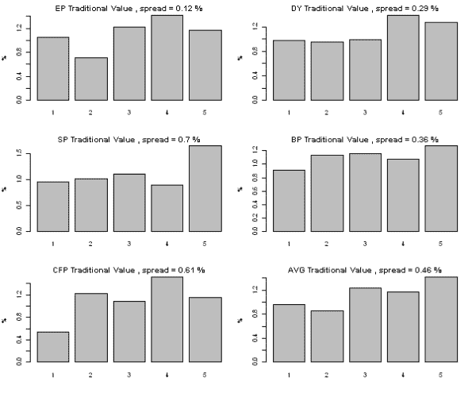
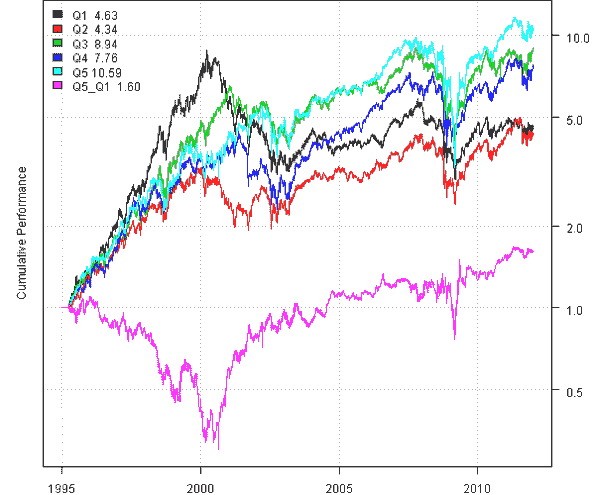

<!--yml
category: 未分类
date: 2024-05-18 14:43:11
-->

# Multiple Factor Model – Building Fundamental Factors | Systematic Investor

> 来源：[https://systematicinvestor.wordpress.com/2012/02/04/multiple-factor-model-building-fundamental-factors/#0001-01-01](https://systematicinvestor.wordpress.com/2012/02/04/multiple-factor-model-building-fundamental-factors/#0001-01-01)

This is the second post in the series about Multiple Factor Models. I will build on the code presented in the prior post, [Multiple Factor Model – Fundamental Data](https://systematicinvestor.wordpress.com/2012/01/29/multiple-factor-model-fundamental-data/), and I will show how to build Fundamental factors described in the CSFB Alpha Factor Framework. For details of the CSFB Alpha Factor Framework please read [CSFB Quantitative Research, Alpha Factor Framework on page 11, page 49 by P. N. Patel, S. Yao, R. Carlson, A. Banerji, J. Handelman](http://www.scribd.com/mobile/documents/62210581/download?commit=Download+Now&secret_password=).

The CSFB Alpha Factor Framework has both traditional Fundamental factors and industry relative Fundamental factors. Let’s start by getting Fundamental data that we will need to create Price/Earnings, Price/Sales, Price/Cash Flow, Dividend Yield, Price/Book factors. In the prior post, I mentioned that it takes a while to download historical fundamental data for all companies in the Dow Jones index, and I recommend saving fundamental data with save(data.fund, file=’data.fund.Rdata’) command. In the following code I will just load historical fundamental data with load(file=’data.fund.Rdata’) command instead of downloading all data again.

```

###############################################################################
# Load Systematic Investor Toolbox (SIT)
# https://systematicinvestor.wordpress.com/systematic-investor-toolbox/
###############################################################################
con = gzcon(url('http://www.systematicportfolio.com/sit.gz', 'rb'))
    source(con)
close(con)

	#*****************************************************************
	# Find Sectors for each company in DOW 30
	#****************************************************************** 
	tickers = spl('XLY,XLP,XLE,XLF,XLV,XLI,XLB,XLK,XLU')
	tickers.desc = spl('ConsumerCyclicals,ConsumerStaples,Energy,Financials,HealthCare,Industrials,Materials,Technology,Utilities')

	sector.map = c()
	for(i in 1:len(tickers)) {
		sector.map = rbind(sector.map, 
				cbind(sector.spdr.components(tickers[i]), tickers.desc[i])
			)
	}
	colnames(sector.map) = spl('ticker,sector')

	#*****************************************************************
	# Load historical data
	#****************************************************************** 
	load.packages('quantmod')		
	tickers = dow.jones.components()

	sectors = factor(sector.map[ match(tickers, sector.map[,'ticker']), 'sector'])
		names(sectors) = tickers

	# get fundamental data
	load(file='data.fund.Rdata')

	# get pricing data
	load(file='data.Rdata')

	#*****************************************************************
	# Combine fundamental and pricing data
	#****************************************************************** 	
	for(i in tickers) {
		fund = data.fund[[i]]
		fund.date = date.fund.data(fund)

		# Earnings per Share		
		EPS = get.fund.data('Diluted EPS from Total Operations', fund, fund.date, is.12m.rolling=T)

		# Sales, exception not available for financial firms
		SALE = get.fund.data('total revenue', fund, fund.date, is.12m.rolling=T)

		# Common Shares Outstanding
		CSHO = get.fund.data('total common shares out', fund, fund.date)

		# Common Equity
		CEQ = get.fund.data('total equity', fund, fund.date)

		# Dividends
		DV.PS = get.fund.data('dividends paid per share', fund, fund.date, is.12m.rolling=T)

		# Cash Flow, exception not available for financial firms
		CFL = get.fund.data('net cash from operating activities', fund, fund.date, cash.flow=T, is.12m.rolling=T)

		# merge
		data[[i]] = merge(data[[i]], EPS, SALE, CSHO, CEQ, DV.PS, CFL)
	}

	bt.prep(data, align='keep.all', dates='1995::2011')

	#*****************************************************************
	# Create Factors
	#****************************************************************** 
	prices = data$prices
		prices = bt.apply.matrix(prices, function(x) ifna.prev(x))

	sectors	= sectors[colnames(prices)]	

	# create factors
	factors = list()	

```

In the Dow Jones index there are 4 financial firms (AXP, BAC, JPM, TRV) and Sales and Cash Flow are not really measurable for financial firms. Please read [Valuing Financial Service Firms by A. Damodaran](www.stern.nyu.edu/~adamodar/pdfiles/papers/finfirm09.pdf) for detailed explanation why Sales and Cash Flow are not really measurable for financial firms.

Next let’s create Traditional Value factors: Price/Earnings, Price/Sales, Price/Cash Flow, Dividend Yield, Price/Book.

```

	#*****************************************************************
	# Traditional Value
	#****************************************************************** 
	factors$TV = list()

	# Market Value - capitalization
	CSHO =  bt.apply(data, function(x) ifna.prev(x[, 'CSHO']))
	MKVAL = prices * CSHO

	# Price / Earnings
	EPS = bt.apply(data, function(x) ifna.prev(x[, 'EPS']))
	factors$TV$EP = EPS / prices

	# Price / Trailing Sales
	SALE = bt.apply(data, function(x) ifna.prev(x[, 'SALE']))	
	factors$TV$SP = SALE / MKVAL

	# Price / Trailing Cash Flow
	CFL = bt.apply(data, function(x) ifna.prev(x[, 'CFL']))
	factors$TV$CFP = CFL / MKVAL

	# Dividend Yield
	DV.PS = bt.apply(data, function(x) ifna.prev(x[, 'DV.PS']))
	factors$TV$DY = DV.PS / prices

	# Price / Book Value		
	CEQ = bt.apply(data, function(x) ifna.prev(x[, 'CEQ']))
	factors$TV$BP = CEQ	/ MKVAL

	# Eliminate Price/Sales and Price/Cash Flow for financial firms
	factors$TV$SP[, sectors == 'Financials'] = NA
	factors$TV$CFP[, sectors == 'Financials'] = NA

	#*****************************************************************
	# Convert to monthly
	#****************************************************************** 
	# find month ends
	month.ends = endpoints(prices, 'months')

	prices = prices[month.ends,]
		n = ncol(prices)
		nperiods = nrow(prices)

	ret = prices / mlag(prices) - 1
		next.month.ret = mlag(ret, -1)

	MKVAL = MKVAL[month.ends,]

	for(j in 1:len(factors)) {	
		for(i in 1:len(factors[[j]])) {
			factors[[j]][[i]] = factors[[j]][[i]][month.ends,]	
		}
	}

```

To create an overall Traditional Value factor, let’s first normalize (convert to z scores) all Traditional Value factors by subtracting capitalization weighted average and dividing by standard deviation. The overall Traditional Value factor is an average of all normalized Traditional Value factors.

```

	#*****************************************************************
	# Create the overall Traditional Value factor 
	#****************************************************************** 
	# check missing data for financial firms
	sapply(factors$TV, count)	

	# normalize (convert to z scores) cross sectionaly all Traditional Value factors
	for(i in names(factors$TV)) {
		factors$TV[[i]] = (factors$TV[[i]] - cap.weighted.mean(factors$TV[[i]], MKVAL)) / 
							apply(factors$TV[[i]], 1, sd, na.rm=T)
	}

	# compute the overall Traditional Value factor
	load.packages('abind') 
	temp = abind(factors$TV, along = 3)
	factors$TV$AVG = factors$TV[[1]]
		factors$TV$AVG[] = apply(temp, c(1,2), mean, na.rm=T)

	# plot quintile charts for all Traditional Value factors
	layout(matrix(1:6,nc=2))
	sapply(1:len(factors$TV), function(i)
		compute.quantiles(factors$TV[[i]], next.month.ret, paste(names(factors$TV)[i], 'Traditional Value'))
	)

```

[](https://systematicinvestor.wordpress.com/wp-content/uploads/2012/02/plot1-small.png)

I created a [compute.quantiles() function in factor.model.r at github](https://github.com/systematicinvestor/SIT/blob/master/R/factor.model.r) to compute and plot quantiles. For example, the quantiles chart for EP factor shows the average next month performance of stocks in each quantiles. The quantiles are created each month by ranking stocks by EP factor and grouping them into 5 quantiles. There is tendency of quantile 5 (Q5) to outperform quantile 1 (Q1) in most cases. The relationship between quantiles is not perfect, but the spread between Q5-Q1 is positive.

Next let’s examine quantiles for the overall Traditional Value factor in more details.

```

	#*****************************************************************
	# Backtest quantiles and quantile spread
	#****************************************************************** 
	out = compute.quantiles(factors$TV$AVG, next.month.ret, plot=F)	

	prices = data$prices
		prices = bt.apply.matrix(prices, function(x) ifna.prev(x))

	# create strategies that invest in each qutile
	models = list()

	for(i in 1:5) {
		data$weight[] = NA
			data$weight[month.ends,] = iif(out$quantiles == i, out$weights, 0)
			capital = 100000
			data$weight[] = (capital / prices) * (data$weight)	
		models[[paste('Q',i,sep='')]] = bt.run(data, type='share', capital=capital)
	}

	# spread
	data$weight[] = NA
		data$weight[month.ends,] = iif(out$quantiles == 5, out$weights, 
						iif(out$quantiles == 1, -out$weights, 0))
		capital = 100000
		data$weight[] = (capital / prices) * (data$weight)
	models$Q5_Q1 = bt.run(data, type='share', capital=capital)

	#*****************************************************************
	# Create Report
	#****************************************************************** 
	plotbt(models, plotX = T, log = 'y', LeftMargin = 3)	    	
		mtext('Cumulative Performance', side = 2, line = 1)

```

[](https://systematicinvestor.wordpress.com/wp-content/uploads/2012/02/plot2-small1.png)

The quantile spread Q5-Q1 shows consistent positive performance after 2000, but is inverted from 1995 to 2000\. This is a bit strange and calls for more investigation.

In the next posts, I will show how to run pooled cross sectional regression to create alpha scores.

To view the complete source code for this example, please have a look at the [fm.fund.factor.test() function in factor.model.test.r at github](https://github.com/systematicinvestor/SIT/blob/master/R/factor.model.test.r).