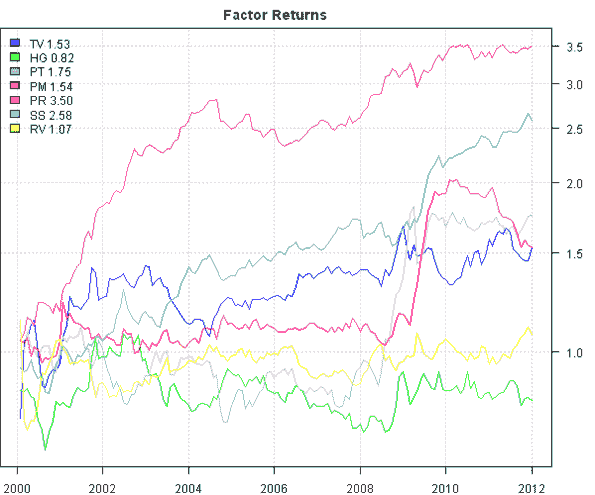
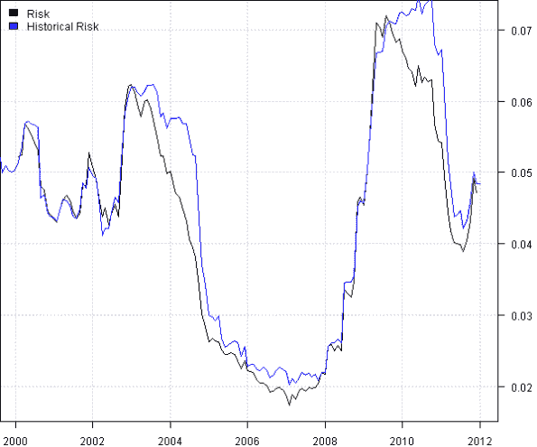

<!--yml
category: 未分类
date: 2024-05-18 14:42:39
-->

# Multiple Factor Model – Building Risk Model | Systematic Investor

> 来源：[https://systematicinvestor.wordpress.com/2012/02/21/multiple-factor-model-building-risk-model/#0001-01-01](https://systematicinvestor.wordpress.com/2012/02/21/multiple-factor-model-building-risk-model/#0001-01-01)

This is the fourth post in the series about Multiple Factor Models. I will build on the code presented in the prior post, [Multiple Factor Model – Building CSFB Factors](https://systematicinvestor.wordpress.com/2012/02/13/multiple-factor-model-building-csfb-factors/), and I will show how to build a multiple factor risk model. For an example of the multiple factor risk models, please read following references:

The outline of this post:

*   Run cross sectional regression to estimate factor returns
*   Compute factor covariance using shrinkage estimator
*   Forecast stocks specific variances using GARCH(1,1)
*   Compute portfolio risk using multiple factor model and compare it to the historical standard deviation of portfolio returns.

Let’s start by loading the CSFB factors that we saved at the end of the [prior post](https://systematicinvestor.wordpress.com/2012/02/13/multiple-factor-model-building-csfb-factors/). [If you are missing data.factors.Rdata file, please execute fm.all.factor.test() function first to create and save CSFB factors.] Next, I will run cross sectional regression to estimate factor returns.

```

###############################################################################
# Load Systematic Investor Toolbox (SIT)
# https://systematicinvestor.wordpress.com/systematic-investor-toolbox/
###############################################################################
con = gzcon(url('http://www.systematicportfolio.com/sit.gz', 'rb'))
    source(con)
close(con)
	#*****************************************************************
	# Load factor data that we saved at the end of the fm.all.factor.test functions
	#****************************************************************** 
	load.packages('quantmod,abind')	

	load(file='data.factors.Rdata')
		# remove Composite Average factor
		factors.avg = factors.avg[which(names(factors.avg) != 'AVG')]	

	#*****************************************************************
	# Run cross sectional regression to estimate factor returns
	#****************************************************************** 
	nperiods = nrow(next.month.ret)
	n = ncol(next.month.ret)

	# create sector dummy variables: binary 0/1 values for each sector
	nsectors = len(levels(sectors))	
	sectors.matrix = array(double(), c(nperiods, n, nsectors))
		dimnames(sectors.matrix)[[3]] = levels(sectors)		
	for(j in levels(sectors)) {
		sectors.matrix[,,j] = matrix(sectors == j,  nr=nperiods, nc=n, byrow=T)
	}

	# create matrix for each factor
	factors.matrix = abind(factors.avg, along = 3)		

	# combine sector dummies and all factors
	all.data = abind(sectors.matrix, factors.matrix)		

	# create betas and specific.return
	beta = all.data[,1,] * NA
	specific.return = next.month.ret * NA
		nfactors = ncol(beta)

	# append next.month.ret to all.data			
	all.data = abind(next.month.ret, all.data, along = 3)
		dimnames(all.data)[[3]][1] = 'Ret'

	# estimate betas (factor returns)
	for(t in 12:(nperiods-1)) {		
		temp = all.data[t:t,,]
		x = temp[,-c(1:2)]
		y = temp[,1]
		b = lm(y~x)$coefficients

		b[2:nsectors] = b[1] + b[2:nsectors]
		beta[(t+1),] = b		

		specific.return[(t+1),] = y - rowSums(temp[,-1] * matrix(b, n, nfactors, byrow=T), na.rm=T)	
	}

```

To estimate factor returns (betas), we solve for coefficients of the following multiple factor model:

```

Ret = b1 * F1 + b2 * F2 + ... + bn * Fn + e
where 
b1...bn are estimated factor returns
F1...Fn are factor exposures. I.e. sector dummies and CSFB factor exposures
e is stock specific return, not captured by factors F1...Fn
```

Note that we cannot include the first sector dummy variable in the regression, otherwise we will get a linearly dependent relationship of the first sector dummy variable with all other sector dummy variables. The sector effect of the first sector dummy variable is absorbed into the intercept in the regression.

There are a few alternative ways of estimating this regression. For example, the robust linear model can be estimated with following code:

```

	load.packages('MASS')
	temp = rlm(y~x)$coefficients

```

The quantile regression can can be estimated with following code:

```

	load.packages('quantreg')
	temp = rq(y ~ x, tau = 0.5)$coefficients

```

Next let’s look at the cumulative factor returns.

```

	#*****************************************************************
	# helper function
	#****************************************************************** 	
	fm.hist.plot <- function(temp, smain=NULL) {			
		ntemp = ncol(temp)		
		cols = plota.colors(ntemp)	
		plota(temp, ylim = range(temp), log='y', main=smain)
		for(i in 1:ntemp) plota.lines(temp[,i], col=cols[i])
		plota.legend(colnames(temp), cols, as.list(temp))
	}

	#*****************************************************************
	# Examine historical cumulative factor returns
	#****************************************************************** 	
	temp = make.xts(beta, index(next.month.ret))
		temp = temp['2000::',]
		temp[] = apply(coredata(temp), 2, function(x) cumprod(1 + ifna(x,0)))

	fm.hist.plot(temp[,-c(1:nsectors)], 'Factor Returns')

```

[](https://systematicinvestor.wordpress.com/wp-content/uploads/2012/02/plot1-small2.png)

The Price Reversals(PR) and Small Size(SS) factors have done well.

Next let’s estimate the factor covariance matrix over the rolling 24 month window.

```

	load.packages('BurStFin')	
	factor.covariance = array(double(), c(nperiods, nfactors, nfactors))
		dimnames(factor.covariance)[[2]] = colnames(beta)
		dimnames(factor.covariance)[[3]] = colnames(beta)

	# estimate factor covariance
	for(t in 36:nperiods) {
		factor.covariance[t,,] = var.shrink.eqcor(beta[(t-23):t,])
	}

```

Next let’s forecast stocks specific variances using GARCH(1,1). I will use the GARCH estimation routine described in the [Trading using Garch Volatility Forecast](https://systematicinvestor.wordpress.com/2012/01/06/trading-using-garch-volatility-forecast/) post.

```

	#*****************************************************************
	# Compute stocks specific variance foreasts using GARCH(1,1)
	#****************************************************************** 	
	load.packages('tseries,fGarch')	

	specific.variance = next.month.ret * NA

	for(i in 1:n) {
		specific.variance[,i] = bt.forecast.garch.volatility(specific.return[,i], 24) 
	}

	# compute historical specific.variance
	hist.specific.variance = next.month.ret * NA
	for(i in 1:n) hist.specific.variance[,i] = runSD(specific.return[,i], 24)	

	# if specific.variance is missing use historical specific.variance
	specific.variance[] = ifna(coredata(specific.variance), coredata(hist.specific.variance))	

	#*****************************************************************
	# Save multiple factor risk model to be used later during portfolio construction
	#****************************************************************** 
	save(all.data, factor.covariance, specific.variance, file='risk.model.Rdata')

```

Now we have all the ingredients to compute a portfolio risk:

```

Portfolio Risk = (common factor variance + specific variance)^0.5
	common factor variance = (portfolio factor exposure) * factor covariance matrix * (portfolio factor exposure)'
	specific variance = (specific.variance)^2 * (portfolio weights)^2
```

```

	#*****************************************************************
	# Compute portfolio risk
	#****************************************************************** 
	portfolio = rep(1/n, n)
		portfolio = matrix(portfolio, n, nfactors)

	portfolio.risk = next.month.ret[,1] * NA
	for(t in 36:(nperiods-1)) {	
		portfolio.exposure = colSums(portfolio * all.data[t,,-1], na.rm=T)

		portfolio.risk[t] = sqrt(
			portfolio.exposure %*% factor.covariance[t,,] %*% (portfolio.exposure) + 
			sum(specific.variance[t,]^2 * portfolio[,1]^2, na.rm=T)
			)
	}

```

Next let’s compare portfolio risk estimated using multiple factor risk model with portfolio historical risk.

```

	#*****************************************************************
	# Compute historical portfolio risk
	#****************************************************************** 
	portfolio = rep(1/n, n)
		portfolio = t(matrix(portfolio, n, nperiods))

	portfolio.returns = next.month.ret[,1] * NA
		portfolio.returns[] = rowSums(mlag(next.month.ret) * portfolio, na.rm=T)

	hist.portfolio.risk = runSD(portfolio.returns, 24)

	#*****************************************************************
	# Plot risks
	#****************************************************************** 			
	plota(portfolio.risk['2000::',], type='l')
		plota.lines(hist.portfolio.risk, col='blue')
		plota.legend('Risk,Historical Risk', 'black,blue')

```

[](https://systematicinvestor.wordpress.com/wp-content/uploads/2012/02/plot2-small3.png)

The multiple factor risk model does a decent job of estimating portfolio risk most of the time.

To view the complete source code for this example, please have a look at the [fm.risk.model.test() function in factor.model.test.r at github](https://github.com/systematicinvestor/SIT/blob/master/R/factor.model.test.r).