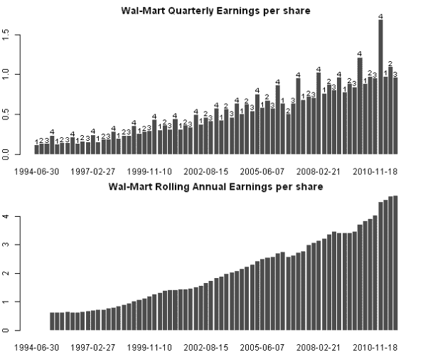
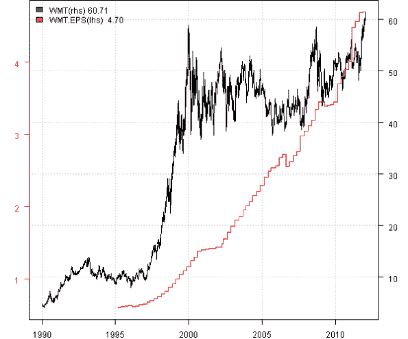
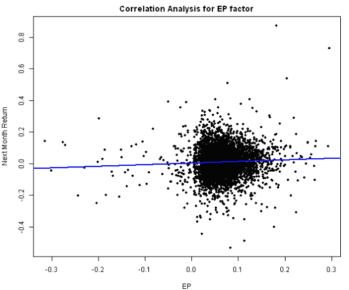

<!--yml
category: 未分类
date: 2024-05-18 14:42:48
-->

# Multiple Factor Model – Fundamental Data | Systematic Investor

> 来源：[https://systematicinvestor.wordpress.com/2012/01/29/multiple-factor-model-fundamental-data/#0001-01-01](https://systematicinvestor.wordpress.com/2012/01/29/multiple-factor-model-fundamental-data/#0001-01-01)

The [Multiple Factor Model](http://www.investopedia.com/terms/m/multifactor-model.asp) can be used to decompose returns and calculate risk. Following are some examples of the Multiple Factor Models:

The factors in the model are usually created using pricing, fundamental, analyst estimates, and proprietary data. I will only show examples of factors using pricing and fundamental data because these infromation is readily available from Yahoo Fiance and ADVFN.

This is the first post in the series about Multiple Factor Models. In this post I will show how to get company’s Fundamental Data into R, create a simple factor, and run correlation analysis. In the next posts, I will show how to:

*   Build Factors and compute quantiles spreads
*   Backtest Multiple Factor Model
*   Calculate Risk using Multiple Factor Model

I created a [fund.data() function in fundamental.data.r at github](https://github.com/systematicinvestor/SIT/blob/master/R/fundamental.data.r) to download company’s historical Fundamental data from ADVFN. Following code loads historical quarterly fundamental data for [Wal-Mart Stores](http://www.google.com/finance?q=nyse:wmt) and computes rolling annual [Earnings per share (EPS)](http://en.wikipedia.org/wiki/Earnings_per_share) using the [Systematic Investor Toolbox](https://systematicinvestor.wordpress.com/systematic-investor-toolbox/):

```

###############################################################################
# Load Systematic Investor Toolbox (SIT)
# https://systematicinvestor.wordpress.com/systematic-investor-toolbox/
###############################################################################
con = gzcon(url('http://www.systematicportfolio.com/sit.gz', 'rb'))
    source(con)
close(con)

###############################################################################
# determine date when fundamental data is available
# use 'date preliminary data loaded' when available
# otherwise lag 'quarter end date' 2 months for Q1/2/3 and 3 months for Q4
###############################################################################		
date.fund.data <- function(data)
{
	# construct date
	quarter.end.date = as.Date(paste(data['quarter end date',], '/1', sep=''), '%Y/%m/%d')	
	quarterly.indicator = data['quarterly indicator',]
	date.preliminary.data.loaded = as.Date(data['date preliminary data loaded',], '%Y-%m-%d') + 1

	months = seq(quarter.end.date[1], tail(quarter.end.date,1)+365, by='1 month') 
	index = match(quarter.end.date, months)
	quarter.end.date = months[ iif(quarterly.indicator == '4', index+3, index+2) + 1 ] - 1

	fund.date = date.preliminary.data.loaded
		fund.date[is.na(fund.date)] = quarter.end.date[is.na(fund.date)] 

	return(fund.date)
}

	#*****************************************************************
	# Load historical fundamental data
	# http://advfn.com/p.php?pid=financials&symbol=NYSE:WMT&mode=quarterly_reports
	#****************************************************************** 
	Symbol = 'NYSE:WMT'	
	fund = fund.data(Symbol, 80)

	# construct date
	fund.date = date.fund.data(fund)	

	#*****************************************************************
	# Create and Plot Earnings per share
	#****************************************************************** 
	EPS.Q = as.double(fund['Diluted EPS from Total Operations',])
		EPS.Q = as.xts(EPS.Q, fund.date)	
	EPS = runSum(EPS.Q, 4)

	# Plot
	layout(1:2)
	par(mar=c(2,2,2,1))
	x = barplot(EPS.Q, main='Wal-Mart Quarterly Earnings per share', border=NA)
	text(x, EPS.Q, fund['quarterly indicator',], adj=c(0.5,-0.3), cex=0.8, xpd = TRUE)

	barplot(EPS, main='Wal-Mart Rolling Annual Earnings per share', border=NA)

```

[](https://systematicinvestor.wordpress.com/wp-content/uploads/2012/01/plot1-small4.png)

You can see a pronounced seasonality in the Quarterly EPS for Wal-Mart, the Q4 always strong and stands out. The common way to deal with seasonality in the income statement is to use rolling annual sum, i.e. sum last 4 quarters.

Next let’s align Wal-Mart prices and EPS and plot them on the same graph.

```

	#*****************************************************************
	# Load historical data
	#****************************************************************** 
	load.packages('quantmod')
	tickers = 'WMT'

	data <- new.env()
	getSymbols(tickers, src = 'yahoo', from = '1980-01-01', env = data, auto.assign = T)
		for(i in ls(data)) data[[i]] = adjustOHLC(data[[i]], use.Adjusted=T)

	data$WMT = merge(data$WMT, EPS)
		# back fill EPS
		data$WMT$EPS = ifna.prev(coredata(data$WMT$EPS))	

	# Plot
	y = data$WMT['1990::']
	plota(Cl(y), type = 'l', LeftMargin=3)

	plota2Y(y$EPS, type='l', las=1, col='red', col.axis = 'red')

	plota.legend('WMT(rhs),WMT.EPS(lhs)', 'blue,red', list(Cl(y),y$EPS))

```

[](https://systematicinvestor.wordpress.com/wp-content/uploads/2012/01/plot2-small3.png)

Next let’s repeat the above steps for all companies in the Dow Jones index.

```

	#*****************************************************************
	# Load historical data
	#****************************************************************** 
	load.packages('quantmod')		
	tickers = dow.jones.components()

	# get fundamental data
	data.fund <- new.env()
		temp = paste(iif( nchar(tickers) <= 3, 'NYSE:', 'NASDAQ:'), tickers, sep='')
		for(i in 1:len(tickers)) data.fund[[tickers[i]]] = fund.data(temp[i], 80)
	save(data.fund, file='data.fund.Rdata')

	# get pricing data
	data <- new.env()
	getSymbols(tickers, src = 'yahoo', from = '1970-01-01', env = data, auto.assign = T)
		for(i in ls(data)) data[[i]] = adjustOHLC(data[[i]], use.Adjusted=T)	
	save(data, file='data.Rdata')

	#load(file='data.fund.Rdata')
	#load(file='data.Rdata')

	# combine fundamental and pricing data
	for(i in tickers) {
		fund = data.fund[[i]]
		fund.date = date.fund.data(fund)

		EPS.Q = as.double(fund['Diluted EPS from Total Operations',])
			EPS.Q = as.xts(EPS.Q, fund.date)	
		EPS = runSum(EPS.Q, 4)

		data[[i]] = merge(data[[i]], EPS)
	}

	bt.prep(data, align='keep.all', dates='1995::2011')

```

It takes a while to download historical fundamental data for all companies in the Dow Jones index, so I recommend saving your results with save(data.fund, file=’data.fund.Rdata’) command. Later on if you want to run code one more time, just load(file=’data.fund.Rdata’) instead of downloading all data again.

Next let’s create monthly factors. EP factor = (Earnings per share) / Price. VOMO factor = Volume x Momentum.

```

	#*****************************************************************
	# Compute monthly factors
	#****************************************************************** 
	prices = data$prices
		prices = bt.apply.matrix(prices, function(x) ifna.prev(x))

	# create factors
	factors = list()

	# E/P
	EPS = bt.apply(data, function(x) ifna.prev(x[, 'EPS']))
	factors$EP = EPS / prices

	# VOMO - Volume x Momentum
	volume = bt.apply(data, function(x) ifna.prev(Vo(x)))
	factors$VOMO = (prices / mlag(prices,10) - 1) * bt.apply.matrix(volume, runMean, 22) / bt.apply.matrix(volume, runMean, 66)

	# find month ends
	month.ends = endpoints(prices, 'months')

	prices = prices[month.ends,]
	n = ncol(prices)
	nperiods = nrow(prices)

	ret = prices / mlag(prices) - 1
	next.month.ret = mlag(ret, -1)

	factors$EP = factors$EP[month.ends,]	
	factors$VOMO = factors$VOMO[month.ends,]			

```

Next let’s run correlation analysis for EP factor. You can do correlation analysis for VOMO factor as a homework.

```

	#*****************************************************************
	# Correlation Analysis
	#****************************************************************** 
	x = as.vector(factors$EP)
 	y = as.vector(next.month.ret)

 	cor.test(x, y, use = 'complete.obs', method = 'pearson')			

 	# Plot
	par(mar=c(4,4,2,1)) 	 	 	
 	plot(x, y, pch=20, main='Correlation Analysis for EP factor', xlab='EP', ylab='Next Month Return')
 		abline(lm(y ~ x), col='blue', lwd=2)

```

[](https://systematicinvestor.wordpress.com/wp-content/uploads/2012/01/plot3-small3.png)

```

>  cor.test(x, y, use = 'complete.obs', method = 'pearson')
        Pearson's product-moment correlation
data:  x and y
t = 3.6931, df = 5867, p-value = 0.0002235
alternative hypothesis: true correlation is not equal to 0
95 percent confidence interval:
 0.02260247 0.07365350
sample estimates:
       cor
0.04815943

```

The correlation between EP and Next Month Returns is small, but significantly different from zero. The small correlation is not a surprise and is usual for this type of analysis. In the next posts, I will show that even this weak dependence can be profitable.

To view the complete source code for this example, please have a look at the [fm.fund.data.test() function in factor.model.test.r at github](https://github.com/systematicinvestor/SIT/blob/master/R/factor.model.test.r).