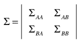
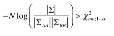

<!--yml
category: 未分类
date: 2024-05-18 15:32:22
-->

# Multivariate Independence Tests | Tr8dr

> 来源：[https://tr8dr.wordpress.com/2010/08/30/multivariate-independence-tests/#0001-01-01](https://tr8dr.wordpress.com/2010/08/30/multivariate-independence-tests/#0001-01-01)

August 30, 2010 · 2:17 pm

Thought I should mention the obvious multivariate independence tests.   These can be used in a 1st pass to trim out the obviously independent variables.   Assume a d-dimensional joint distributions **p(x0, x1, x2, … xd)** as a starting point with sample vector X = { x0, x1, x2, .. xd }.

Let us consider a subdividing of the above **d** dimensional distribution into **n** and **m** dimensional distributions respectively (where d = n+m).  We want to test to see whether the marginal distribution of **n** variables is independent of the distribution of **m** variables.   Our sample vector for the full joint distribution can be expressed as:

X = { {a1,a2, ..an}, {b1,b2,…,bm}}

and we have marginal distributions **p(A)** and **p(B)** each of which is a subset of the dimensions of **p(X)**.   The covariance matrix for **p(X)** looks like:

Intuitively if A and B are independent then Σab should be 0 (well not significantly different from 0).   We set up the null hypothesis H0 to indicate independence.   The wilks’ test rejects independence if:

where N is the number of samples.   This test is valid even for non-elliptical distributions, so is a good 1st line test.   The intuition with the above measure is that the determinant ratio is measuring the volume of the covariance matrix in ratio to the volumes of the non-crossing components of covariance.   If the volume is mostly explained by the non-crossing components, then A and B are independent.