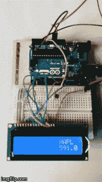

<!--yml
category: 未分类
date: 2024-05-18 14:21:30
-->

# My first stock ticker – Sniper In Mahwah & friends

> 来源：[https://sniperinmahwah.wordpress.com/2014/05/02/my-first-stock-ticker/#0001-01-01](https://sniperinmahwah.wordpress.com/2014/05/02/my-first-stock-ticker/#0001-01-01)

I just built my firsthomemade electronic  stock ticker, with [Arduino](http://arduino.cc). Prices are coming from the Yahoo RSS ticker feeds – but I assume I would need some DMA at some point, I have been told that public feeds are “low frequency” ;)

