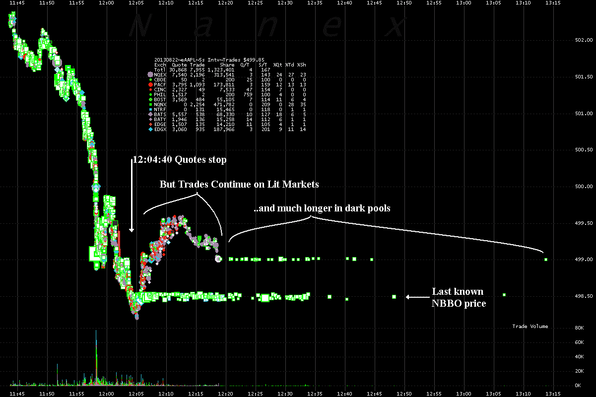

<!--yml
category: 未分类
date: 2024-05-18 14:26:10
-->

# Nasdark – Sniper In Mahwah & friends

> 来源：[https://sniperinmahwah.wordpress.com/2013/08/23/nasdark/#0001-01-01](https://sniperinmahwah.wordpress.com/2013/08/23/nasdark/#0001-01-01)

Il y a un peu plus d’un an, le 1er août 2012, le courtier américain **Knight Capital** faisait quasiment faillite suite à quelques lignes de code mort (probablement un module désactivé ) qui, subitement, revinrent à la vie et causèrent (notamment en achetant au plus haut pour vendre ensuite au plus bas) la perte de plus de 460 millions de dollars en une quarantaine de minutes – un record dans l’histoire des marchés américains. Knight se fit alors renflouer par Goldman Sachs, avant d’être racheté par Getco, qui est (ou était ?) l’un des plus efficaces traders à haute fréquence américain – “était” est sans doute de mise étant donné que Getco a perdu quasiment 80% de son chiffre d’affaires lié aux transactions à hautes fréquences ces derniers mois, et que bon nombre de CV d’employés de Getco arrivent sur les bureaux de sociétés concurrentes, ce qui n’est pas très bon signe…

Même s’il y eut peu d’algorithmes pour respecter quelques millisecondes de silence en l’honneur du décès de Knight Capital, il semblerait, un an après, que l’histoire se soit rejouée mais du côté de **Goldman Sachs**, le 20 août 2013\. La banque a visiblement passé des ordres concernant des options qui n’étaient pas destinés à être réellement exécutés.  Le « problème technique » viendrait probablement du système informatique de la banque (qui a ici un rôle de *market maker*), lequel aurait mal évalué le prix de certains ordres sur trois plateformes différentes – le Nyse, le Chicago Board Options Exchange et le Nasdaq. D’après des gens familiers de Goldman Sachs, ce *bug* coûterait à la banque une centaine de millions de dollars (compte tenu de sa taille, c’est assez peu comparé aux 460 millions perdus par Knight). Le plus surprenant de l’histoire : la Securities and Exchange Commission (SEC) et les trois marchés concernés ont annoncé qu’ils allaient regarder si certains ordres passés par erreur pourraient être annulés. Il y aurait-il deux poids, deux mesures ? Aucun ordre erroné passé par Knight Capital l’année dernière n’a été annulé par les marchés (principalement le Nyse), alors on ne voit pas pourquoi Goldman bénéficierait de quelconques privilèges… C’est d’ailleurs ce qu’a déclaré avant-hier Myron Scholes, le co-inventeur avec Fisher Black de la célèbre formule Black-Scholes (qui permet de calculer le prix d’une option en fonction du prix du sous-jacent), en affirmant que si un opérateur de marché se trompe lors de transactions liées à des options, alors la faute lui incombe et il n’y a aucune raison d’annuler des ordres…

Les déboires de Knight Capital comme ceux de Goldman Sachs sont des symptômes de ce que sont devenus les marchés américains – des plateformes électroniques interconnectés qui rendent compliqué le passage des ordres étant donné les temps de latence nécessaires pour que l’information arrive et reparte d’une plateforme à une autre. **La panne générale du Nasdaq** hier, jeudi 22 août 2013 (la plateforme électronique historique a été incapable de fonctionner pendant trois heures, ce qui est particulièrement long) est un autre symptôme de cette complexité des marchés, une conséquence directe de Regulation National Market System (ou Reg NMS), décidé par la SEC en 2005 et mis en place en 2007\. Rappelons, pour faire court, que depuis 2007 et Reg NMS, il y a aux Etats-Unis 13 marchés officiels (Nyse, Nyse Arca, Nasdaq, Bats, Direct Edge EDGX et EDGA, etc.) et une cinquantaine de « plateformes alternatives », ou *alternative trading systems*, qui regroupent notamment les *dark pools* (où les transactions se font de manière complètement anonymes, sans informations sur les cotations) et les internalisateurs (des “marchés” internes qui appartiennent par exemple à une banque, laquelle fait correspondre en interne ordres d’achats et ordres de ventes de ses clients sans disséminer de cotations à l’extérieur de cette plateforme interne).

Ce qui s’est passé au Nasdaq hier est particulièrement intéressant en terme de « structure de marché » et quant à certaines obligations qu’ont les marchés américains. Certaines règles de Reg NMS (Rule 610 notamment, dite “Access Rule”) obligent une plateforme à faire passer l’ordre de l’un de ses clients sur une autre plateforme au cas où le prix d’un titre serait plus intéressant sur cette autre plateforme. Cette règle permet (logiquement) à un investisseur d’obtenir le meilleur prix pour un ordre passé, et ce quelle que soit la plateforme initiale où cet ordre a été passé. Tout aussi logiquement, afin qu’un marché soit informé des prix des autres plateformes, Reg NMS a mis en place le NBBO, soit National Best Bid and Offer, qui répertorie le prix de tous les titres négociés sur l’ensemble des 13 plateformes américaines (notons au passage que le NBBO n’existe qu’aux Etats-Unis, les régulations décidées par Mifid en Europe – qui est plus ou moins l’équivalent européen de Reg NMS – n’ayant pas envisagé un tel système de regroupement de l’information pour les marchés européens).

Techniquement, pour le Nasdaq comme pour le Nyse, cette dissémination des prix du NBBO passe par les Security Information Processors (SIP), qui récupèrent les données concernant les prix avant d’envoyer des prix consolidés au NBBO. Le SIP du Nasdaq s’intitule UTP Quote Data Feed (UQDF), et il semblerait que la panne du marché électronique d’hier vienne d’un problème technique concernant ce UQDF : c’est parce que l’UQDF était incapable  d’envoyer les données des cotations en cours sur le Nasdaq (ces données sont regroupées dans la “Tape C”) au NBBO que le marché électronique fut, à 12h18 (heure locale), obligé de suspendre ses activités, ce qui se comprend aisément : le Nasdaq étant l’un des plus gros marchés américains en terme de volumes, si les autres plateformes ne savent plus ce qui s’y passe, l’archipel tout entier des marchés électroniques se grippe, sans parler des conséquences pour certaines grosses compagnies cotées au Nasdaq (on pense à Apple) ou à la mise à jour des index Dow ou S&P500\. On comprend également pourquoi Nyse Arca, à la demande du Nasdaq, a cessé de traiter sur sa propre plateforme les titres cotés au Nasdaq (les ordres passés au Nyse ont été annulé par le marché), tout cela entraînant logiquement une cascade de dysfonctionnement ici et là (en conséquence, les plateformes de BATS eurent elles-mêmes des problèmes de liaisons avec Nyse Arca).

Cette panne historique du Nasdaq (probablement la plus longue de l’histoire du marché électronique) est intéressante en ce qu’elle montre bien que le fonctionnement de l’archipel des plateformes électroniques dépend de technologies où le moindre *bug* d’un seul marché peut avoir des conséquences importantes pour l’ensemble des plateformes électroniques. Pour une fois, les transactions à haute fréquence n’ont rien à voir avec cette panne : tout vient de la fragmentation complexe des marchés américains, une complexité que Reg NMS a accentué. Dans le même temps, cette panne tombe à pic pour la SEC puisque le régulateur américain est en train de plancher sur une nouvelle série de règles : après Reg ATS et Reg NMS, la SEC travaille à Reg SCI (pour Regulation Systems Compliance and Integrity), qui est censé mettre un peu d’ordre dans cette complexité technologique sans nom de plus en plus dénoncée par certains opérateurs de marchés. Les consultations engagées par la SEC pour rédiger Reg SCI se sont terminées début juillet 2013, les premières propositions devant tomber d’ici la fin de l’année (en espérant que, cette fois, ces nouvelles règles ne compliquent pas de nouveau le fonctionnement des marchés). Notons au passage que Reg SCI a été mis en route suite aux divers *bugs* qu’ont connu les marchés en 2012 (les IPO ratées de Bats Global et de Facebook, le Knightmare du 1er août 2012, etc.).

Si certains ont pu s’étonner du fait que le Nasdaq a pris trois bonnes heures pour se remettre en route, il faut toutefois souligner que le problème lié à SIP a été réglé en une demie-heure seulement mais que le Nasdaq a préféré ne pas rouvrir aussitôt. Le marché électronique a eu raison de faire montre de prudence et d’organiser sa remise en route avec les autres plateformes, contrairement à ce qu’il avait fait lors de l’introduction en Bourse de Facebook l’année dernière, où le Nasdaq avait connu des problèmes techniques dès l’ouverture du marché (deux millisecondes supplémentaires de temps de calcul du prix d’ouverture avait créé une grande pagaille) et pensait les avoir corrigé rapidement alors que ce ne fut pas le cas. Le fait que le Nasdaq ait prit le temps nécessaire, hier, pour réouvrir, montre que certaines leçons ont été retenues… Heureusement pour le Nasdaq que ce *bug* est survenu en plein mois d’août, dans une période d’activité assez calme ; si la panne était arrivée, mettons, en septembre, en une journée très volatile, les conséquences auraient été tout autres.

Reste que les problèmes techniques du Nasdaq, liés à SIP et au NBBO, mettent une nouvelle fois en lumière le fonctionnement, disons, parfois peu efficace du NBBO. Un des problèmes du NBBO est la vitesse à laquelle les informations sur les prix sont calculées puis disséminées vers les différentes plateformes, dans un écosystème où chaque milliseconde compte. Certains ont montré que ce NBBO pouvait parfois être complètement ignoré par les marchés, qui calculent alors eux-même les meilleurs prix (voir cette page de [Nanex](http://www.nanex.net/Research/IsNBBOIgnored.html "NBBO ignored ?") par exemple) ; d’autres, comme cet article de juillet 2013 de [Ding, Hanna et Hendershott](http://faculty.haas.berkeley.edu/hender/NBBO.pdf), montrent que la mise à jour du NBBO se fait parfois avec une ou deux millisecondes de retard par rapport aux données consolidées venant des marchés eux-mêmes, ce qui doit permettre à certaines traders à haute fréquence de faire de l’arbitrage (quelque part, de loin, cela rappelle un peu les problèmes de DOT lors du Black Monday du 19 octobre 1987). Sans même évoquer le fait que les transactions venant des *dark pools*, qui peuvent faire bouger les prix des cotations des marchés éclairés (Nasdaq et consorts), bénéficient d’un délai de 90 secondes maximum (une éternité !) pour sortir de l’obscurité… Une question s’impose, donc, en conclusion : étant donné que le NBBO est soit ignoré, soit en retard d’une ou deux millisecondes par rapport aux données consolidées des marchés, est-ce qu’il vaut le coup pour un marché comme le Nasdaq de disparaître pendant trois heures pour régler un problème lié à un système déficient ?

**Mise à jour 1 (23/08/2013, 13h20)**

Il semblerait qu’une partie de la panne ayant mené le Nasdaq à disparaître hier viendrait d’un problème de connexion entre  le Nasdaq et Nyse Arca, même si le Nasdaq ne désigne pas (dans cet article du [Wall Street Journal](http://online.wsj.com/article/SB10001424127887324619504579029602557987812.html#printMode)) nommément Nyse Arca mais un “exchange participant” – une manière de rejeter la faute sur un tiers ? Affaire à suivre, Nanex est à l’heure actuelle en train d’enquêter sur l’affaire…

**Mise à jour 2 (23/08/2013, 17h34)**

Le PDG du Nasdaq, Robert Greifeld, a donné une rapide interview à CNBC en début de journée à propos de la fermeture du marché hier : [Robert Greifeld, Nasdaq CEO, on CNBC](http://video.cnbc.com/gallery/?video=3000193392)

Greifeld explique que si le Nasdaq a décidé de fermer ses portes car il était incapable de mettre à jour le NBBO, c’est parce que certains opérateurs de marchés (nommément, des *hedge funds*) avaient un accès direct aux prix de toutes les plateformes, alors que les investisseurs disons “traditionnels” (au long terme) n’avaient plus accès à ces informations puisque le NBBO n’était plus mis mis à jour. *Fair enough*… mais cela n’explique pas pourquoi le Nasdaq a mis autant de temps à publier un communiqué faisant état du dysfonctionnement du SIP (la publication tardive de ce communiqué ayant sans doute permis aux *hedge funds* de faire des affaires sur le dos d’opérateurs moins informés).

Par ailleurs, [Nanex](http://www.nanex.net/aqck2/4396.html) vient de mettre en ligne quelques graphiques à la panne du Nasdaq, dont celui-ci :

Constatation intéressante : alors que les cotations d’Apple  ont cessé, des transactions ont eu lieu, malgré tout, pendant une quinzaine de minutes (Nanex pose alors la bonne question : comment est-il possible de réaliser des transactions sans cotations ? *That is the point…*). Tout aussi intéressant est la manière dont les *dark pools* ont réagi à l’absence d’informations en provenance du NBBO : 1) non seulement les transactions au sein des *dark pools* se sont poursuivies bien après que les marchés éclairés aient arrêté d’acheter ou de vendre  Apple, mais 2) comme le montre ce graphique, le titre Apple a été traité dans les *dark pools* avec deux prix différents (la ligne de carrés verts du dessous montre que des transactions ont eu lieu dans les *dark pools* à un prix correspondant à celui du dernier prix envoyé par le NBBO, alors que le ligne du dessus montre que des transactions ont eu lieu en fonction du prix le plus récent auquel l’action Apple était négocié, ce qui est tout de même plus logique). La conclusion est simple : à ce moment-là, un investisseur n’était pas du tout certain de vendre ou d’acheter un titre Apple au meilleur prix…

Enfin, Themis a publié un [billet](http://blog.themistrading.com/the-real-story-of-why-nasdaq-halted-trading-yesterday/) fort intéressant sur la panne du Nasdaq et pointe du doigt plusieurs points problématiques, notamment le fait qu’il est anormal que cela soit un marché *for profit* (ici le Nasdaq, lequel doit réaliser des profits pour ses investisseurs comme toute société cotée en Bourse) qui, parallèlement à ses activités, gère SIP et donc, en partie le NBBO. « *Doesn’t the SEC see a potential problem by having a for profit exchange run the SIP? Isn’t there an inherent conflict of interest here?* ». Le conflit d’intérêt est évident, et remet sur le devant de la scène le fait que les marchés, autrefois mutualisés, sont devenus des entreprises comme les autres. Mais malheureusement, il est trop tard pour revenir en arrière…

**Mise à jour 3 (23/08/2013, 17h47)**

Nanex vient [de mettre en ligne](http://www.nanex.net/aqck2/4397.html) quelques graphiques montrant les conséquences de la disparition du Nasdaq sur les cotations de 8 000 titres au sein des plateformes américaines. Le cinquième graphique (nombre de cotations / nombre de transactions) est une belle visualisation de ce que sont les ~~transactions~~ pardon, cotations à hautes fréquences.

**Mise à jour 4 (23/08/2013, 20h10)**

Ce vendredi 23 août est une journée bien mouvementée. Les conséquences de la panne du Nasdaq continuent à être discutées, comme [ici](http://www.bloomberg.com/video/narang-lauer-discuss-nasdaq-s-trading-halt-tcwy7DuTQlq~t2NKxzS1zw.html) sur CBNC, lors d’un bref débat entre Manoj Narang, le patron de Tradeworx ardent défenseur des transactions à hautes fréquences (dont je parle [ici](https://sniperinmahwah.wordpress.com/2013/04/21/tradetech-1-ca-chauffe-a-haute-frequence/) à l’occasion du dernier TradeTech européen), et Dave Lauer qui, revenu de chez Citadel, a un discours offensif contre les abus des traders à hautes fréquences et la structure actuelle des marchés financiers américains. Au-delà de l’affaire du Nasdaq, il est intéressant de constater que l’un comme l’autre sont d’accord sur le fait que SIP et le NBBO ne fonctionnent pas bien (on ne s’étonnera pas que Narang trouve le NBBO « trop lent ») , ce qui pousse certains opérateurs à acheter les données directement aux plateformes plutôt que de prendre en compte le NBBO… Message envoyé à la SEC et à Reg SCI.

Autre nouvelle particulièrement intéressante : Bats Global Market, qui contrôle les plateformes Bats-Y et BatX aux Etats-Unis ainsi que Chi-X en Europe (entre autres), a entamé des discussions avec Direct Edge, qui contrôle les plateformes EDGE-A et EDGE-X. D’après le Wall Street Journal qui [relate](http://online.wsj.com/article/SB10001424127887324619504579030893759719248.html?mod=WSJ_hpp_LEFTTopStories) l’affaire, la fusion de ces plateformes en ferait un concurrent direct du Nyse, soit le deuxième marché américain derrière le marché historique. Je reviendrai plus tard sur cette fusion, particulièrement instructive car elle permet de faire un retour sur les origines des plateformes de trading contemporaines, notamment du côté de Tradebot…

*Last but not least*, le Nasdaq a fini par publier ce [communiqué](http://www.nasdaqtrader.com/TraderNews.aspx?id=uva2013-9) à propos de son dysfonctionnement. *No comment*, si ce n’est le fait qu’il aura fallu 1h25mn pour “reconnecter” les marchés entre eux et redémarrer la machine, un point qui reste à explorer. *Attention must be paid*.

**Mise à jour 5 (23/08/2013, 21h00)**

Cette journée est particulièrement vivifiante . Alors que Josh Levine, le créateur d’Island (une plateforme électronique pionnière dont je parle dans [6](http://www.zones-sensibles.org/index.php?mod=auteurs&a=06), qui a façonné l’archipel des marchés électroniques d’aujourd’hui), demeurait silencieux depuis bien longtemps, il vient de livrer quelques commentaires à propos de SIP et de la disparition du Nasdaq hier. Je reviendrai plus tard sur cette réapparition de Josh Levine, notons simplement que les propos du créateur d’Island (laquelle plateforme finit indirectement par être rachetée par le Nasdaq), à la fin de cet [article](http://www.bloomberg.com/news/2013-08-23/island-inventor-levine-says-backups-not-enough-in-stocks.html) de Bloomberg, confirment bel et bien les idées égalitaires (voire libertariennes) et financièrement désintéressées qui avaient cours dans les sous-sols de Datek au début des années 1990\. Que Josh Levine ait proposé de concevoir (gratuitement qui plus est) un SIP efficace et accessible à tout le monde va de pair avec la manière dont Island a été conçu. Lorsque Levine affirme qu’à l’époque “*my ultimate hope [was] that the SIP would effectively disappear”,* il touche là où cela fait mal, avec justesse : si le modèle tracé par Island en 1996 avait survécu aux hautes fréquences, le NBBO n’aurait même pas lieu d’exister – à quelques millisecondes près…