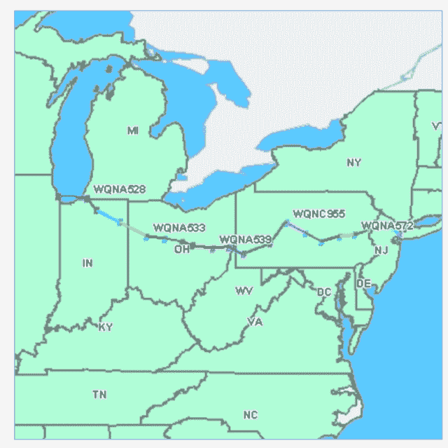
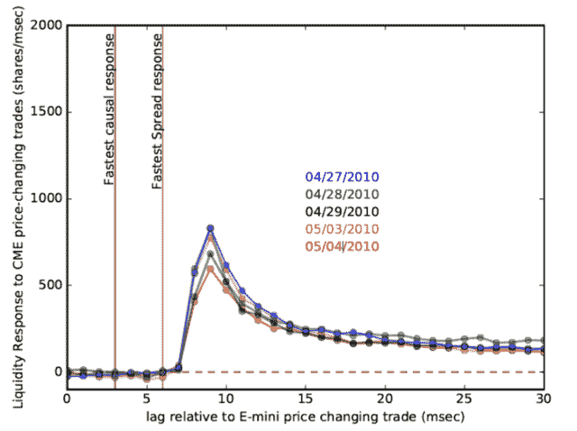

<!--yml
category: 未分类
date: 2024-05-18 14:08:41
-->

# Network Effects | Part II – Sniper In Mahwah & friends

> 来源：[https://sniperinmahwah.wordpress.com/2017/06/26/network-effects-part-ii/#0001-01-01](https://sniperinmahwah.wordpress.com/2017/06/26/network-effects-part-ii/#0001-01-01)

The nondisclosure agreements have lapsed. The Chicago to New Jersey microwave arms race has converged to a few winners. Many of the early participants must now be eying the runaway success (and the glaring shortcomings) of a certain HFT-associated [bestseller](https://en.wikipedia.org/wiki/Flash_Boys), and thinking,  yeah, “*I could do that.”*

It’s a fantastic story, after all, and it hasn’t really been told yet. It seems like there are two basic approaches. You could write a cinema-ready page-turner heavy on the skulduggery. Antennas knocked out of alignment the night before the jobs number. Unlicensed broadcasting on cognitive radio. Itinerant con men peddling futures on networks that will never exist. Or you could try to write a book with longer-term importance that draws the details within the larger context and paradoxes of the modern-day United States.

*

A colleague in the tech industry was recently recalling his first encounters with the *real* Flash Boys.

“It was some time in the summer of 2010 when the calls started coming in,” he said, “It came on suddenly, and then it ramped up. Fast. All through the fall and then into 2011\. They’d come on site, and it was clear they weren’t your traditional telecom guys. They were a lot younger, for one. Sandals, cargo shorts, T-shirts. They flat-out refused to say what it was they were actually doing.

“They talked gain margins, modulation, propagation physics, *et cetera*, but in an oddly theoretical way. It was as if they’d just stayed up late mastering a textbook. Every single one of them wanted to know about regeneration latency. Up to then I’d never given any consideration to internal latencies. Normally, on the digital signal processing side, you’re interested in error correction, and doing it absolutely as well as you can. Extra microseconds had never mattered, period.

“They weren’t staying at the Super Eight. They’d limo out, keep the limo waiting all day. Once, I said to one of them, ‘Hey, let me give you a lift back to the airport.’ Turned out he wasn’t flying commercial. I dropped him off at general aviation. I saw that a G4 was waiting on the tarmac.”

*

In early 2011, I attended an event, known as a research “Jamboree” where everyone – that is, the large collection of physicists working in the building – stands up in rapid succession and gives a one-minute talk while showing pre-loaded PowerPoint slides. Having already given several of these talks, I knew that my previous *modus operandi*, which had consisted of earnestly trying to explain too much research, and then getting unceremoniously cut off, [Gong Show](https://en.wikipedia.org/wiki/The_Gong_Show) style, was completely ineffective.

When my minute came up, I went up to the podium. My slide was a screenshot of a maze of numbers; an asof joined [kdb](https://en.wikipedia.org/wiki/Kdb%2B)+ table of equity quotes – sample data that I had been using while learning the terse [Q](https://en.wikipedia.org/wiki/Q_(programming_language_from_Kx_Systems)) language.

The one-minute timer started. I looked at the audience, keeping my expression entirely blank. Five, six, seven seconds ticked by awkwardly.

“One minute isn’t very much time,” I said, finally, breaking the silence, “but it’s an eternity in the highly secretive, highly profitable world of high-frequency trading.”

I pointed to the numbers on the slide. “This is a time series of offers to buy and sell shares of stock. What’s completely amazing is that the data structure holding these ticks has a *nanosecond* field. Every one of the 23,400 seconds in the trading day is now potentially divisible into a billion individual increments. Kind of staggering when you compare with the fact that Earth is 4.5 billion years old.”

“A decade ago, talking about nanosecond stamps on the trade blotter would have been absurd. In the Dot-Com boom, you had day traders flipping shares of Xilinx, and sometimes they even managed consistent profitability. The fastest human reaction times are of order one hundred and fifty million nanoseconds.”

“Speed of light is a foot per nanosecond. Einstein’s theory of special relativity is now an *economic* issue. A few more orders of magnitude decrease in latency, and general relativistic time dilation starts to matter. In the future, to get a competitive interest rate, you’ll need to live deep in a gravitational potential well, and you’ll need to have your bank out in flat space time.”

My minute was up. Everyone was staring at me like I’d arrived from outer space.

“Well, Uh, OK…” the moderator said, “That was something different. Our next speaker is going to tell us about the accretion of gas onto galaxies at [redshift](https://en.wikipedia.org/wiki/Redshift) Z=2.”

*

 The next day, I ran into a colleague, I’ll call him Tim, in the hallway, “Were you serious?” he asked.

“More or less,” I said, “General Relativity – gravitational time dilation – that’s for sure playing no role in the market right now, but special relativity is relevant in the sense that the distinction between timelike and spacelike events definitely matters if you are back-testing a strategy against historical data.”

I told him about the scheme to use a microwave relay to beat Spread’s Network. “Apparently, they spent of order $300M to trench the fiber. Wireless could be more than two orders of magnitude less expensive…”

“I’m in,” he said.

*

Even at 1% the expense of Spread’s fiber, a clandestine wireless relay spanning a third of the continent presents a daunting project. The urgent question at the start of 2011 was whether anyone had gotten there first.

“If it’s being done already, maybe it’s sitting in plain sight. Say they’re using licensed spectrum. The Federal Communications Commission [FCC] might have a searchable database?”

They do indeed. 

The geodesic arc from Chicago to New York never strays far from [41 N](https://en.wikipedia.org/wiki/41st_parallel_north), and the [FCC](https://www.fcc.gov) has made it easy to query for entities that fit specified criteria within a relevant geographic range. A first pass through the filters produced a jumble of familiar and obscure names:

> AB Services LLC
> 
> airBand Communications
> 
> AT&T Corp
> 
> Cellco Partnership
> 
> Clearwise Spectrum Holdings II & III, LLC
> 
> Comprehensive Wireless, LLC
> 
> ECHOSTAR CORPORATION
> 
> FELHC, Inc.
> 
> FiberTower Network Services Corp.
> 
> FiberTower Spectrum Holdings LLC
> 
> Fundamental Broadcasting LLC 
> 
> HISPANIC INFORMATION AND TELECOMMUNICATIONS NETWORK; INC.
> 
> IDT Spectrum; LLC
> 
> MCI Communications Services; Inc
> 
> METROPOLITAN AREA NETWORKS; INC.
> 
> MPX Inc.
> 
> New Cingular Wireless PCS; LLC
> 
> Norfolk Southern Railway Company
> 
> Northrop Grumman Systems Corp.
> 
> Open Range Communications
> 
> Telecom Transport Management; Inc.
> 
> TEXAS EASTERN COMMUNICATIONS INC
> 
> Thought Transmissions LLC
> 
> Towerstream Corp.
> 
> Trex Enterprises Corporation
> 
> Westwood One Radio Networks; Inc.

With the transect list in hand, it was straightforward to step through the firms and plot their antenna locations. A Chicago to New York line-of-sight-relay would presumably be obvious, even at a glance. First on the list was “AB Services”, but the FCC website had suddenly slowed to an infuriating crawl. We waited for nearly a minute. Finally a map appeared on the screen, triggering a mixture of awe and disappointment.

A quick back of the envelope calculation indicated that even with off-the-shelf radio latencies, AB Networks, as licensed in the FCC  database, was *easily* capable of beating Spread’s fiber. Google linked the LLC to Anton Kapela and Alex Pilosov, two gentlemen who, if nothing else, appeared to have a variety of marketable tech skills. A *Wired* [article](https://www.wired.com/2008/08/revealed-the-in/) from 2008 reported on a presentation they’d given at the [DefCon](https://www.defcon.org) hacker conference: 

“…BGP eavesdropping has long been a theoretical weakness, but no one is known to have publicly demonstrated it until Anton ‘Tony’ Kapela, data center and network director at [5Nines Data](http://www.5ninesdata.com/), and Alex Pilosov, CEO of Pilosoft, showed their technique at the recent DefCon hacker conference. The pair successfully intercepted traffic bound for the conference network and redirected it to a system they controlled in New York before routing it back to DefCon in Las Vegas…”

Stepping through the list of licensees indicated that “Comprehensive Wireless”, “Fundamental Broadcasting” and, the creepily named “Thought Transmissions” had, starting a few months after AB’s appearance in September 2010, also licensed a network, using the different LLCs to help mask their intentions. Comprehensive-Fundamental-Thought had set up a more direct route, and if operative, would be even faster than AB’s. 

*

It was clear that an arms race was developing, with an end state winner destined to be a very straight network with very fast radios. To see how far along things were, we needed to look at tick data to discern how fast the information was propagating. Was anyone already up and already front-running Spread?

The Forbes [article](https://www.forbes.com/forbes/2010/0927/outfront-netscape-jim-barksdale-daniel-spivey-wall-street-speed-war.html) suggested that the fiber build was spurred by a trade involving “tiny discrepancies between futures contracts in Chicago and their underlying equities in New York.” Looking through the academic literature, a [paper](https://papers.ssrn.com/sol3/papers.cfm?abstract_id=252304) by Joel Hasbrouck, titled “Intraday Price Formation in U.S. Equity Index Markets” jumped out by virtue of having been cited hundreds of times. The abstract reads:

“The market for U.S. equity indexes presently comprises floor-traded index futures contracts, exchange-traded funds (ETFs), electronically traded, small-denomination futures contracts (E-minis), and sector ETFs that decompose the S&P 500 index into component industry portfolios. This paper empirically investigates price discovery in this environment. For the S&P 500 and Nasdaq-100 indexes, most of the price discovery occurs in the E-mini market. For the S&P 400 MidCap index, price discovery is shared between the regular futures contract and the ETF. The S&P 500 ETF contributes markedly to price discovery in the sector ETFs, but there are only minor effects in the reverse direction.”

So it appeared that we were in familiar territory! We were effectively faced with a particle physics experiment, which was soon diagrammed on a whiteboard: 

E-mini trades in Chicago propagate more than a thousand kilometers, at a substantial fraction of the speed of light, before slamming into data center “detectors” in suburban New Jersey. We could measure the latency by correlating the SPY order book response to E-mini price-changing trades. After obtaining data, sorting out [FIX](https://en.wikipedia.org/wiki/Financial_Information_eXchange) and [ITCH](http://www.nasdaqtrader.com/content/technicalsupport/specifications/dataproducts/NQTVITCHSpecification_5.0.pdf), and building the order book — hassles all – we could see how fast trading was occurring.

To get a baseline, we first sifted data from the period around the end of April 2010 leading up to the Flash Crash. Those were among the now long-gone glory days of HFT. Huge volumes, huge volatility, and no sign whatsoever of anyone trading at a rate that could beat Spread, whose construction crews were racing to bore the tunnels for their fiber through the resistant Precambrian basement of the crystalline Appalachians.

Walking home that night, a Vampire Weekend [song](http://www.azlyrics.com/lyrics/vampireweekend/thekidsdontstandachance.html) that rotated randomly into my earbuds seemed somehow apropos:

*The pin-striped men of morning
Coming forward to dance
Forty million dollars
The kids don’t stand a chance*

*