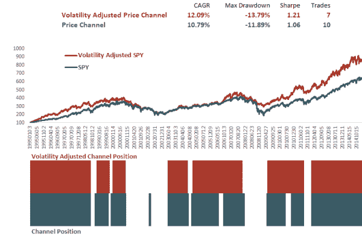
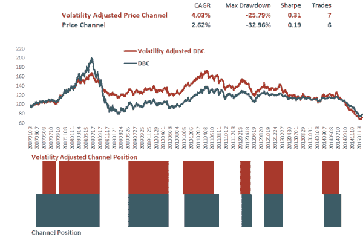

<!--yml
category: 未分类
date: 2024-05-12 17:48:39
-->

# New Channel Concepts: Volatility-Adjusted Time Series | CSSA

> 来源：[https://cssanalytics.wordpress.com/2015/02/12/new-channel-concepts-volatility-adjusted-time-series/#0001-01-01](https://cssanalytics.wordpress.com/2015/02/12/new-channel-concepts-volatility-adjusted-time-series/#0001-01-01)

In the last several posts, I introduced some different methods for channel strategies including [Percentile Channel](https://cssanalytics.wordpress.com/2015/01/21/percentile-channels-a-new-twist-on-a-trend-following-favorite/ "Percentile Channels: A New Twist On a Trend-Following Favorite")s. A simple way to potentially improve (or at least take a different approach) to a donchian channel strategy is to use a different price input to generate trading signals. As stated in [Error-Adjusted Momentum Redux](https://cssanalytics.wordpress.com/2015/02/02/error-adjusted-momentum-redux/ "Error-Adjusted Momentum Redux"), using any type of risk adjustment tends to improve performance by reducing some of the noise. That is easy to apply when using returns, but how do we apply this concept to a price-based strategy? Actually it is quite simple: using a fixed target percentage- say 1%- you multiply all returns since inception by the target divided by some lag of standard deviation. Then you create an index of those returns which becomes the new price series (being careful to avoid any lookahead bias). This volatility-adjusted index is what generates the signals for your channel strategy instead of the traditional price history. Of course in backtesting, you receive returns on the actual price history and not on the volatility-adjusted index. As a final point of clarification, you are not changing your position size as a function of volatility, instead you are just changing the input price.

So lets compare using a traditional 120-day Donchian Channel strategy that buys the S&P500 on new 120-day highs and sells and goes to cash (SHY) on 120-day lows versus the same strategy using a volatility-adjusted time series to generate signals. The lookback is a 20-day standard deviation to adjust daily returns to create the index (with a .75% vol target–note the choice of target doesn’t alter performance just the scale of the index). For this test we use SPY with data from Yahoo, and SHY with data extended from Morningstar. Note that the red line is NOT the equity curve of the strategy, but rather the Volatility-Adjusted Index created using SPY. The performance of the strategy using the index for signals is also highlighted in red:

In this case, performance is improved using the volatility-adjusted index for signals versus the actual SPY price. Here is the same strategy using DBC with the ETF data only (since the choice of extension of DBC can create significant variability in performance):

The strategy shows some promise and generates different signals at certain times than the traditional strategy. Perhaps using different risk metrics such as acceleration or using other filtering techniques may hold even more promise. This same concept can be applied with moving averages or any other time of price-based signal. Just another concept for the diligent researcher to experiment with. Perhaps applying fractals to generate charts may be another useful avenue of exploration.