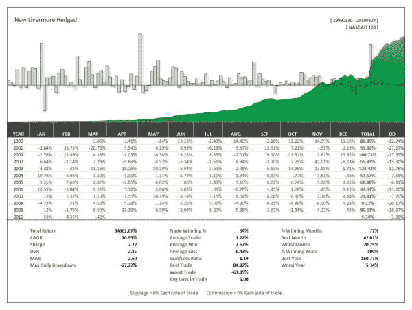

<!--yml
category: 未分类
date: 2024-05-12 18:34:21
-->

# New Livermore Active Issues Index Hedged (Nasdaq 100) | CSSA

> 来源：[https://cssanalytics.wordpress.com/2010/03/11/new-livermore-active-issues-index-hedged-nasdaq-100/#0001-01-01](https://cssanalytics.wordpress.com/2010/03/11/new-livermore-active-issues-index-hedged-nasdaq-100/#0001-01-01)

Following the series of posts on the impact of volume, I decided to integrate this factor into the ranking methodology for the Livermore Active Issues Index. This change produced a significant increase in returns, and also produced arguably better risk-adjusted returns as well. The final index methodology is now even more similar in spirit to what Jesse Livermore would have looked for in the “leading stocks.” Not only are the index constituents a group of high-momentum and smoothly trending stocks, but they also show substantial volume activity relative to other stocks in the Nasdaq. The chart above shows the top 10 ranked stocks in the Nasdaq100  rebalancing with a 5-day holding period. Note that the avg trade statistics are distorted by having to exit and re-enter every 5-days. The turnover was actually much less frequent and the trade gains were higher. These stocks are hedged 100% of the time using the QQQQ throughout the entire backtest. No timing is employed on either the short or longer term time frames. Preliminary testing shows that using the 50 and 200 day moving averages reduced risk for both the individual stocks as well as the hedge position in the QQQQ.