<!--yml
category: 未分类
date: 2024-05-13 00:12:49
-->

# New Semi-Analytic Heston Pricing Algorithms – HPC-QuantLib

> 来源：[https://hpcquantlib.wordpress.com/2017/05/07/newer-semi-analytic-heston-pricing-algorithms/#0001-01-01](https://hpcquantlib.wordpress.com/2017/05/07/newer-semi-analytic-heston-pricing-algorithms/#0001-01-01)

The pricing engines for the Heston model in QuantLib have aged a bit. Meanwhile newer and better algorithms have been developed and discussed in the literature. For a comprehensive review please see [1][2]. Time to refurbish the existing engines.

The Heston model is defined by the following stochastic differential equation of the log spot

The normalized characteristic function in the Gatheral formulation is given by

Andersen and Piterbarg [3] introduced a Black-Scholes control variate to improve the numerical stability of Lewis’s formula (2001) for the price of a vanilla call option

with the Black-Scholes price  of a vanilla call option with volatility  and the characteristic function

Different proposals for the volatility of the vanilla option have been brought up in order to achieve an optimal control variate:

*   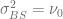
*   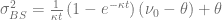
*   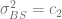 with  the second cumulant of 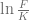 [1].

The diagram below shows the resulting integrand for the different control variate volatilities, the Heston model parameters

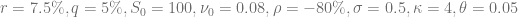

and for a vanilla call option with strike  and maturity 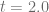.

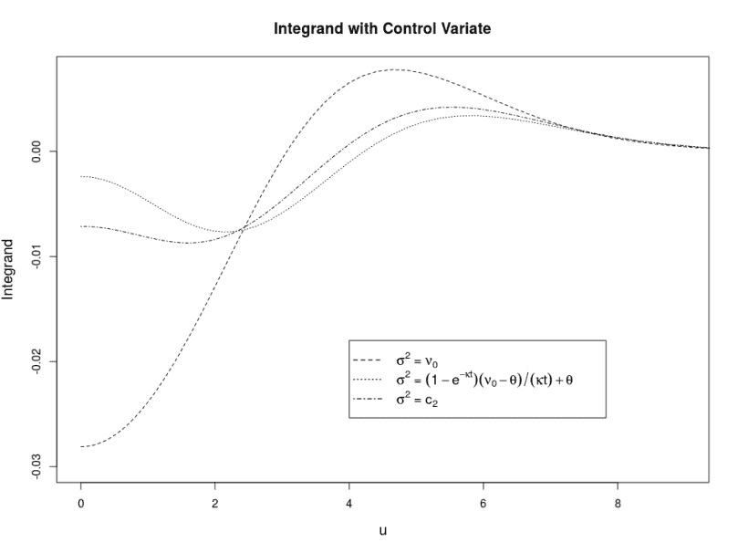

The best choice depends on the Heston- and option parameters but it seems that

is a good option for a large variety of parameters. A direct comparison of the integrand with and without control variate shows how effective the control variate is.

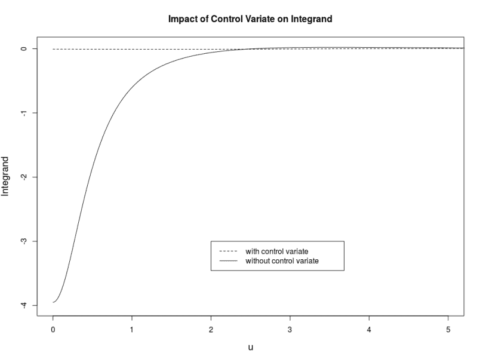

The central trick of Andersen-Piterbarg is now to truncate Lewis’s infinite integral at a finite 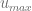 such that the remaining part is smaller than a given threshold based on the following inequation

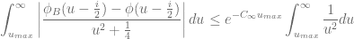

Please see the original paper or [2] for further details on how to get from here to an algorithm for , especially for short dated options.

As Andersen and Piterbarg have pointed out, the simple trapezoidal rule works surprisingly well to carry out the resulting integral if a control variate is used. Alan Lewis’s [test cases](https://forum.wilmott.com/viewtopic.php?f=34&t=90957&hilit=heston#p620396) with high precision Heston reference prices should serve as a test bed here, in particular the call with strike 100\. The Gauss-Laguerre method is very thankful for this particular test case but the point here is that the trapezoidal rule converges much faster than the higher order Simpson rule or the even more complex adaptive Gauss-Lobatto method.

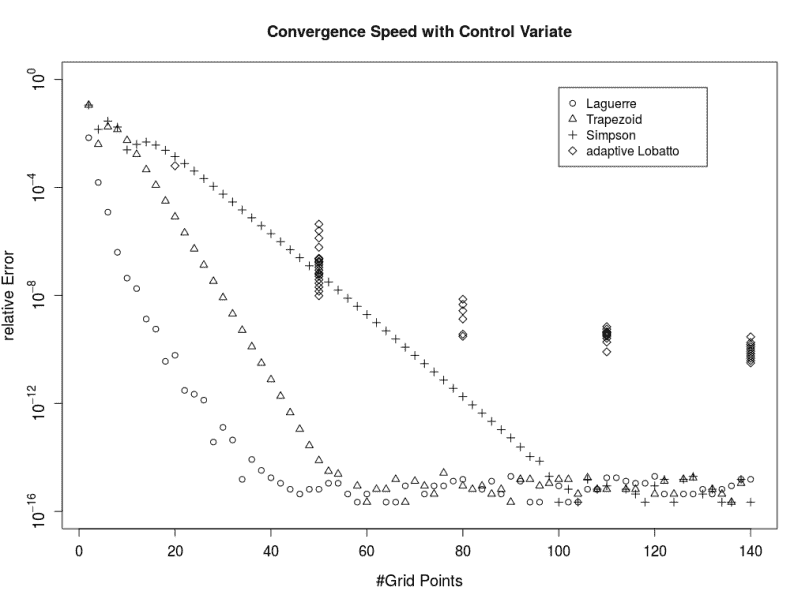

The diagram below compares the recently added COS engine with the Andersen-Piterbarg method using the trapezoid rule for this test-case. The Andersen-Piterbarg method is more accurate for a similar number of points.

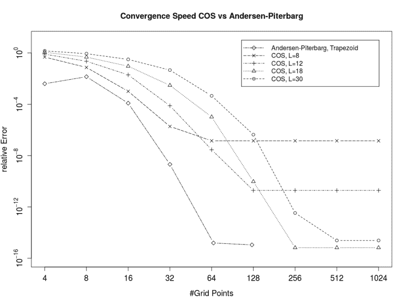

The implementation is part of the pull request [#251](https://github.com/lballabio/QuantLib/pull/251).

[1] M. Schmelzle, [Option Pricing Formulae using Fourier Transform: Theory and Application.](http://pfadintegral.com/docs/Schmelzle2010%20Fourier%20Pricing.pdf)

[2] F. Le Floc’h, [Fourier Integration and Stochastic Volatility Calibration.](https://papers.ssrn.com/sol3/papers.cfm?abstract_id=2362968)

[3] L. Andersen, and V. Piterbarg, 2010,  Interest Rate Modeling, Volume I: Foundations and Vanilla Models,  Atlantic Financial Press London.