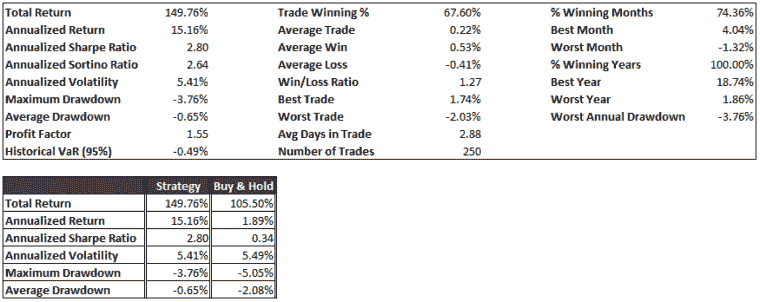

<!--yml
category: 未分类
date: 2024-05-18 14:02:09
-->

# New Strategy Performance Summary – Quantum Financier

> 来源：[https://quantumfinancier.wordpress.com/2010/09/24/new-strategy-performance-summary/#0001-01-01](https://quantumfinancier.wordpress.com/2010/09/24/new-strategy-performance-summary/#0001-01-01)

Last week I said I would change the design of my strategy performance summaries to help compare better around the blogosphere, so here is the first example with it.

This strategy is also to show that sometimes we are so focused on the US securities market that we miss some attractive investment opportunity. As a matter of fact, I am particularly guilty on this one. I usually study the S&P 500 and its futures in my research. However for this one, I turn home to look at an ETF for Canadian Government Bonds (Yahoo ticker: XGB.TO) introduced to me in one of my classes. I tested a simple DV2 strategies using entry/exit at .5 and traded the strategy long and short. The results are below.

The results were impressive for such a simple strategies, the risk vs. return profile is also very good, I usually wouldn’t share a strategies with such good results but since it is so simple I figured why not. However, be careful with this, transaction costs would definitely impact performance. As a closing thought, I encourage you to look for trading ideas in places where you normally wouldn’t as you might be surprised by the results.

Lastly, in the post where I discuss the [new strategy report](https://quantumfinancier.wordpress.com/2010/09/10/improved-key-perfomance-statistics/), Freeman commented and made a valid point:

*QF-For the Sortino Ratio why not set the MAR equal to the benchmark’s historical returns for the period under consideration? It appears unrealistic to set an acceptable %-return at 0 given the opportunity costs associated with trading any strategy. The above suggestion is just one way (albeit a simple one) to consider given the hypothetical alternatives one could have had at the time a strategy was executed.* 

So basically, here is the trade off, we either base the Sortino ratio on the excess return, or simply take the unprocessed return over the downside deviation. Both have their advantages, if we use the excess return, we take into account the opportunity cost of trading the strategy vs. buy and hold the benchmark. If we decide to compute the ratio using the normal return series, we gain the opportunity to put it in perspective with the Sharpe ratio as currently computed (Rf = 0%). We would basically get the Sharpe ratio computed only with the downside deviation (ie. no penalty for upside volatility). Alternatively, I could compute both measures with the excess return series. I would like reader feedback on this, so if you would just let me know in the comment section what you would prefer for the ratios and also what you think of the new performance summary as a whole, it would help me make it better for you!

QF