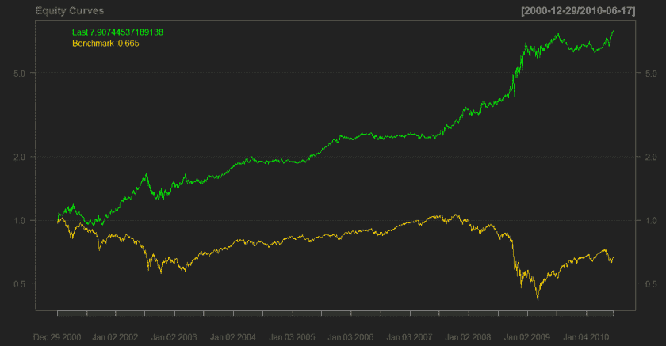
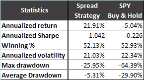

<!--yml
category: 未分类
date: 2024-05-18 14:04:05
-->

# Normalized Price Spread Strategy – Quantum Financier

> 来源：[https://quantumfinancier.wordpress.com/2010/06/17/normalized-price-spread-strategy/#0001-01-01](https://quantumfinancier.wordpress.com/2010/06/17/normalized-price-spread-strategy/#0001-01-01)

Here is a quick idea I had the other day. I was reading about statistical arbitrage and pair trading and as some of you may know, the notion of spread is quite central in the domain. The idea behind pair trading is somewhat simple; find assets exhibiting similar behavior, then when the spread depart from the mean bet on the subsequent return to normal. Simple, elegant and based on sheer intuition, everything I like in a trading concept.

I looked at ways to incorporate the concept in a simple system. This strategy looks at the normalized spread (difference) between the closing price and a short-term moving average (for this example 3 days). In other words, I use the percentrank function on the difference between the last closing price and the 3 day moving average of a single asset. Enter long if < 50th percentile, short otherwise. The results on SPY since 2000 are presented below.

Conceptually this makes a lot of sense. If the recent price exhibit strong relative strength we expect it to return to normal, the opposite holds true for weak relative strength. Normalizing the spread give use an indication of the degree to which the recent price departs from the past couple days and from there we can expect a given degree of reversion to the mean. If the price becomes “stretched” I would be more confident than if the price was range bound around the mean. That being said, this idea has nothing genius about it; it is yet another relative strength strategy and is very similar to the well known z-score. However, I like that by using the percentile we do not have to assume any distribution thus relaxing the need for normality in the data. It also facilitates the creation of a confidence based bet scheme or a [“dimmer approach” à la MarketSci](http://marketsci.wordpress.com/2010/05/12/tweaking-the-sector-rotation-strategy-part-2/). Regardless, I think that the concept of spread is a good concept, expect it to come back on the blog as I learn more about it.

QF