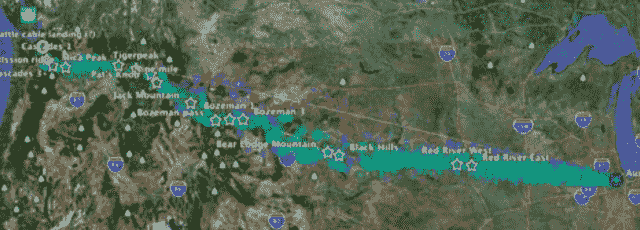
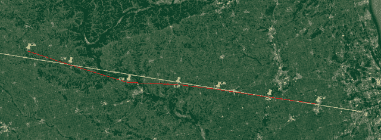
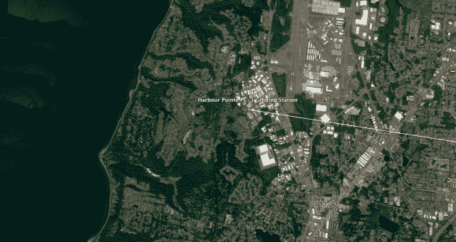

<!--yml
category: 未分类
date: 2024-05-18 14:10:20
-->

# Once Upon a Time in the West – Sniper In Mahwah & friends

> 来源：[https://sniperinmahwah.wordpress.com/2016/09/23/once-upon-a-time-in-the-west/#0001-01-01](https://sniperinmahwah.wordpress.com/2016/09/23/once-upon-a-time-in-the-west/#0001-01-01)

I don‘t really have time to write more posts on this blog now (I have more interesting research to do) but here are some words about “Go West”. Three weeks ago Bloomberg released this [story](http://www.bloomberg.com/news/articles/2016-08-29/traders-said-to-discuss-data-superhighway-from-chicago-to-japan), *Traders Discuss Data Superhighway From Chicago to Japan*, detailing a “project dubbed ‘Go West’ [that] would install a line of microwave towers from the Chicago area to the U.S. west coast, possibly ending near Seattle. Rival high-frequency trading firms are in talks to jointly build a Chicago-to-Japan communications link that would accelerate trading across the Pacific Ocean”. That’s interesting, and probably the first time several “HFT” firms (Virtu, Citadel and Jump are mentioned) join to build a verrrrry long microwave network somewhere (2,800 kilometers). The timing is interesting as in the UK two HFT firms, Vigilant and New Line Networks (aka Jump + KCG), are fighting to build a 300-meter tower in Richborough to save 4-5 microseconds between Frankfurt (the Deutsche Boerse FR4 data center) and Slough (the LD4 data center). In the UK the two firms compete for towers but in the US various companies join friendly.

Beyond the crucial New Jersey-Chicago microwaves [routes](https://www.google.be/url?sa=t&rct=j&q=&esrc=s&source=web&cd=3&ved=0ahUKEwiI9dq8u6XPAhWFCBoKHcxJB8YQFgg2MAI&url=https%3A%2F%2Feconomics.sas.upenn.edu%2Fsystem%2Ffiles%2Fevent_papers%2FLAG_final.pdf&usg=AFQjCNFzUi5zvY31CNRMB-M3oVbgGuTO3g&sig2=v5ByajQFyktD02ddTuYsaQ) I don’t exactly know what is going on in the United States of America (this is too far from my backyard), but I wanted to check out this “Go West”. Since I’m not that familiar with these very long-haul routes, I needed to start somewhere, so I asked help and received a feasibility study made in 2012 by a firm I can’t name, and the study was considering a Chicago to Seattle transcontinental route (what a coincidence ;) in a broader context (the great circle distances between the different world’s exchanges).  

The study said that a microwave link between Chicago and Seattle would cut up 28 milliseconds off of current-best round-trip latencies between Asian market centers and the major trading centers in North America. The famous Hibernia cable was not operating in 2012 but the paper stated that a 10 ms Seattle to Chicago microwave link would allow Tokyo to London communication that is ± equal to the planned Tokyo to London undersea cables. Here are some latencies (remember, it was in 2012):

I was searching where I could find some possible “Go West” paths but the global map (included in the study) of the possible microwave routes between Chicago and Seattle is not that clear:

Luckily, there is this detailed map of the Idaho-Montana border:

So I checked the Federal Communications Commission (FCC) [website](http://fcc.gov) and started to search for licences in this corner of the US – just to see if this “Go West” route was in progress. And I found some licences hold by a firm named “RSN Wireless”: 

And others, on the other side of the route, near Aurora (where the CME data center is living):

Then I put all the RSN Wireless licences…

… on a map (click to enlarge):

Well, that looks like (a partial) “Go West” route between Aurora and Seattle. The last path is going to the Harbour Pointe Cable Landing Station (where the terminal station for the PC-1 cable linking the USA to Japan is):

The route is partial but that’s interesting to note the first licences/paths RSN Wireless asked the FCC is for the Idaho-Montana border, around Tiger Peak and Pat’s Knob. Interesting because the feasibility study of 2012 stated that this area is a critical checkpoint. As you can see on the picture below, the route walks away from the straight line between Chicago and Seattle:

“Locking down these towers may impart a substantial first-mover advantage” said the 2012 study. That seems true as these licences/paths were granted to RWS Wireless in December 2014 (the last ones: August 2016). 

Now, is this really the “Go West” route involving different HFT firms Bloomberg talked about? On the FCC website the RSN Wireless address is “233 S. Wacker Dr., Suite 4300\. Chicago” so I googled “233 S. Wacker Dr., Suite 4300\. Chicago” and…

This is the IMC address! Well. IMC is not mentioned by Bloomberg, so we have two possibilities: 1/ IMC secured this Chicago-Seatle route, so the “Go West” consortium will have to compete with IMC; or 2/ IMC is part of the “Go West” consortium and they are building the route for all the different HFT firms. Now, remember that we just learnt IMC [took stakes](https://sniperinmahwah.wordpress.com/2016/09/01/the-brothers-get-a-taste-of-gouda/) in McKay Brothers, one of the microwave provider leaders. May we assume that McKay is working for IMC (and the others) on “Go West”? I don’t know, and I didn’t ask. But one question remains: where is Gran Turismo?

Happy week-end.