<!--yml
category: 未分类
date: 2024-05-18 13:49:33
-->

# Optimal Equity Monetization: Part 2 | Quantivity

> 来源：[https://quantivity.wordpress.com/2011/07/31/optimal-equity-monetization-part-2/#0001-01-01](https://quantivity.wordpress.com/2011/07/31/optimal-equity-monetization-part-2/#0001-01-01)

The previous post [Optimal Equity Monetization](https://quantivity.wordpress.com/2011/07/30/optimal-equity-monetization) introduced a mathematical model for optimizing equity monetization. In this follow-up post, we consider several solutions to that model under naïve assumptions about the dynamics of 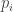.

Begin by making the (unrealistic) assumption that the distribution of values for  is both known and deterministic. Given that, consider two scenarios for  dynamics that admit simple analytic solutions: monotonic first differences and flat. Collar overlays are considered for non-zero vesting. These solutions are notable as they hold true irrespective of the relative value of .

**Monotonic First Differences**

Consider when all first differences of p are either monotonically increasing or monotonically decreasing; in other words:

   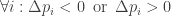

where:

   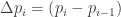

In other words, the price of the underlying is either increasing or decreasing consistently *every* period.

For monotonically decreasing 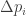, the solution is selling shares immediately as they vest:

   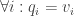

If there is no vesting, then the solution simplifies to selling all shares in the first period:

   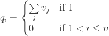

For monotonically increasing , the solution is to hold as long as possible and sell in the final period:

   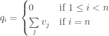

Sadly, this scenario is rarely reality. Yet, from these two scenarios we can consider more realistic generalizations.

**Collared**

Consider again when  is monotonically decreasing with *non-zero* vesting. As exemplified by the zero vesting case, the optimal is selling all shares in the first period. Yet, non-zero vesting results in the inequity constraint for 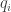 (see [Optimal Equity Monetization](https://quantivity.wordpress.com/2011/07/30/optimal-equity-monetization) for more details), and thus the inability to sell all shares in the first period. An obvious question to ask is how to relax this constraint in the presence of vesting.

As selling unvested shares is obviously not possible, use of options is a natural choice to replicate the equivalent cash flows. Specifically, one or more [collars](http://en.wikipedia.org/wiki/Collar_%28finance%29). Theoretical optimal solution matches cash flow: pairs each vesting period with a matching-expiry collar with equal size. For example, 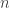 collars would be required to match  months of vesting: expiry of collar 1 equal to period 1, expiry of collar 2 equal to period 2, *etc*.

A more simple alternative option strategy is to open a single collar with size equal to  during the first period, then decrease exposure each period by closing part of the collar. Size of the exposure decrease is equivalent to 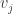 shares in each period 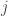 (scaled by the options’ multiplier, obviously). While this more simple approach likely has lower transaction costs, it has [vega](http://en.wikipedia.org/wiki/Greeks_%28finance%29#Vega_.CE.BD) risk (due to option positions being closed prior to expiry). However, given comparatively lower theta decay exposure, cost to enter this position *could* also potentially be lower cost.

In both strategies, [European](http://en.wikipedia.org/wiki/Option_style#American_and_European_options) collars are usually preferred to [Americans](http://en.wikipedia.org/wiki/Option_style#American_and_European_options) for two reasons: eliminate assignment risk (on short call) and reduce cost.

Using this collared approach, the optimal equity monetization model simplifies to:

![\begin{aligned}  \underset{q_i}{\text{max}}  & \sum\limits_i [(q_i \times \gamma) - \hat t (q_i, p_1)] \\  \text{subject to}  & \sum_i{q_i} = \hat q  \end{aligned} ](img/e23100e4d8dad9546e44abf9ec216404.png)

where 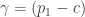, which represents cash flow neutralization of downside risk in the underlying price throughout all periods, and 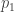 is the price of underlying in period when collar is opened.

The solution is equal to selling shares as they vest, with corresponding offset in collar (either expiring or partially closing):

   

The corresponding profit, reduced by cost of the collar(s) , is:

   ![\pi = \left( \sum\limits_i \left[ (q_i \times \gamma) - \hat t (q_i, p_1) \right] \right) - \rho ](img/d1e02169c70ca568c4797706e52c851d.png)

In other words, this model manifests a classic derivative tradeoff: guaranteed profit cashflow at the expense of a fixed one-time, upfront cost (*i.e.* 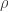).

**Flat**

Price of the underlying trading flat over the entire period is the third simple scenario to consider; in other words:

   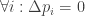

which is equivalent to:

   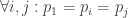

This equality expression is useful as it resembles the above collar approach, in which 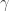 neutralized underlying price exposure (*i.e.* collar and underlying cash flows net to zero). Specifically, when the underlying price is known in advance to trade flat over all periods, the cash flow is equivalent to collaring (without requiring any options). Hence, the optimization model and solution remain the same as collar model:

   

Profit simplifies to the following, by eliminating the collar cost:

   ![\pi = \sum\limits_i \left[ (q_i \times \gamma) - \hat t (q_i, p_1) \right] ](img/c9c11f433f3163946533e803ecc08509.png)

Thus, flat profit is higher compared to collared profit in all cases, except when collar(s) are opened with credit premium (*i.e.* premium is positive, thus being paid to open the collar).