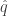
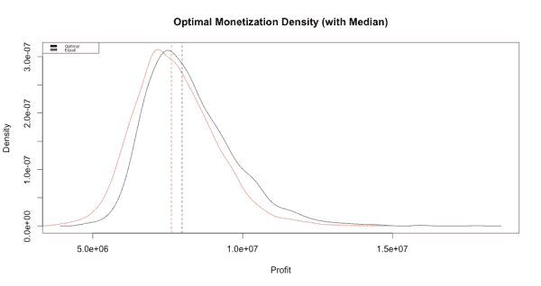
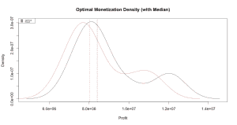
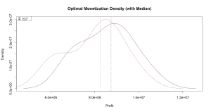
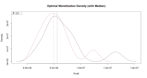
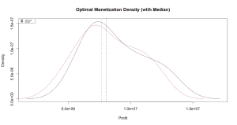
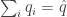
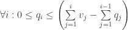
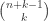
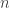

<!--yml
category: 未分类
date: 2024-05-18 13:49:08
-->

# Optimal Equity Monetization: Part 3 | Quantivity

> 来源：[https://quantivity.wordpress.com/2011/08/03/optimal-equity-monetization-part-3/#0001-01-01](https://quantivity.wordpress.com/2011/08/03/optimal-equity-monetization-part-3/#0001-01-01)

The previous post [Optimal Equity Monetization](https://quantivity.wordpress.com/2011/07/30/optimal-equity-monetization) introduced a mathematical model for optimizing equity monetization. In the follow-up post [Optimal Equity Monetization: Part 2](https://quantivity.wordpress.com/2011/07/31/optimal-equity-monetization-part-2), solutions are considered which assume  are deterministic. In this post, real-life is considered by assuming  is a stochastic process.

Despite this topic seeming pedestrian at first glance, it turns out to be unexpectedly beautiful in exemplifying quant techniques spanning finance, ML, and pure math: fitting empirical returns, [monte carlo](http://en.wikipedia.org/wiki/Monte_Carlo_method), [global optimization](http://en.wikipedia.org/wiki/Global_optimization), [integer composition](http://en.wikipedia.org/wiki/Composition_(number_theory)), [MLE](http://en.wikipedia.org/wiki/Maximum_likelihood), genetic randomization, and [portfolio theory](http://en.wikipedia.org/wiki/Portfolio_theory).

The first important question to ask in a model with stochastic future equity prices is *what impact does intelligent (or dumb) choice of quantities  have on monetization profit*. How does perfect foresight predicting all future returns compare with no foresight?

By framing monetization in this context, techniques from portfolio optimization can be borrowed: quantities  are considered longitudinally (over the monetization periods), akin to cross-sectional portfolio weights. Moreover, this perspective suggests an obvious prior on : sell equal-sized quantities in every period. By conceptual analogy, this is the “equal weight portfolio” solution for monetization.

Hence, this post considers *how monetization profit compares for optimal foresight versus equal-quantity*. This matters because it gives insight into whether there is benefit in spending time predicting future returns. This consideration is especially relevant for equity monetization, as it is most interesting for equities with high vol and/or new issues for which prediction is notoriously poor.

To quantify and answer this comparison, monetization profit is calculated via monte carlo of future returns. Analysis begins by looking at asymptotic densities and moments for optimal and equal-weight selling strategies, followed by looking at the corresponding small sample analysis. After results, the analytic and computational methodology is discussed. Finally, R code is provided.

**Asymptotic Results**

Cutting to the chase: the difference in profit between optimal and equal-quantity is *surprisingly small*. About 5%.

The following graph illustrates the densities for optimal and equal-quantity monetization profit for a representative scenario (using a well-known equity, round-number , and 48 periods), evaluated via 2000-iteration monte carlo:

[](https://quantivity.wordpress.com/wp-content/uploads/2011/08/optimal-equal-monetization.png)

In this graph, black is optimal and red is equal-quantity. Profit distributions are similar; equal-quantity has more negative skew, with larger left tail; optimal has more positive skew, with larger right tail. That all makes intuitive sense. Here is the unexpected part: dashed vertical lines are medians of the respective densities (median is preferred to mean due to skew). The difference in median profit between optimal and equal-quantity is less than 5%.

In other words, *perfect foresight about future returns generates no more than 5% greater monetization profit than selling an equal-quantity of shares every period*, when considered *asymptotically* over a large distribution of future scenarios. Thus, there is fairly minimal benefit to spending effort trying to predict the future.

**Small Sample Results**

Asymptotic results are useful, but they ignore an absolutely crucial fact (often overlooked): monetization is an activity that is undertaken *once*, thus looking only at the distribution potentially masks *small sample risk*. Towards this end, small sample dynamics are explored via monte carlo with a small number of iterations.

The following four graphs illustrate representative small sample monetization simulations, each 10 iterations. Worth visually noting is both instability and qualitative differences in distribution shape.

[](https://quantivity.wordpress.com/wp-content/uploads/2011/08/optimal-equal-monetization-small.png)

[](https://quantivity.wordpress.com/wp-content/uploads/2011/08/optimal-equal-monetization-small-2.png)

[](https://quantivity.wordpress.com/wp-content/uploads/2011/08/optimal-equal-monetization-small-3.png)

[](https://quantivity.wordpress.com/wp-content/uploads/2011/08/optimal-equal-monetization-small-4.png)

Of particular interest, and potential concern, is clear evidence of [bimodality](http://en.wikipedia.org/wiki/Bimodal_distribution). One potential explanation is jumps in the returns, induced by a distribution fitted from a very high-vol equity which possesses large tails: a single large jump, either positive or negative, will drive the price (as geometric cumulative) far away from its value in the first period. Thus, converging to two modes: positive jump and negative jump.

Yet, despite this prevalent bimodality, the *asymptotic median difference result also holds true in small samples*: maximum difference in median between optimal and equal is less than 7%. Robustness of this median difference is pleasantly surprising, and suggests this result may matter in practice.

Coming full circle, this analysis informs that even perfect foresight of 4 years of future returns translates into only modestly greater profit. Thus implying there is even less comparative profitability in trying to *predict* the unknown future returns found in real life. Beyond practical benefit, this result also sheds light on results reported in the accounting literature on abnormal 10b5-1 returns (see research by [Jagolinzer](http://leeds-faculty.colorado.edu/alja4277/research.html), for example).

* * *

Discussion of the methodology, math, and R implementation follow for those interested.

**Past and Future Returns Distribution**

Begin by assuming  is a stochastic process. [Geometric Brownian motion](http://en.wikipedia.org/wiki/Geometric_Brownian_motion) makes no sense, given high vol. Instead, assume returns following the univariate [generalized hyperbolic distribution](http://en.wikipedia.org/wiki/Generalised_hyperbolic_distribution), which generalizes the familiar fat-tail distributions ([Student’s *t*](http://en.wikipedia.org/wiki/Student%27s_t-distribution), [Laplace](http://en.wikipedia.org/wiki/Laplace_distribution), and [Variance-gamma](http://en.wikipedia.org/wiki/Variance-gamma_distribution)). Distribution parameters should be fit directly from the observable data, given no *a priori* intuition on suitable values. Thus, in R:

```

fit.NIGuv(returns, opt.pars=c(alpha.bar=FALSE),
          alpha.bar=1, control=list(abstol=1e-8), silent=TRUE)

```

Assuming an unknown stochastic future of returns, one way to compare optimal-vs-equal is to consider a large number  of potential futures via monte carlo sampling; in R:

```

replicate(periods, rghyp(n,fit))

```

For each of these potential futures, monetization profit must be calculated for both optimal and equal quantities and compared. Calculating profit for equal quantity is easy (*i.e.* longitudinal price times quantity, subject to quantity constraints).

**Optimal Profit Optimization**

For optimal quantities, calculating profit requires a bit more effort: all quantities must be chosen to optimize total profit, hence optimization. Given convexity of this problem is not assured, one way to calculate profit is to globally optimize the objective, subject to quantity bounds:

```

lower <- rep(0, periods)
upper <- rep(qHat, periods)
cont <- DEoptim.control(trace=FALSE, itermax=500, initialpop=randomPartitions,
                        NP=as.numeric(nrow(randomPartitions)))
DEoptim(profit, lower, upper, control=cont, prices, qHat, vest, cost)

```

One optimization wrinkle is quantities must satisfy both of the following inequality constraints ([Optimal Equity Monetization](https://quantivity.wordpress.com/2011/07/30/optimal-equity-monetization) for explanation):

   
   

Applying the portfolio optimization methodology from [Ardia *et al*.](http://papers.ssrn.com/sol3/papers.cfm?abstract_id=1584905) to equity monetization, an initial random population is generated satisfying the constraints, which seeds genetic optimization. Given the above first constraint, each population member is an integer composition of the total quantity . Yet, composition cardinality is:

   

Which would generate a massive matrix, given  periods and  fractional partitions. Thus, use of `partitions::compositions()` is out due to memory constraints. Instead, the random population matrix of compositions are built via two-partition [genetic](http://en.wikipedia.org/wiki/Genetic_algorithm) [mutation](http://en.wikipedia.org/wiki/Mutation_%28genetic_algorithm%29) in `randomPartitions()`.

* * *

For those readers familiar with R, the following calculates equity monetization:

```

### Optimal monetization for concentrated equity.

library("tseries")
library("DEoptim")
library("HyperbolicDist")
library("ghyp")
library("partitions")

fitDistribution <- function(returns)
{
  # Fit generalized hyperbolic distribution to univariate series of returns.
  #
  # Args:
  #   returns: series of returns
  #
  # Returns: fit model corresponding

  fit.NIGuv(returns, opt.pars=c(alpha.bar=FALSE),
            alpha.bar=1, control=list(abstol=1e-8), silent=TRUE)
}

sampleDistribution <- function(fit, periods, n=1)
{
  # Sample values from a generialized hyperbolic distribution, previously fit by fitDistribution().
  #
  # Args:
  #   fit: fit previously returned by fitDistribution
  #   periods: number of samples to generate
  #
  # Returns: vector (n=1) or matrix (n > 1) of samples from fit

  replicate(periods, rghyp(n,fit))
}

# optimization function for calculating profit
profit <- function(quantity, prices, qHat, vest, cost)
{
  # Optimization function to calculate profit for a series of quantity and prices, subject 
  # to quantity constraints. This functions negative values, suitable for minimization.
  #
  # Args:
  #   quantity: vector of quantities, aligned with quantity
  #   prices: vector of prices, aligned with quantity
  #   qHat: maximum quantity, which should satisfy invariant sum(quantity) = qHat
  #   vest: vector of number of shares vested per period, aligned with quantity
  #   cost: average cost per share, aligned with quantity
  #
  # Returns: vector of profit per period

  # enforce qHat equality constraint
  if (round(sum(quantity) - qHat) > 0)
  {
    # illegal value, optimizer treat as worse value
    return (Inf)
  }

  p <- quantity %*% (prices - cost)
  return (-p)
}

randomPartitions <- function(qHat, periods, count, warmup=500, skip=100)
{  
  # Generate random partition matrix for quantities with length periods. Using a simple 
  # genetic algo, as integral partitions (via partitions::compositions) generates a 
  # matrix which is way too big for reasonable-sized periods (size is choose(n+k-1,k)).
  # This function also enforces constraints.
  #
  # Args:
  #   qHat: total quantity, which to all rows should sum
  #   periods: number of partitions (equal to number of periods to spread quantity over)
  #   count: number of quantity rows to generate
  #   warmup: number of generic iterations to warmup randomization
  #   skip: number of genetic iterations to skip between samples
  #
  # Returns: random partition

  # start with equal-fraction integer partition
  partition <- round(qHat / periods)
  equal <- rep.int(partition, periods)
  elen <- length(equal)

  # mutation randomizer: choose two entries, increment one and decrement the other
  randomizer <- function(dup)
  {
    sample <- sample.int(elen, 2)
    up <- sample[1]
    down <- sample[2]
    olddup <- dup

    diff <- sample.int(partition,1)
    dup[up] <- dup[up] + diff
    dup[down] <- dup[down] - diff

    # TODO: add vesting constraint

    # try again if constraints are violated
    if (length(which(dup<0)) > 0)
    {
      dup <- (Recall(olddup))
    }

    dup
  }

  # warmup randomization
  for (i in c(1:warmup))
  {
    equal <- randomizer(equal)
  }

  # generate random partitions, skipping skip between samples
  randomPartitions <- matrix(data=NA, nrow=count, ncol=periods)
  skipper <- skip
  i <- 1
  while (i <= count)
  {
    equal <- randomizer(equal)

    if (skipper == 0)
    {
      randomPartitions[i,] <- equal
      skipper <- skip
      i <- i + 1
    }
    else
    {
      skipper <- skipper - 1
    }
  }

  rownames(randomPartitions) <- c(1:nrow(randomPartitions))

  return (randomPartitions)
}

optimizeQuantity <- function(randomPartitions, prices, qHat, periods, vest, cost)
{
  # Generate quantities which maximize profit for monetization given prices, via global 
  # optimization using DEoptim().
  #
  # Args:
  #   randomPartitions: random partition of quantities, previously generated by randomPartitions()
  #   prices: vector of prices, aligned with quantity
  #   qHat: maximum quantity, which should satisfy invariant sum(quantity) = qHat
  #   periods: number of periods to optimize quantities
  #   vest: vector of number of shares vested per period, aligned with quantity
  #   cost: average cost per share, aligned with quantity
  #
  # Returns: vector of quantities optimized to maximize monetization

    lower <- rep(0, periods)
    upper <- rep(qHat, periods)
    cont <- DEoptim.control(trace=FALSE, itermax=500, initialpop=randomPartitions,
                            NP=as.numeric(nrow(randomPartitions)))
    DEoptim(profit, lower, upper, control=cont, prices, qHat, vest, cost)
}

# Monte-Carlo sampling for optimal partition equity monetization (perfect foresight)
optimalEquityMonetization <- function(prices, periods, qHat, vest, cost, mcCount, doPlot=FALSE)
{
  # Calculate profit of optimal equity monetization using monte carlo sampling assuming perfect 
  # foresight from random quantity partitions.
  #
  # Args:
  #   prices: daily prices from equity
  #   periods: number of periods to calculate optimal
  #   qHat: maximum quantity, which should satisfy invariant sum(quantity) = qHat
  #   vest: vector of number of shares vested per period, aligned with quantity
  #   cost: average cost per share, aligned with quantity
  #   mcCount: number of monte carlo iterations
  #   doPlot: flag indicating to plot the monte carlo return series
  #
  # Returns: vector of profits from monte carlo, length equal to mcCount

  message("Fitting and sampling returns distribution\n")
  samples <- sampleDistribution(fitDistribution(returns), periods, mcCount)

  optimalEquityMonetizationWithSamples(prices, periods, qHat, vest, cost, samples, doPlot)
}

optimalEquityMonetizationWithSamples <- function(prices, periods, qHat, vest, cost, samples, doPlot=FALSE)
{
  # Calculate profit of optimal equity monetization using monte carlo sampling assuming perfect 
  # foresight from random quantity partitions.
  #
  # Args:
  #   prices: daily prices from equity
  #   periods: number of periods to calculate optimal
  #   qHat: maximum quantity, which should satisfy invariant sum(quantity) = qHat
  #   vest: vector of number of shares vested per period, aligned with quantity
  #   cost: average cost per share, aligned with quantity
  #   samples: future return samples, over which monte carlo is evaluated
  #   doPlot: flag indicating to plot the monte carlo return series
  #
  # Returns: vector of profits from monte carlo, length equal to mcCount

  returns <- ROC(prices,type="discrete",na.pad=FALSE)
  priceNow <- last(prices)

  message("Building random partitions\n")
  randomPartitions <- randomPartitions(qHat, periods,1000)

  message("Optimizing optimal\n")
  mcCount <- nrow(samples)
  profits <- sapply(c(1:mcCount), function(i) {

    returns <- samples[i,]

    if (doPlot) { plot(cumprod(1+returns),type='l') }

    prices <- as.matrix(coredata(priceNow) * cumprod(1+returns))

    # find quantities which maximize profit
    optim <- optimizeQuantity(randomPartitions, prices, qHat, periods, vest, cost)
    best <- -optim$optim$bestval

    best
  })

  return (as.matrix(profits))
}

equalEquityMonetization <- function(prices, periods, qHat, vest, cost, mcCount, doPlot=FALSE)
{
  # Calculate profit of optimal equity monetization using from monte carlo sampling 
  # assuming equal-size quantity partitions.
  #
  # Args:
  #   prices: daily prices from equity
  #   periods: number of periods to calculate optimal
  #   qHat: maximum quantity, which should satisfy invariant sum(quantity) = qHat
  #   vest: vector of number of shares vested per period, aligned with quantity
  #   cost: average cost per share, aligned with quantity
  #   mcCount: number of monte carlo iterations
  #   doPlot: flag indicating to plot the monte carlo return series
  #
  # Returns: vector of profits from equal monetization, length equal to mcCount

  message("Fitting and sampling returns distribution\n")
  samples <- sampleDistribution(fitDistribution(returns), periods, mcCount)

  equalEquityMonetizationWithSamples(prices, periods, qHat, vest, cost, samples, doPlot)
}

equalEquityMonetizationWithSamples <- function(prices, periods, qHat, vest, cost, samples, doPlot=FALSE)
{
  # Calculate profit of optimal equity monetization using from monte carlo sampling 
  # assuming equal-size quantity partitions.
  #
  # Args:
  #   prices: daily prices from equity
  #   periods: number of periods to calculate optimal
  #   qHat: maximum quantity, which should satisfy invariant sum(quantity) = qHat
  #   vest: vector of number of shares vested per period, aligned with quantity
  #   cost: average cost per share, aligned with quantity
  #   doPlot: flag indicating to plot the monte carlo return series
  #
  # Returns: vector of profits from equal monetization, length equal to mcCount

  returns <- ROC(prices,type="discrete",na.pad=FALSE)
  priceNow <- last(prices)

  message("Optimizing equal\n")
  mcCount <- nrow(samples)
  profits <- sapply(c(1:mcCount), function(i) {

    returns <- samples[i,]

    if (doPlot) { plot(cumprod(1+returns),type='l') }

    prices <- as.matrix(coredata(priceNow) * cumprod(1+returns))

    # calculate profit for equal quantities
    quantity <- rep.int(qHat / periods, periods)
    best <- -profit(quantity, prices, qHat, vest, cost)

    best
  })

  return (as.matrix(profits))
}

analyzeMonetizationFromSymbol <- function(symbol, quoteType, qHat, periods, perShareCost, mcCount=500)
{
  # Plot optimal vs equal equity monetization profits.
  #
  # Args:
  #   symbol: equity symbol which to monetize
  #   quoteType: quote type for equity, such as "AdjClose"
  #   qHat: total quantity of shares to monetize
  #   periods: number of distinct periods over which to monetize
  #   perShareCost: cost to exercise share; zero for RSUs; strike price for ISO/NQs
  #   mcCount: number of monte carlo iterations

  prices <- get.hist.quote(instrument=symbol,quote=quoteType)
  analyzeMonetization(prices, qHat, periods, perShareCost, mcCount)
}

analyzeMonetization <- function(prices, qHat, periods, perShareCost, mcCount=500)
{
  # Generate monte carlo densities of optimal and equal equity monetization profits.
  #
  # Args:
  #   prices: vector of prices to monetize
  #   qHat: total quantity of shares to monetize
  #   periods: number of distinct periods over which to monetize
  #   perShareCost: cost to exercise share; zero for RSUs; strike price for ISO/NQs
  #   mcCount: number of monte carlo iterations
  #
  # Returns: percentage difference in profit between optimal and equal 

  message("Fitting and sampling returns distribution\n")
  samples <- sampleDistribution(fitDistribution(returns), periods, mcCount)

  optimal <- optimalEquityMonetizationWithSamples(prices, 
                                       periods, qHat,rep(qHat/periods,periods), 
                                       rep(perShareCost,periods), samples)

  equal <- equalEquityMonetizationWithSamples(prices, 
                                   periods, qHat, rep(qHat/periods,periods), 
                                   rep(perShareCost,periods), samples)

  plot(density(optimal), main="Optimal Monetization Density (with Median)", xlab="Profit",
       ylim=c(min(density(optimal)$y,density(equal)$y),
              max(density(optimal)$y,density(equal)$y)))
  lines(density(equal), col='red')
  abline(v=median(optimal),lty=2)
  abline(v=median(equal),col='red',lty=2)
  legend("topleft",legend=c("Optimal","Equal"), fill=c('black', 'red'), cex=0.5)

  # calculate difference in first moments of optimal and equal
  medOptimal <- median(optimal)
  medianDiff <- ((medOptimal - median(equal)) / medOptimal)

  meanOptimal <- mean(optimal)
  meanDiff <- ((meanOptimal - mean(equal)) / meanOptimal)

  return (list(medianDiff=medianDiff, meanDiff=meanDiff, optimal=optimal, equal=equal))
}

```