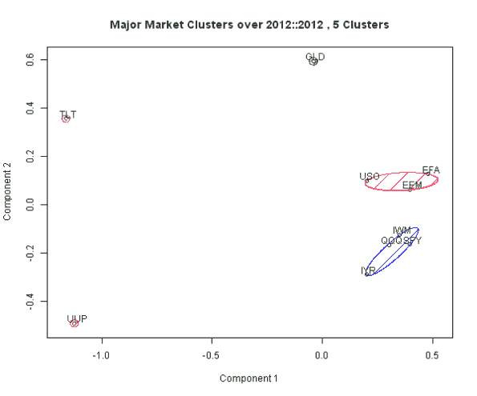
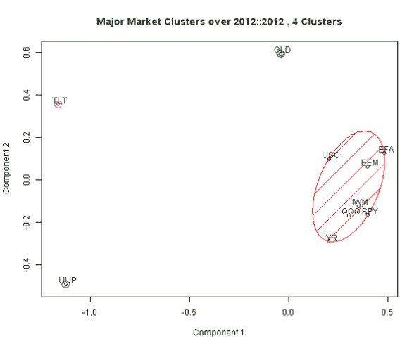

<!--yml
category: 未分类
date: 2024-05-18 14:34:41
-->

# Optimal number of clusters | Systematic Investor

> 来源：[https://systematicinvestor.wordpress.com/2013/01/17/optimal-number-of-clusters/#0001-01-01](https://systematicinvestor.wordpress.com/2013/01/17/optimal-number-of-clusters/#0001-01-01)

In the last post, [Examples of Current Major Market Clusters](https://systematicinvestor.wordpress.com/2013/01/12/examples-of-current-major-market-clusters/), we looked at clustering Major Markets into 4 groups based on their correlations in 2012\. Today, I want to continue with clustering theme and discuss methods of selecting number of clusters.

I will look at the following methods of selecting optimal number of clusters:

*   Minimum number of clusters that explain at least 90% of variance
*   Minimum number of clusters such that correlation among all components in each cluster is at least 40%
*   [Elbow method](http://en.wikipedia.org/wiki/Determining_the_number_of_clusters_in_a_data_set)

Let’s first load historical for the 10 major asset classes

```

###############################################################################
# Load Systematic Investor Toolbox (SIT)
# https://systematicinvestor.wordpress.com/systematic-investor-toolbox/
###############################################################################
setInternet2(TRUE)
con = gzcon(url('http://www.systematicportfolio.com/sit.gz', 'rb'))
    source(con)
close(con)

	#*****************************************************************
	# Load historical data for ETFs
	#****************************************************************** 
	load.packages('quantmod')

	tickers = spl('GLD,UUP,SPY,QQQ,IWM,EEM,EFA,IYR,USO,TLT')

	data <- new.env()
	getSymbols(tickers, src = 'yahoo', from = '1900-01-01', env = data, auto.assign = T)
		for(i in ls(data)) data[[i]] = adjustOHLC(data[[i]], use.Adjusted=T)

	bt.prep(data, align='remove.na')

	#*****************************************************************
	# Create Clusters
	#****************************************************************** 
	# compute returns
	ret = data$prices / mlag(data$prices) - 1
		ret = na.omit(ret)		

	# setup period and method to compute correlations
	dates = '2012::2012'
	method = 'pearson'	# kendall, spearman

	correlation = cor(ret[dates], method = method)    
        dissimilarity = 1 - (correlation)
        distance = as.dist(dissimilarity)

	# get first 2 pricipal componenets
	xy = cmdscale(distance)

```

Next, let’s iterate from 2 clusters to 2/3N clusters (where N is the number of securities) and in each case compute the percentage of variance explained by clusters and minimum correlation among all components in each cluster.

```

    #*****************************************************************
	# Determine number of clusters
	#****************************************************************** 
	n = ncol(data$prices)
		n1 = ceiling(n*2/3)

	# percentage of variance explained by clusters
	p.exp = rep(0,n1)

	# minimum correlation among all components in each cluster	
	min.cor = matrix(1,n1,n1)  

	for (i in 2:n1) {
		fit = kmeans(xy, centers=i, iter.max=100, nstart=100)
		p.exp[i] = 1- fit$tot.withinss / fit$totss

		for (j in 1:i) {
			index = fit$cluster == j
			min.cor[i,j] = min(correlation[index,index])
		}
	}

	# minimum number of clusters that explain at least 90% of variance
	min(which(p.exp > 0.9))

	# minimum number of clusters such that correlation among all components in each cluster is at least 40%
	# will not always work
	min(which(apply(min.cor[-1,],1,min,na.rm=T) > 0.4)) + 1

	# number of clusters based on elbow method
	find.maximum.distance.point(p.exp[-1]) + 1

```

In the first method, we set number of clusters equal to the minimum number of clusters that explain at least 90% of variance. This is not a bad choice; the downside is why 90%, why not 75%?

```

min(which(p.exp > 0.9))
[1] 4

```

In the second method, we set number of clusters equal to the minimum number of clusters such that correlation among all components in each cluster is at least 40%. Also not a bad choice; the downside is why 40%, why not 50%?

```

min(which(apply(min.cor[-1,],1,min,na.rm=T) > 0.4)) + 1
[1] 5

```

In the third method, we use [Elbow method](http://en.wikipedia.org/wiki/Determining_the_number_of_clusters_in_a_data_set) to set number of clusters. The idea behind the [Elbow method](http://en.wikipedia.org/wiki/Determining_the_number_of_clusters_in_a_data_set) is to look at the marginal gain of adding each additional cluster. And set the number of clusters equal to the largest K that has positive marginal gain. Geometrically thinking, if you graph the percentage of variance explained by the clusters against the number of clusters, the point on the curve that is farthest from the 45 degree line corresponds the optimal number of clusters.

```

find.maximum.distance.point(p.exp[-1]) + 1
[1] 4

```

All methods have produced similar number of clusters. Let’s visually see the difference between 4 and 5 clusters

```

	#*****************************************************************
	# Create Plot
	#****************************************************************** 	
	load.packages('cluster')
	fit = kmeans(xy, 4, iter.max=100, nstart=100)
	clusplot(xy, fit$cluster, color=TRUE, shade=TRUE, labels=3, lines=0, plotchar=F, 
		main = paste('Major Market Clusters over', dates, ', 4 Clusters'), sub='')

	fit = kmeans(xy, 5, iter.max=100, nstart=100)
	clusplot(xy, fit$cluster, color=TRUE, shade=TRUE, labels=3, lines=0, plotchar=F, 
		main = paste('Major Market Clusters over', dates, ', 5 Clusters'), sub='')

```

[](https://systematicinvestor.wordpress.com/wp-content/uploads/2013/01/plot2.png)

[](https://systematicinvestor.wordpress.com/wp-content/uploads/2013/01/plot11.png)

It is a judgment call, what do you think is better 4 or 5 clusters in this case?

Takeaways: I have barely scratched the surface in terms of methods that you can use to select number of clusters. I highly recommend following resources, if you want to get more background and/or discussion about clustering:

In the next post I will show the transition of clusters as we move in time. After that I will discuss the [Cluster Risk Parity](http://cssanalytics.wordpress.com/) portfolio allocation method (Varadi, Kapler, 2012). For more details about [Cluster Risk Parity](http://cssanalytics.wordpress.com/), please read David’s blog at [http://cssanalytics.wordpress.com/](http://cssanalytics.wordpress.com/).

To view the complete source code for this example, please have a look at the [bt.cluster.optimal.number.test() function in bt.test.r at github](https://github.com/systematicinvestor/SIT/blob/master/R/bt.test.r).