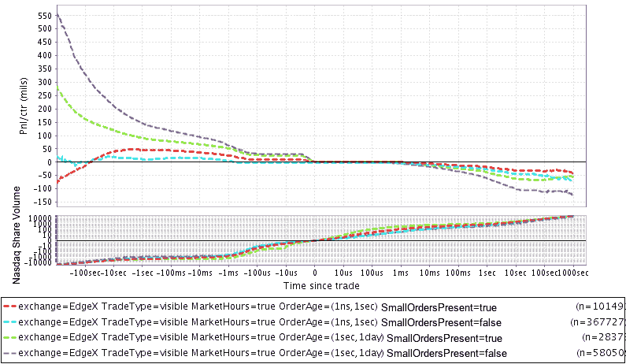
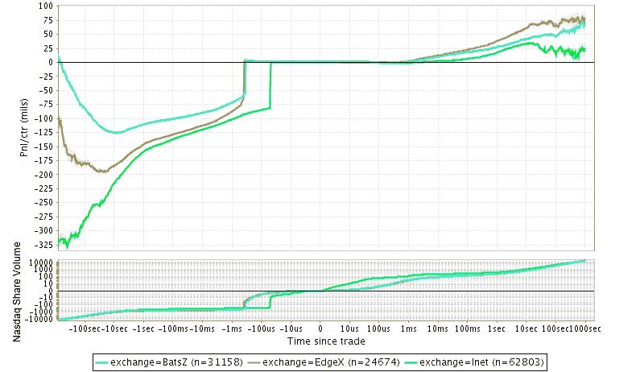

<!--yml
category: 未分类
date: 2024-05-18 06:44:21
-->

# Order Size in the HFT Era: Identifying Trader Type Pt. 3 | Mechanical Markets

> 来源：[https://mechanicalmarkets.wordpress.com/2015/02/09/order-size-in-the-hft-era-identifying-trade-type-pt-3/#0001-01-01](https://mechanicalmarkets.wordpress.com/2015/02/09/order-size-in-the-hft-era-identifying-trade-type-pt-3/#0001-01-01)

In the last 2 parts [[pt. 1](https://mechanicalmarkets.wordpress.com/2015/01/13/trader-type-and-order-age/ "Finding Low-Alpha Orders: Identifying Trader Type Pt. 1"), [pt. 2](https://mechanicalmarkets.wordpress.com/2015/01/20/identifying-trader-type-pt-2/ "Creating an HFT Strategy: Identifying Trader Type Pt. 2")] we saw how a known feature of HFTs, their high cancellation rates, can be used to evaluate the toxicity of a wide class of orders and form the basis of a trading strategy. In this post, I’ll present another feature of the same theme and a simple accompanying strategy.

One nice thing about this first series of posts is the obviousness of the features. If we think about HFT stereotypes, after high cancellation rates, the next thing to come to mind is their small average trade size [[1](#bottom)]. Computerized traders of all types are expected to send small resting orders. Market-making HFTs would do so because they want to selectively trade with smaller aggressors, in an effort to avoid liquidity sweeps of the entire price level. Execution algorithms that add liquidity would send small orders because they want to hide their intention to trade a large quantity, keeping the price from moving away from them for as long as possible. Of course, aggressive trading might be a little different – execution algorithms run the risk of having other programs take any liquidity they leave resting if they don’t sweep the entire price level, but still want to hide their intentions. Aggressive HFTs don’t have even that concern, so would be expected to remove all liquidity that they think will be profitable. Though, I’ll mention that we didn’t see this behavior (on EdgeX) from aggressive traders in part 2.

With that in mind, let’s consider whether there’s a good way to observe in market data this tendency for computers to send small orders. We could just look at post-trade performance of orders split by their size, but it seems better to consider all orders at a price level. And, since we can, we’ll do that across all exchanges. There are many measures we could use, but I’ll just compare what happens to trades when there are no orders significantly smaller than 2 round lots (200 shares) present on any exchange when a trade occurs.

Top Panel: Performance of trades versus market price on Nasdaq split by age and whether there are any orders smaller or equal to 201 shares at its price. Order size here refers to the **original** size when the order first appeared in the market data, which excludes any changes in size due to execution, reduction, or update messages. Includes the order that generated the fiducial trade. Fees and rebates are excluded and some exchanges are missing from the dataset. Bottom Panel: Share volume on Nasdaq, including fiducial trade.

A similar plot for EdgeX. Bottom panel is still share volume on Nasdaq.

We can see a very large influence from the presence of small orders on a trade’s long term performance. On Nasdaq, if there are no small orders present and the order traded is fresh (less than 1 second old), then the passive side of the trade is extremely toxic. Note that a passive trade breaking even on Nasdaq actually may make a large profit due to the approximately 0.30 cent rebate. This is the opposite of my hypothesis above, which was that the lack of any small orders might indicate fewer programmatic orders and lower alpha. I haven’t looked hard whether this is the case, but this pattern could be consistent with algos submitting large orders when the order book is rapidly flipping back and forth, in an effort to scalp the rebate. If the entire market knows the price is very close to the round tick value, then whoever can submit orders on either side the fastest could be expected to earn the rebate. In such a situation, it’d make sense to submit very large orders, especially if being first requires the submission of loss-making inter-market sweep orders. This scenario is just speculation, but if true it could indicate poor market quality in these instances.

The situation reverses when we look at Nasdaq orders older than 1 second, consistent with the original hypothesis. The absence of small orders corresponds to very low-alpha liquidity, on Nasdaq losing almost an entire cent after trading. This is also what happens to orders both young and old on EdgeX, with age and size showing a synergistic effect. And the same happens on all the exchanges I’ve examined, including those with inverted pricing (e.g. [EdgeA](https://mechanicalmarkets.wordpress.com/wp-content/uploads/2015/02/toa-age-201shrbbofilter-edgea-1366.png)). I couldn’t say why Nasdaq is unique in the circumstance of young orders, but I will note that it is the fastest equity exchange under heavy message traffic and exchanges can have very complex behavior when the NBBO is locked. If there’s demand, I may discuss this more in future posts.

If the market were truly efficient, we’d likely see a much smaller effect of this kind. We can imagine, for instance, aggressive traders becoming less discerning if there are few small orders present. This might entice market makers and passive execution algorithms to submit larger orders to trade with these lower-alpha aggressors. Eventually we’d see this effect shrink or disappear. I’ll note that the mechanisms that would do so are not completely analogous to those that would reduce the alpha difference between young and old orders; it is often easy for an algo to change its order size, but hard for an algo to keep its orders live longer than propitious.

Now that we can pick out low-alpha resting orders using this method, we can simulate a strategy doing pretty much the same thing as in part 2\. That is, when we see low-alpha orders trading, submit our own marketable orders to trade with any liquidity remaining. Specifically:

1.  Keep track of all orders on all available exchanges that were <= 201 shares at their time of submission.
2.  If an order older than 5 seconds trades at a price level with no small or very young (<100ms) orders present then
3.  Send orders to other exchanges at the same price. In the previous example we submitted one tick more aggressively, but we can’t simulate that as well here because this strategy is not restricted to expensive stocks. On cheaper stocks, in order to trade 1 tick through the NBBO we’d need to send ISO and/or routable orders, which we won’t simulate here.

Note the above is completely untuned. If we use Nasdaq trades as the signal, we get the following result:

Top Panel: Performance of simulated trades versus market price split by executed exchange over about a week in Aug. 2014\. All simulated orders are 100 shares. Bottom Panel: Nasdaq share volume, excluding simulated trade.

The volume is low, but even after subtracting fees there is still a decent profit margin, particularly on EdgeX. EdgeX as we’ve seen can also accept more sizable orders without adverse selection. If we send 1000 share orders to EdgeX instead, this strategy amounts to about 5k/day on that route alone. This is only an illustration, but I’ll note that the Nasdaq->EdgeX exchange pairing is not the only one amenable to this strategy, especially if we’re more restrictive about trading cheap stocks. Additionally, if we were to send orders priced 1 cent more aggressively on expensive stocks, the volume could be much higher.

Once again we’ve seen the importance of examining counterparty order characteristics. It’s particularly funny that we can use these blunt stereotypes of HFT to come up with strongly predictive features. Moreover, if computerized traders were astute about capturing all available alpha, these features would have little value. It’s almost as if algorithmic traders as a body do not understand their own effects on the market.

> ###### HFT proxies include high message rates, bursts of order cancellations and modifications, high order-to-trade ratios, small trade sizes, and increases in trading speed. These proxies generally are associated with the broader phenomena of algorithmic trading and computer-assisted trading in all their forms.