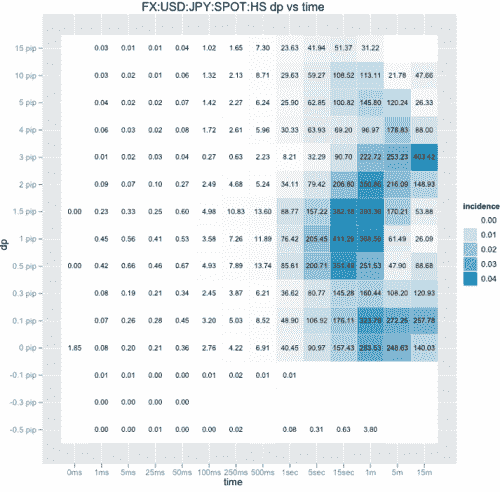
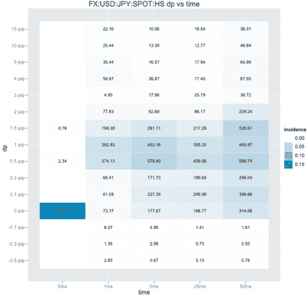

<!--yml
category: 未分类
date: 2024-05-18 15:30:49
-->

# Orderbook Profile | Tr8dr

> 来源：[https://tr8dr.wordpress.com/2011/01/29/orderbook-profile/#0001-01-01](https://tr8dr.wordpress.com/2011/01/29/orderbook-profile/#0001-01-01)

January 29, 2011 · 9:41 pm

I haven’t posted for quite a while as have been busy getting a new high-frequency venture off the ground.   We started trading 2 weeks ago so will start posting periodically again.

There is some modeling crossover between the medium-daily frequency to high-frequency space, but of course each of these areas has their own characteristics.

The highest profit-per-trade strategies focus on short-term cross-asset relationships, MR, and long-run mean prediction.   These strategies have holding periods in minutes, anywhere from 5-20 minutes generally.  That said, there is a whole world of opportunity at the higher frequencies.    In some cases the profit after transaction cost may only be a couple 10ths of a basis point, but with a very high win/loss ratio.

For some of the simpler HF strategies, interpreting the order book and the flows in and out are key.   Here is a sample order book profile showing the longevity of orders in the book versus initial positioning relative to the inside price (as-of just before placement).  +pips are outside of the inside price and -pips are better than inside (i.e. better than best bid or ask as appropriate).

Clearly for this sample most orders live in the 15sec – 15min range from inside to inside + 3 pips.   More interesting is to look at the higher frequency activity in a subset of this:

We can use this to see where most of the activity is occurring.   With a bit more analysis get an idea of what other algorithms are doing and their frequency in the market.    Seeing how this changes with market time and regime is also telling..

In the above density graph it is easy to see that +5/10ths pip is a popular target for HF algorithms in this sample, for order durations 1ms and larger.  There is also something interesting going on with orders < 1ms (basically a place followed closely by a cancel).   One can then trace through order streams against targets like these and get a view on other games in town.