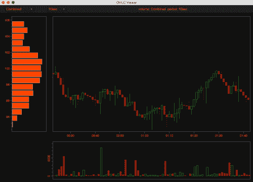
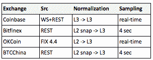

<!--yml
category: 未分类
date: 2024-05-18 15:28:10
-->

# OxyPlot, Bitcoin progress, etc. | Tr8dr

> 来源：[https://tr8dr.wordpress.com/2015/02/28/oxyplot-bitcoin-progress-etc/#0001-01-01](https://tr8dr.wordpress.com/2015/02/28/oxyplot-bitcoin-progress-etc/#0001-01-01)

February 28, 2015 · 6:41 pm

I’ve been a bit distracted recently brainstorming some blockchain-related ideas with colleagues, and working on a research & trading UI.

**OxyPlot**

First I wanted to give a plug for OxyPlot.  If you use F#/C# or the .NET ecosystem, [OxyPlot](http://oxyplot.org "OxyPlot") is a well designed interactive scientific plotting library.  The library renders to iOS, Android, Mono.Mac, GTK#, Silverlight, and WPF.    If one is dealing with a manageable amount of data, highly recommend [Bokeh](http://bokeh.pydata.org/en/latest/ "Bokeh") & python.   However if you need significant interactive functionality or need to interact with large data sets, OxyPlot is a great solution:

I wanted to build a UI to allow me to observe and develop better intuitions around order book characteristics.   OxyPlot did not have good financial charts, so contributed high-performance interactive candlestick & volume charts that can handle millions of bars (points) and some pane alignment controls to the project.   Here is an example of the sort of UI one can put together with OxyPlot:

**Feed Status**

I was awaiting a reply from BTCChina regarding their broken FIX implementation.   As the API issue has not been resolved, implemented the BTC China REST API and deployed the feeds for the 4 exchanges of primary interest:

Though 2 of the exchanges require 4-sec sampling (due to the lack of streaming APIs), all intervening trades are captured between queries.   For L2 sources, order book transactions are implied by looking at the minimum sequence of transactions that would produce the difference between 2 successive snapshots of the order book.   All of the feeds yield a common transaction format:

