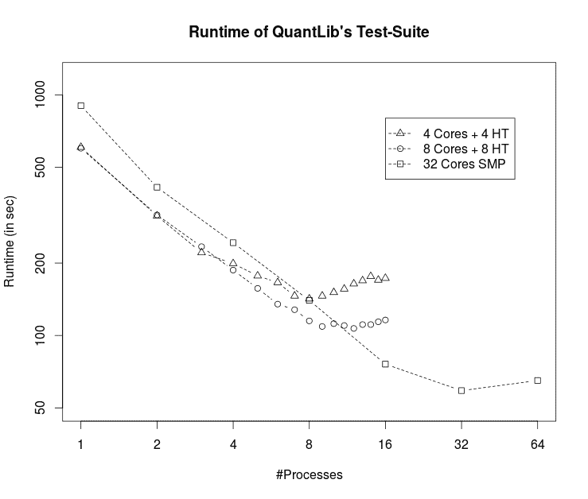

<!--yml
category: 未分类
date: 2024-05-17 23:28:04
-->

# Parallel Unit Test Runner using MPI – HPC-QuantLib

> 来源：[https://hpcquantlib.wordpress.com/2015/12/22/parallel-unit-test-runner-using-mpi/#0001-01-01](https://hpcquantlib.wordpress.com/2015/12/22/parallel-unit-test-runner-using-mpi/#0001-01-01)

Update: 10.03.2016: added performance results of latest QuantLib test-suite build on a 32 Core SMP machine using boost interprocess instead of MPI.

Running QuantLib’s test suite on a recent computer takes around 10min. The situation will improve a lot if the test runner utilises more than one core of today’s multi-core CPUs to run the tests in parallel. Unfortunately multi-threading won’t work because the boost unit test framework is not thread safe.  A reasonable way forward to speed-up the test suite is via multiprocessing using message passing between the compute nodes based on the master-slave paradigm. The cross platform standard MPI together with boost::mpi is tailor-made for this task.

The missing piece is an external, parallel unit test runner, which uses MPI for load balancing and to collect the test results. The runner for QuantLib ‘s test suite needs boost version 1.59 or higher and can be found [here](http://hpc-quantlib.de/src/mpiparalleltestrunner.zip).  Please replace in quantlibtestsuite.cpp line 24

```
 #include <boost/test/unit_test.hpp> 
```

by

```
 #include <mpiparalleltestrunner.hpp> 
```

and do not link the executable with libboost_unit_test_framework.so because the new header file includes the header only version of the boost test framework (Thanks to Peter Caspers for the hint). Load balancing is a crucial point for the overall speed-up because  QuantLib’s test suite has a handful of long running tests (max. around 90 seconds), which should be scheduled first. Therefore the MPI test runner collects the statistics of every unit-test’s runtime and stores these in a local file to plan the schedule of the next runs.



The diagram above shows the runtime of QuantLib’s test suite for a different number of parallel processes and CPU configurations. The minimum runtime is set by the longest running test case, which is around 50 seconds. On a single CPU the performance scales pretty linear with the number of cores being utilised and also hyper-threading cores help. Using more than sixteen real cores does not improve the situation any further because the overall runtime is already dominated by the longest running test case.