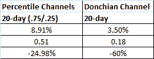

<!--yml
category: 未分类
date: 2024-05-12 17:49:30
-->

# Percentile Channels: A New Twist On a Trend-Following Favorite | CSSA

> 来源：[https://cssanalytics.wordpress.com/2015/01/21/percentile-channels-a-new-twist-on-a-trend-following-favorite/#0001-01-01](https://cssanalytics.wordpress.com/2015/01/21/percentile-channels-a-new-twist-on-a-trend-following-favorite/#0001-01-01)

One of the most widely used trend-following approaches are [Donchian Channels](http://en.wikipedia.org/wiki/Donchian_channel) which were popularized by the famous “[Turtle Traders](http://turtletrader.com/).” In fact, it was the subject of Donchian Channels that started my collaboration with Corey Rittenhouse with the popular post [Percent Exposure Donchian Channel Method](https://cssanalytics.wordpress.com/2009/08/10/quick-take-percent-exposure-donchian-channel-method/ "Quick Take: Percent Exposure Donchian Channel Method"). One of the original turtle systems used a 55-day donchian channel that bought at new 55-day highs and sold at new 55-day lows. This system- along with many other popular systems- suffered an erosion in profitability as other people copied the same approach. What has often fascinated me is how one might go about front-running such systems to achieve superior profitability. While I was thinking about this concept, I theorized that entering prior to new highs or lows might create an early entry that would be sufficient to avoid false breakouts induced by system traders. As an alternative one could use Percentile Channels- which function the same as Donchian Channels but instead use the percentile of the price specified instead of a maximum or minimum. Below is a picture comparing percentile channels to donchian channels:

For a fun experiment I decided to run a test using the Commodity Index (DBC- extended with index data) as a rough proxy for a trend-follower’s portfolio with Donchian Channels versus Percentile Channels. The original 55-day Donchian Channel is used to trade long or short on new highs/lows, versus a 55-day Percentile Channel with a 75th and 25th percentile threshold.
The results from 1995-2014 are presented below:

Interestingly enough, the percentile channels help to revive a broken system with earlier entries. Another turtle system–perhaps the most famous- used the 20-day Donchian Channel. For added robustness, lets see how percentile channels might revive this long-broken system:

While this isn’t a perfect proxy for a futures/trend-following portfolio, the results show that it is possible to revive old systems based on new highs and lows using a less restrictive percentile channel approach. This leads to earlier entries that avoid the noise generated from competing signals. Regardless, percentile channels are just another tool for trend-following and can create a wider range of support/resistance type systems by varying the chosen entry/exit threshold.