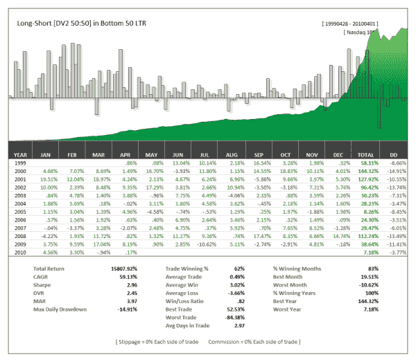
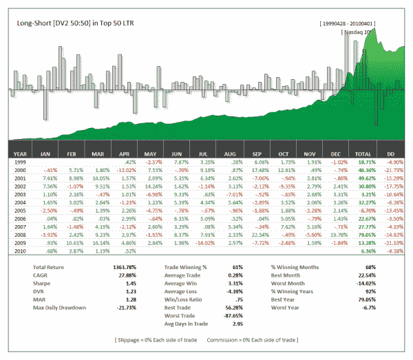

<!--yml
category: 未分类
date: 2024-05-12 18:32:24
-->

# Performance of DV2 on the Bottom 50 LTR (DV Index) versus the Top 50 LTR (Trend Index) | CSSA

> 来源：[https://cssanalytics.wordpress.com/2010/04/06/performance-of-dv2-on-the-bottom-50-ltr-dv-index-versus-the-top-50-ltr-trend-index/#0001-01-01](https://cssanalytics.wordpress.com/2010/04/06/performance-of-dv2-on-the-bottom-50-ltr-dv-index-versus-the-top-50-ltr-trend-index/#0001-01-01)

To continue the story about a tale of two markets within the Nasdaq 100– below is the performance of “The DV Index” or otherwise the equivalent of a  swing or mean-reversion oriented index. The DV Index is constructed using the Bottom 50% of stocks in the Nasdaq 100 by LTR–a proprietary measure of the  historical tendency of a stock or market to trend. For comparsion we show the performance of the Top 50% of stocks by LTR–which is effectively a trend index.  The difference is substantial–similar to what was seen with the reverse daily follow-through (although dv2 was powerful enough to ensure positive performance on both). What is striking is the incredible risk-adjusted returns to be had by sticking with the DV Index versus the Trend Index. Again, this highlights my point that not all markets or stocks are the same–and the smart trader will gravitate to the stocks/markets that best suit their style. **Note:** *The DV Index and LTR rankings for the Nasdaq 100 and S&P500 will be available on a weekly basis to subscribers to the new **DV Excel Plug-In** with dozens of indicators as well as a new set of adaptive indicators. The plug-in is an incredible research tool and coupled with the  LTR rankings, one can create highly profitable and unique strategies to set you apart from the crowd.*

