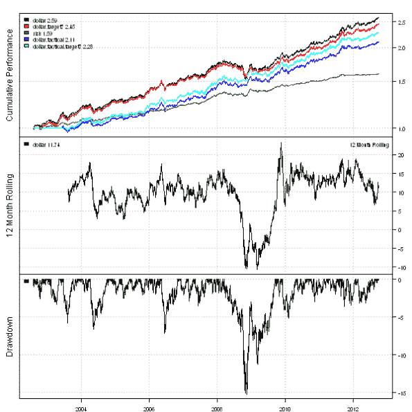
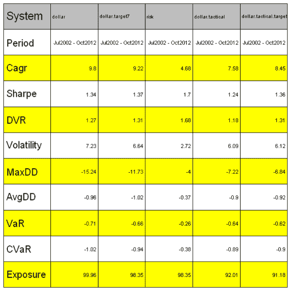

<!--yml
category: 未分类
date: 2024-05-18 14:36:57
-->

# Permanent Portfolio – Simple Tools | Systematic Investor

> 来源：[https://systematicinvestor.wordpress.com/2012/10/05/permanent-portfolio-simple-tools/#0001-01-01](https://systematicinvestor.wordpress.com/2012/10/05/permanent-portfolio-simple-tools/#0001-01-01)

I have previously described and back-tested the [Permanent Portfolio](https://systematicinvestor.wordpress.com/2012/09/18/permanent-portfolio/) strategy based on the series of posts at the [GestaltU](http://gestaltu.blogspot.ca/) blog. Today I want to show how we can improve the [Permanent Portfolio](https://systematicinvestor.wordpress.com/2012/09/18/permanent-portfolio/) strategy perfromance using following simple tools:

*   Volatility targeting
*   Risk allocation
*   Tactical market filter

First, let’s load the historical prices for the stocks(SPY), gold(GLD), treasuries(TLT), and cash(SHY) and create a quarterly rebalanced [Permanent Portfolio](https://systematicinvestor.wordpress.com/2012/09/18/permanent-portfolio/) strategy using the [Systematic Investor Toolbox](https://systematicinvestor.wordpress.com/systematic-investor-toolbox/).

```

###############################################################################
# Load Systematic Investor Toolbox (SIT)
# https://systematicinvestor.wordpress.com/systematic-investor-toolbox/
###############################################################################
setInternet2(TRUE)
con = gzcon(url('http://www.systematicportfolio.com/sit.gz', 'rb'))
    source(con)
close(con)

	#*****************************************************************
	# Load historical data
	#****************************************************************** 
	load.packages('quantmod')	
	tickers = spl('SPY,TLT,GLD,SHY')

	data <- new.env()
	getSymbols(tickers, src = 'yahoo', from = '1980-01-01', env = data, auto.assign = T)
		for(i in ls(data)) data[[i]] = adjustOHLC(data[[i]], use.Adjusted=T)

		# extend GLD with Gold.PM - London Gold afternoon fixing prices
		data$GLD = extend.GLD(data$GLD)

	bt.prep(data, align='remove.na')

	#*****************************************************************
	# Setup
	#****************************************************************** 		
	prices = data$prices   
		n = ncol(prices)

	period.ends = endpoints(prices, 'quarters')
		period.ends = period.ends[period.ends > 0]		
		period.ends = c(1, period.ends)

	models = list()

	#*****************************************************************
	# Dollar Weighted
	#****************************************************************** 			
	target.allocation = matrix(rep(1/n,n), nrow=1)
	weight.dollar = ntop(prices, n)

	data$weight[] = NA
		data$weight[period.ends,] = weight.dollar[period.ends,]
	models$dollar = bt.run.share(data, clean.signal=F)

```

Now let’s create a version of the [Permanent Portfolio](https://systematicinvestor.wordpress.com/2012/09/18/permanent-portfolio/) strategy that targets the 7% annual volatility based on the 21 day look back period.

```

	#*****************************************************************
	# Dollar Weighted + 7% target volatility
	#****************************************************************** 				
	data$weight[] = NA
		data$weight[period.ends,] = target.vol.strategy(models$dollar,
						weight.dollar, 7/100, 21, 100/100)[period.ends,]
	models$dollar.target7 = bt.run.share(data, clean.signal=F)

```

Please note that allocating equal dollar amounts to each investment puts more risk allocation to the risky assets. If we want to distribute risk budget equally across all assets we can consider a portfolio based on the equal risk allocation instead of equal capital (dollar) allocation.

```

	#*****************************************************************
	# Risk Weighted
	#****************************************************************** 				
	ret.log = bt.apply.matrix(prices, ROC, type='continuous')
	hist.vol = sqrt(252) * bt.apply.matrix(ret.log, runSD, n = 21)	
	weight.risk = weight.dollar / hist.vol
		weight.risk = weight.risk / rowSums(weight.risk)

	data$weight[] = NA
		data$weight[period.ends,] = weight.risk[period.ends,]
	models$risk = bt.run.share(data, clean.signal=F)

```

We can also use market filter, for example a 10 month moving average, to control portfolio drawdowns.

```

	#*****************************************************************
	# Market Filter (tactical): 10 month moving average
	#****************************************************************** 				
	period.ends = endpoints(prices, 'months')
		period.ends = period.ends[period.ends > 0]		
		period.ends = c(1, period.ends)

	sma = bt.apply.matrix(prices, SMA, 200)
	weight.dollar.tactical = weight.dollar * (prices > sma)	

	data$weight[] = NA
		data$weight[period.ends,] = weight.dollar.tactical[period.ends,]
	models$dollar.tactical = bt.run.share(data, clean.signal=F)

```

Finally, let’s combine market filter and volatility targeting:

```

	#*****************************************************************
	# Tactical + 7% target volatility
	#****************************************************************** 				
	data$weight[] = NA
		data$weight[period.ends,] = target.vol.strategy(models$dollar.tactical,
						weight.dollar.tactical, 7/100, 21, 100/100)[period.ends,]
	models$dollar.tactical.target7 = bt.run.share(data, clean.signal=F)

	#*****************************************************************
	# Create Report
	#******************************************************************       
	plotbt.custom.report.part1(models)       

	plotbt.strategy.sidebyside(models)	

```

[](https://systematicinvestor.wordpress.com/wp-content/uploads/2012/10/plot1-small.png)

[](https://systematicinvestor.wordpress.com/wp-content/uploads/2012/10/plot2-small.png)

The final portfolio that combines market filter and volatility targeting is a big step up from the original [Permanent Portfolio](https://systematicinvestor.wordpress.com/2012/09/18/permanent-portfolio/) strategy: the returns are a bit down, but draw-downs are cut in half.

To view the complete source code for this example, please have a look at the [bt.permanent.portfolio2.test() function in bt.test.r at github](https://github.com/systematicinvestor/SIT/blob/master/R/bt.test.r).