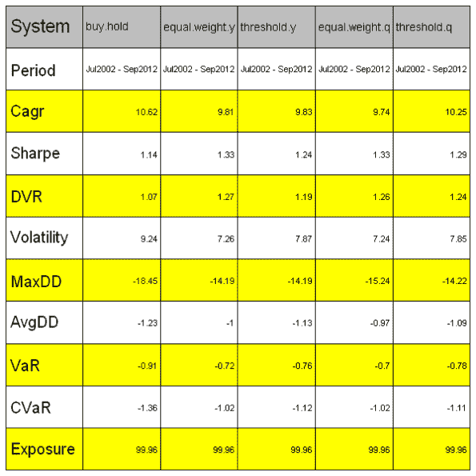
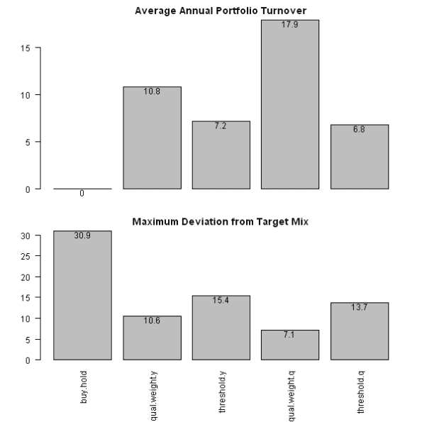

<!--yml
category: 未分类
date: 2024-05-18 14:37:51
-->

# Permanent Portfolio | Systematic Investor

> 来源：[https://systematicinvestor.wordpress.com/2012/09/18/permanent-portfolio/#0001-01-01](https://systematicinvestor.wordpress.com/2012/09/18/permanent-portfolio/#0001-01-01)

First, just a quick update: I’m moving the release date of the SIT package a few months down the road, probably in November.

Now back to the post. Recently I came across a series of interesting posts about the [Permanent Portfolio](http://gestaltu.blogspot.ca/2012/08/permanent-portfolio-shakedown-part-1.html) at the [GestaltU](http://gestaltu.blogspot.ca/) blog. Today I want to show you how to back-test the [Permanent Portfolio](http://en.wikipedia.org/wiki/Fail-Safe_Investing) using the [Systematic Investor Toolbox](https://systematicinvestor.wordpress.com/systematic-investor-toolbox/).

The simple version of the [Permanent Portfolio](http://en.wikipedia.org/wiki/Fail-Safe_Investing) consists of equal allocations to stocks(SPY), gold(GLD), treasuries(TLT), and cash(SHY). [25% allocation each] The portfolio is rebalanced once a year if any allocation breaks out from the 15% – 35% range.

```

###############################################################################
# Load Systematic Investor Toolbox (SIT)
# https://systematicinvestor.wordpress.com/systematic-investor-toolbox/
###############################################################################
setInternet2(TRUE)
con = gzcon(url('http://www.systematicportfolio.com/sit.gz', 'rb'))
    source(con)
close(con)

	#*****************************************************************
	# Load historical data
	#****************************************************************** 
	load.packages('quantmod')	
	tickers = spl('SPY,TLT,GLD,SHY')

	data <- new.env()
	getSymbols(tickers, src = 'yahoo', from = '1980-01-01', env = data, auto.assign = T)
		for(i in ls(data)) data[[i]] = adjustOHLC(data[[i]], use.Adjusted=T)

		# extend GLD with Gold.PM - London Gold afternoon fixing prices
		data$GLD = extend.GLD(data$GLD)

	bt.prep(data, align='remove.na')

	#*****************************************************************
	# Code Strategies
	#****************************************************************** 		
	prices = data$prices   
		n = ncol(prices)
		nperiods = nrow(prices)

	# annual
	period.ends = endpoints(prices, 'years')
		period.ends = period.ends[period.ends > 0]		
		period.ends.y = c(1, period.ends)

	# quarterly
	period.ends = endpoints(prices, 'quarters')
		period.ends = period.ends[period.ends > 0]		
		period.ends.q = c(1, period.ends)

	models = list()

	#*****************************************************************
	# Code Strategies
	#****************************************************************** 	
	target.allocation = matrix(rep(1/n,n), nrow=1)

	# Buy & Hold	
	data$weight[] = NA	
		data$weight[period.ends.y[1],] = target.allocation
	models$buy.hold = bt.run.share(data, clean.signal=F)

	# Equal Weight Annual
	data$weight[] = NA
		data$weight[period.ends.y,] = ntop(prices[period.ends.y,], n)
	models$equal.weight.y = bt.run.share(data, clean.signal=F)

	# Equal Weight Quarterly
	data$weight[] = NA
		data$weight[period.ends.q,] = ntop(prices[period.ends.q,], n)
	models$equal.weight.q = bt.run.share(data, clean.signal=F)

```

To rebalance base on the 10% threshold (i.e. portfolio weights breaking out from the 15% – 35% range) I will use bt.max.deviation.rebalancing() function introduced in the [Backtesting Rebalancing methods](https://systematicinvestor.wordpress.com/2011/12/16/backtesting-rebalancing-methods/) post.

```

	#*****************************************************************
	# Rebalance based on threshold
	#****************************************************************** 	
	# Rebalance only when threshold is broken
	models$threshold.y = bt.max.deviation.rebalancing(data, models$buy.hold, target.allocation, 10/100, 0, period.ends = period.ends.y) 

	# Rebalance only when threshold is broken
	models$threshold.q = bt.max.deviation.rebalancing(data, models$buy.hold, target.allocation, 10/100, 0, period.ends = period.ends.q) 

	#*****************************************************************
	# Create Report
	#******************************************************************       
	plotbt.custom.report.part1(models)       

	plotbt.strategy.sidebyside(models)

	# Plot Portfolio Turnover for each Rebalancing method
	layout(1:2)
	barplot.with.labels(sapply(models, compute.turnover, data), 'Average Annual Portfolio Turnover', F)
	barplot.with.labels(sapply(models, compute.max.deviation, target.allocation), 'Maximum Deviation from Target Mix')

```

[](https://systematicinvestor.wordpress.com/wp-content/uploads/2012/09/plot1-small1.png)

[](https://systematicinvestor.wordpress.com/wp-content/uploads/2012/09/plot2-small.png)

[](https://systematicinvestor.wordpress.com/wp-content/uploads/2012/09/plot3-small1.png)

The Quarterly rebalancing with 10% threshold produces an attractive portfolio with top performance and low turnover.

To view the complete source code for this example, please have a look at the [bt.permanent.portfolio.test() function in bt.test.r at github](https://github.com/systematicinvestor/SIT/blob/master/R/bt.test.r).