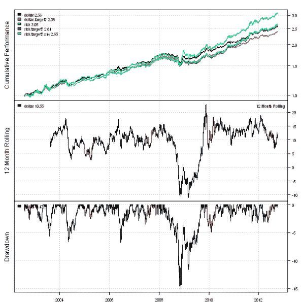
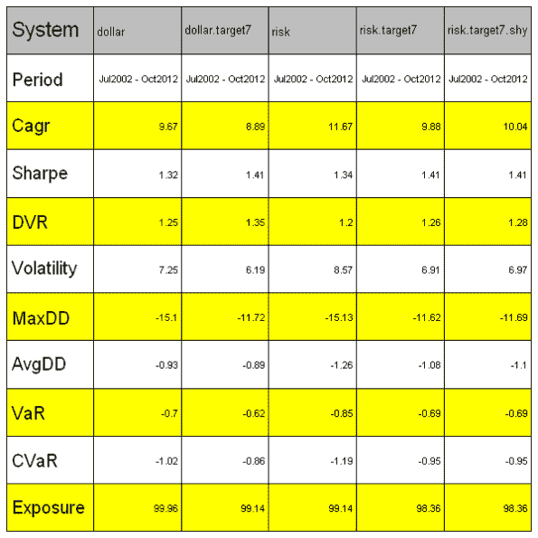
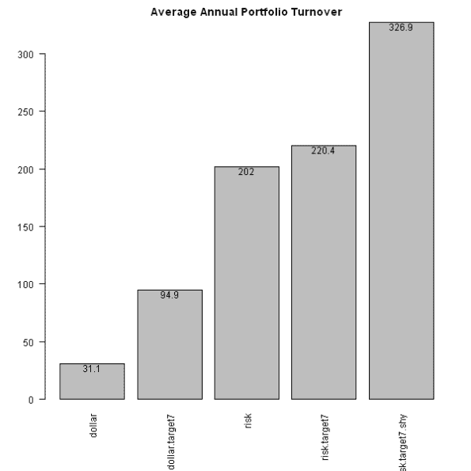

<!--yml
category: 未分类
date: 2024-05-18 14:36:41
-->

# Permanent Portfolio – Transaction Cost and better Risk Parity | Systematic Investor

> 来源：[https://systematicinvestor.wordpress.com/2012/10/10/permanent-portfolio-transaction-cost-and-better-risk-parity/#0001-01-01](https://systematicinvestor.wordpress.com/2012/10/10/permanent-portfolio-transaction-cost-and-better-risk-parity/#0001-01-01)

I want to address comments that were asked in my last post, [Permanent Portfolio – Simple Tools](https://systematicinvestor.wordpress.com/2012/10/05/permanent-portfolio-simple-tools/), about [Permanent Portfolio](https://systematicinvestor.wordpress.com/2012/09/18/permanent-portfolio/) strategy. Specifically:

*   The impact of transaction costs on the perfromance and
*   Create a modified version of risk allocation portfolio that distributes weights across 3 asset classes: stocks(SPY), gold(GLD), and treasuries(TLT), and only invests into cash(SHY) to fill the residual portfolio exposure once we scale the SPY/GLD/TLT portfolio to the target volatility

The first point is easy, to incorporate the transaction cost into your back-test just add commission=0.1 parameter to the bt.run.share() function call.For example, to see the dollar allocation strategy perfromance assuming 10c a share commission, use following code:

```

# original strategy
models$dollar = bt.run.share(data, clean.signal=F)

# assuming 10c a share commissions
models$dollar = bt.run.share(data, commission=0.1, clean.signal=F)

```

The second point is a bit more work. First, let’s allocate risk across only to 3 asset classes: stocks(SPY), gold(GLD), and treasuries(TLT). Next, let’s scale the SPY/GLD/TLT portfolio to the 7% target volatility. And finally, let’s allocate to cash(SHY) the residual portfolio exposure.

```

	#*****************************************************************
	# Risk Weighted: allocate only to 3 asset classes: stocks(SPY), gold(GLD), and treasuries(TLT)
	#****************************************************************** 				
	ret.log = bt.apply.matrix(prices, ROC, type='continuous')
	hist.vol = sqrt(252) * bt.apply.matrix(ret.log, runSD, n = 21)	
	weight.risk = weight.dollar / hist.vol
		weight.risk$SHY = 0 
		weight.risk = weight.risk / rowSums(weight.risk)

	data$weight[] = NA
		data$weight[period.ends,] = weight.risk[period.ends,]
	models$risk = bt.run.share(data, commission=commission, clean.signal=F)

	#*****************************************************************
	# Risk Weighted + 7% target volatility
	#****************************************************************** 				
	data$weight[] = NA
		data$weight[period.ends,] = target.vol.strategy(models$risk,
						weight.risk, 7/100, 21, 100/100)[period.ends,]
	models$risk.target7 = bt.run.share(data, commission=commission, clean.signal=F)

	#*****************************************************************
	# Risk Weighted + 7% target volatility + SHY
	#****************************************************************** 				
	data$weight[] = NA
		data$weight[period.ends,] = target.vol.strategy(models$risk,
						weight.risk, 7/100, 21, 100/100)[period.ends,]

  		cash = 1-rowSums(data$weight)
	    data$weight$SHY[period.ends,] = cash[period.ends]
	models$risk.target7.shy = bt.run.share(data, commission=commission, clean.signal=F)

```

[](https://systematicinvestor.wordpress.com/wp-content/uploads/2012/10/plot1-small2.png)

[](https://systematicinvestor.wordpress.com/wp-content/uploads/2012/10/plot2-small2.png)

[](https://systematicinvestor.wordpress.com/wp-content/uploads/2012/10/plot3-small1.png)

The modified version of risk allocation portfolio performs well relative to other portfolios even after incorporating the 10c transaction cost.

To view the complete source code for this example, please have a look at the [bt.permanent.portfolio3.test() function in bt.test.r at github](https://github.com/systematicinvestor/SIT/blob/master/R/bt.test.r).