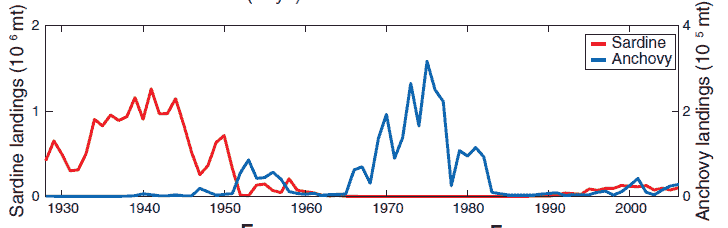

<!--yml
category: 未分类
date: 2024-05-18 06:59:34
-->

# Physics Perspective: A new take on causality

> 来源：[http://physicsoffinance.blogspot.com/2012/12/a-new-take-on-causality.html#0001-01-01](http://physicsoffinance.blogspot.com/2012/12/a-new-take-on-causality.html#0001-01-01)

It's not often that something fundamentally new comes along on the topic of causality. That notion is one of the most basic concepts in science and philosophy, indeed in all human thinking (non-human as well, I would guess). Finding causal links helps us interpret the world, make predictions, render the unpredictable environment around us a little less unpredictable. But we still have a lot to learn about causality, and especially how to infer causal links using data.

This is clear from a fascinating

[recent study](http://www.sciencemag.org/content/338/6106/496.abstract)

that I think will ultimately have quite an impact on applied studies of causal links in fields ranging from economics and finance to ecology. This paper by George Sugihara and colleagues -- its entitled "Detecting Causality in Complex Ecosystems" -- is well worth a few hours of study, as it explores some history of attempts to detect causal links from empirical data and then demonstrates a new technique that appears to be a significant advance on past techniques. 

The key problem in inferring causal links from data, of course, is that mere correlation does not imply causation. The two things in question, A and B, might both be linked to some other causal factor C, but actually have no causal links running from one to the other. In economics, Clive Granger became famous for proposing, in

[this paper](http://ideas.repec.org/a/ecm/emetrp/v37y1969i3p424-38.html)

1969, a way to go beyond correlation. He reasoned that if some thing X causally influences some other thing Y, then including X in a predictive scheme should make predictions of Y better. Conversely, excluding X should make predictions worse. Causal factors, in other words, can be identified as those that reduce predictive accuracy when excluded.

This notion of ‘Granger causality’ makes obvious intuitive sense, and has found many applications, especially in econometrics. However, read the original paper and you quickly see that the theory was developed explicitly for use with stochastic variables, especially in linear systems. As Granger noted, “The theory is, in fact, non-relevant for non-stochastic variables.” Which is unfortunate as so much of the world seems to be more suitably described by nonlinear, deterministic systems.

I've just written for

*Nature Physics* [a short essay](http://www.nature.com/nphys/journal/v8/n12/full/nphys2497.html)

describing the Sugihara

*et al.*

work. I assume many people won't have access to that article (oddly enough, I don't either!) so I thought I'd include a few words here. One problem with Granger causality, the authors point out, is that intimate connections between the parts of any nonlinear system make ‘excluding’ a variable more or less impossible. They demonstrate this for a simple nonlinear system of two variables describing the direction interaction of, say, foxes and rabbits. Call the populations X and Y. Following Granger, you might exclude Y and see if you can predict X. If exclusion of Y reduces your ability to predict, then you've found a causal link. But this recipe yields nothing in this case, because of the nonlinearity. The mathematical model they study definitely, by construction, has a causal links between the two. But the Granger method won't show it.

Why? A key result in dynamical system theory — known as the Takens embedding theorem — implies that one can always reconstruct the dynamical attractor for a system from data in the form of lagged samples of just one variable. In effect, X(t) (fox numbers in time) is always predictable from enough of its earlier values. Hence, excluding Y doesn’t make X any less predictable. The notion of Grange causality would erroneously conclude that Y is non-causal.

To get around this problem, Sugihara and colleagues use the embedding theorem to their advantage. The reconstruction trick can be done for both variables X and Y. I won't dwell on technical details which can be found in the paper, but this yields two mathematical "manifolds" -- essentially, subsets of the space of possible dynamics that describe the actual dynamics that happen. Both of these describe the dynamical attractor of the entire system, one using the variable X, the other the variable Y. Now, sensibly, if X has a causal influence on Y, one should expect this influence to show up as a direct link between the dynamics on these two manifolds. Knowing states on one manifold (for Y) at a certain time should make it possible to know the states on the other (for X) at the same time.

That IS technical, but it's really not complicated. The original paper offers links to some beautiful simulations that aid understanding. The strength of the paper is to show how taking this small step into dynamical system theory pays big results. To begin with, it gives superior performance over the Granger method for several test problems. More impressively, it appears to have already resolved an outstanding puzzle in contemporary ecology.

Ecologists have for decades debated what’s going on with two fish species, the Pacific sardine and northern anchovy, the populations of which on a global scale alternate powerfully on a decadal timescale (see fig below). These data, some suggest, imply that these species must have some direct competition or other interaction, as when the numbers of one go up, those of the other go down. Failing any direct observation of such interactions, however, others have proposed that the global synchrony betrays something else — global forcing from changing sea surface temperatures which just happen to affect the two species differently.

Strikingly, the results from the new method -- Sugihara and colleagues give it memorable name "convergent cross mapping" -- seem to resolve the matter in one stroke. The analysis shows no evidence at all for a direct causal link between the two species, and clear evidence for a link from sea surface temperature to each species. In this case, the correlation is NOT reflecting causation, but simultaneous response to a third factor, though a response in opposite directions.

So there you go -- following the basic ideas of dynamical system theory and actually reconstructing attractors for nonlinear systems makes it possible to tease out causal links far more powerfully than correlation studies alone. This is a major advance on our understanding of causality and I find it hard to believe this technique won’t find immediate application in economics and finance as well as in ecology, neuroscience and elsewhere. If you're involved in time series analysis, looking for correlations and causal relations, give

[it](http://www.sciencemag.org/content/338/6106/496.abstract)

a read.