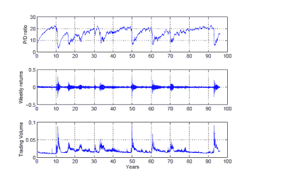

<!--yml
category: 未分类
date: 2024-05-18 06:58:44
-->

# Physics Perspective: A real model of Minsky

> 来源：[http://physicsoffinance.blogspot.com/2013/02/a-real-model-of-minsky.html#0001-01-01](http://physicsoffinance.blogspot.com/2013/02/a-real-model-of-minsky.html#0001-01-01)

Noah Smith has

[a wonderfully informative post](http://noahpinionblog.blogspot.fr/2013/02/is-business-cycle-cycle.html)

on the business cycle in economics. He's looking at the question of whether standard macroeconomic theories view the episodic ups and downs of the economy as the consequence of a real cycle, something arising from positive feed backs that drive persisting oscillations all on their own, or if they instead view these fluctuations as the consequence of external shocks to the system. As he notes, the tendency in macroeconomics has very much been the latter:

> When things like this [cycles] happen in nature - like the Earth going around the Sun, or a ball bouncing on a spring, or water undulating up and down - it comes from some sort of *restorative force*. With a restorative force, being up high is what makes you more likely to come back down, and being low is what makes you more likely to go back up. Just imagine a ball on a spring; when the spring is really stretched out, all the force is pulling the ball in the direction opposite to the stretch. This causes cycles.
> 
> It's natural to think of business cycles this way. We see a recession come on the heels of a boom - like the 2008 crash after the 2006-7 boom, or the 2001 crash after the late-90s boom - and we can easily conclude that *booms cause busts*.
> 
> So you might be surprised to learn that very, very few macroeconomists think this! And very, very few macroeconomic models actually have this property.
> 
> In modern macro models, business "cycles" are nothing like waves. A boom does not make a bust more likely, nor vice versa. Modern macro models assume that what looks like a "cycle" is actually something called a "trend-stationary stochastic process" (like an [AR(1)](http://en.wikipedia.org/wiki/Autoregressive_model)). This is a system where random disturbances ("shocks") are temporary, because they decay over time. After a shock, the system reverts to the mean (i.e., to the "trend"). This is very different from harmonic motion - a boom need not be followed by a bust - but it can end up looking like waves when you graph it...

I think this is interesting and deserves some further discussion. Take an ordinary pendulum. Give such a system a kick and it will swing for a time but eventually the motion will damp away. For a while, high now does portend low in the near future, and vice versa. But this pendulum won't start start swinging this way on its own, nor will it persist in swinging over long periods of time unless repeatedly kicked by some external force.

This is in fact a system of just the kind Noah is describing. Such a pendulum (taken in the linear regime) is akin to the AR(1) autoregressive process entering into macroeconomic models and it acts essentially as a filter on the source of shocks. The response of the system to a stream of random shocks can have a harmonic component, which can make the output look roughly like cycles as Noah mentioned. For an analogy, think of a big brass bell. This is a pendulum in the abstract, as it has internal vibratory modes that, once excited, damp way over time. Hang this bell in a storm and, as it receives a barrage of shocks, you'll hear a ringing that tells you more about the bell than it does the storm.

Still, to get really interesting cycles you need to go beyond the ordinary pendulum. You need a system capable of creating oscillatory behavior all on its own. In dynamical systems theory, this means a system with a limit cycle in its dynamics, which settles down in the absence of persisting perturbation to a cyclic behavior rather than to a fixed point. The existence of such a limit cycle generally implies that the system will have an unstable fixed point -- a state that seems superficially like an equilibrium, but which in fact will always dissolve away into cyclic behavior over time. Mathematically, this is the kind of situation one ought to think about when considering the possibility that natural instabilities drive oscillations in economics. Perhaps the equilibrium of the market is simply unstable, and the highs and lows of the business cycle reflect some natural limit cycle?

Noah mentions the work of Steve Keen, who has developed models along such lines. As far as I understand, these are generally low-dimensional models with limit cycle behavior and I expect they may be very instructive. But Noah also makes a good point that the data on the business cycle really doesn't show a clear harmonic signal at any one specific frequency. The real world is messier. An alternative to low dimensional models written in terms of aggregate economic variables is to build agent based models (of much higher dimension) to explore how natural human behavior such as trend following might lead to instabilities at least qualitatively like those we see.

For some recent work along these lines, take a look at

[this paper](http://people.brandeis.edu/~blebaron/wps/minsky.pdf)

by Blake LeBaron which attempts to flesh out Hyman Minsky's well known story of inherent market instability in an agent based model. Here's the basic idea, as LeBaron describes it:

> Minksy conjectures that financial markets begin to build up bubbles as investors become increasingly overconfident about markets. They begin to take more aggressive positions, and can often start to increase their leverage as financial prices rise. Prices eventually reach levels which cannot be sustained either by correct, or any reasonable forecast of future income streams on assets. Markets reach a point of instability, and the over extended investors must now begin to sell, and are forced to quickly deleverage in a fire sale like situation. As prices fall market volatility increases, and investors further reduce risky positions. The story that Minsky tells seems compelling, but we have no agreed on approach for how to model this, or whether all the pieces of the story will actually fit together. The model presented in this paper tries to bridge this gap.

The model is in crude terms like many I've described earlier on this blog. The agents are adaptive and try to learn the most profitable ways to behave. They are also heterogeneous in their behavior -- some rely more on perceived fundamentals to make their investment decisions, while others follow trends. The agents respond to what has recently happened in the market, and then the market reality emerges out of their collective behavior. That reality, in some of the runs LeBaron explores, shows natural, irregular cycles of bubbles and subsequent crashes of the sort Minsky envisioned. The figure below, for example, shows data for the stock price, weekly returns and trading volume as they fluctuate over a 10 year period of the model:

Now, it is not surprising at all that one can make a computational model to generate dynamics of this kind. But if you read the paper, LeBaron has tried hard to choose the various parameters to fit realistically with what is known about human learning dynamics and the behavior of different kinds of market players. The model also does a good job in reproducing many of the key statistical features of financial time series including long range fundamental deviations, volatility persistence, and fat tailed return distributions. So it generates Minsky-like fluctuations in what is arguably a plausible setting (although I'm sure experts will quibble with some details).

To my mind, one particularly interesting point to emerge from this model is the limited ability of fundamentalist investors to control the unstable behavior of speculators. One nice feature of agent based models is that it's possible to look inside and examine all manner of details. For example, during these bubble phases, which kind of investor controls most of the wealth? As LeBaron notes,

> The large amount of wealth in the adaptive strategy relative to the fundamental is important. The fundamental traders will be a stabilizing force in a falling market. If there is not enough wealth in that strategy, then it will be unable to hold back sharp market declines. This is similar to a limits to arbitrage argument. In this market without borrowing the fundamental strategy will not have sufficient wealth to hold back a wave of self-reinforcing selling coming from the adaptive strategies.

Another important point, which LeBaron mentions in the paragraph above, is that there's no leverage in this model. People can't borrow to amplify investments they feel especially confident of. Leverage of course plays a central role in the instability mechanism described by Minsky, but it doesn't seem to be absolutely necessary to get this kind of instability. It can come solely from the interaction of different agents following distinct strategies.

I certainly don't mean to imply that these kinds of agent based models are superior to the low-dimensional modelling of Steve Keen and others. I think these are both useful approaches, and they ought to be complementary. Here's LeBaron's summing up at the end of the paper:

> The dynamics are dominated by somewhat irregular swings around fundamentals, that show up as long persistent changes in the price/dividend ratio. Prices tend to rise slowly, and then crash fast and dramatically with high volatility and high trading volume. During the slow steady price rise, agents using similar volatility forecast models begin to lower their assessment of market risk. This drives them to be more aggressive in the market, and sets up a crash. All of this is reminiscent of the Minksy market instability dynamic, and other more modern approaches to financial instability.
> 
> Instability in this market is driven by agents steadily moving to more extreme portfolio positions. Much, but not all, of this movement is driven by risk assessments made by the traders. Many of them continue to use models with relatively short horizons for judging market volatility. These beliefs appear to be evolutionarily stable in the market. When short term volatility falls they extend their positions into the risky asset, and this eventually destabilizes the market. Portfolio composition varying from all cash to all equity yields very different dynamics in terms of forced sales in a falling market. As one moves more into cash, a market fall generates natural rebalancing and stabilizing purchases of the risky asset in a falling market. This disappears as agents move more of their wealth into the risky asset. It would reverse if they began to leverage this position with borrowed money. Here, a market fall will generate the typical destabilizing fire sale behavior shown in many models, and part of the classic Minsky story. Leverage can be added to this market in the future, but for now it is important that leverage per se is not necessary for market instability, and it is part of a continuum of destabilizing dynamics.