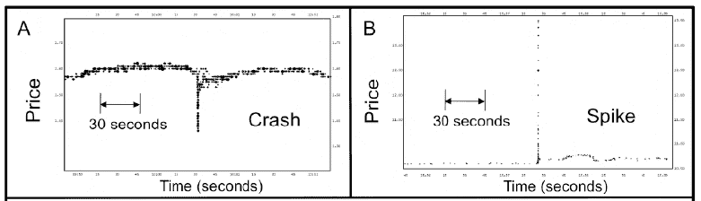

<!--yml
category: 未分类
date: 2024-05-18 07:01:20
-->

# Physics Perspective: Approaching the singularity -- in global finance

> 来源：[http://physicsoffinance.blogspot.com/2012/02/approaching-singularity-in-global.html#0001-01-01](http://physicsoffinance.blogspot.com/2012/02/approaching-singularity-in-global.html#0001-01-01)

In

[a new paper](http://arxiv.org/pdf/1202.1448)

on trends in high-frequency trading, Neil Johnson  and colleagues note that:

> ... a new dedicated transatlantic cable is being built just to shave 5 milliseconds off transatlantic communication times between US and UK traders, while a new purpose-built chip iX-eCute is being launched which prepares trades in 740 nanoseconds ...

This just illustrates the technological arms race underway as firms try to out-compete each other to gain an edge through speed. None of the players in this market worries too much about what this arms race might mean for the longer term systemic stability of market; it's just race ahead and hope for the best. I've written before (

[here](http://physicsoffinance.blogspot.com/2011/09/high-frequency-trading-downside-part-i.html)

and

[here](http://physicsoffinance.blogspot.com/2011/09/high-frequency-trading-downside-part-ii.html)

) about some analyses (notably from Andrew Haldane of the Bank of England) suggesting that this race is generally increasing market volatility and will likely lead to disaster in one form or another. 

We may be getting close. If Johnson and his colleagues are correct, the markets are already showing signs of having already made a transition into a machine-dominated phase in which humans have little control.

Most readers here will probably know about futurist Ray Kurzweil's

[prediction](http://en.wikipedia.org/wiki/Technological_singularity)

of the approaching "singularity" -- the idea that as our technology becomes increasingly intelligent it will at some point create self-sustaining positive feedback loops that drive explosively faster science and development leading to a kind of super-intelligence residing in machines. Humans will be out of the loop and left behind. Given that so much of the future vision of computing now centers on bio-inspired computing -- computers that operate more along the lines of living organisms, being able do things like self-repair and adaptation, true reproduction, etc, -- it's easy to imagine this super-intelligence again ultimately being strongly biological in form, while also exploiting technologies that earlier evolution was unable to harness (superconductivity, quantum computing, etc.). In that case -- again, if you believe this conjecture has some merit -- it could turn out ironically that all of our computing technology will act as a kind of mid-wife aiding a transition from

*Homo sapiens*

to some future non-human but super-intelligent species.

But forget that. Think singularity, but in the smaller world of the markets. Johnson and his colleagues ask the question of whether today's high-frequency markets are moving toward a boundary of speed where human intervention and control is effectively impossible:

> The downside of society’s continuing drive toward larger, faster, and more interconnected socio-technical systems such as global financial markets, is that future catastrophes may be less easy to forsee and manage -- as witnessed by the recent emergence of financial flash-crashes. In traditional human-machine systems, real-time human intervention may be possible if the undesired changes occur within typical human reaction times. However,... in many areas of human activity, the quickest that someone can notice such a cue and physically react, is approximately 1000 milliseconds (1 second)

Obviously, most trading now happens much faster than this. Is this worrying? With the authors, let's look at the data.

In the period from 2006-2011, they found (looking at many stocks on multiple exchanges) that there were about 18,500 specific episodes in which markets, in less than 1.5 seconds, either 1\. ticked down at least 10 times in a row, dropping by more than 0.8% or 2\. ticked up at least 10 times in a row, rising by more than 0.8%. The figure below shows two typical events, a crash and a spike (upward), both lasting only 25 ms.

Apparently, these very brief and momentary downward crashes or upward spikes -- the authors refer to them as "fractures" or "Black Swan events" -- are about equally likely. And they become more likely as one goes to shorter time intervals:

> ... our data set shows a far greater tendency for these financial fractures to occur, within a given duration time-window, as we move to smaller timescales, e.g. 100-200ms has approximately ten times more than 900-1000ms.

But they also find something much more significant. They studied the distribution of these events by size, and considered if this distribution changes when looking at events taking place on different timescales. The data suggests that it does. For times above about 0.8 seconds or so, the distribution closely fits a power law, in agreement with countless other studies of market returns on times of one second or longer. For times shorter than about 0.8 seconds, the distribution begins to depart from the power law form. (It's NOT that it becomes more Gaussian, but it does become something else that is not a power law.) The conclusion is that something significant happens in the market when we reach times going below 1 second -- roughly the timescale of human action.

Ok. Now for the punchline -- an effort to understand how this transition might happen. In my last blog post

[I wrote about the Minority Game](http://physicsoffinance.blogspot.com/2012/02/minority-games.html)

-- a simple model of a market in which adaptive agents attempt to profit by using a variety of different strategies. It reproduces the realistic statistics of real markets, despite its simplicity. I expect that some people may wonder if this model can really be useful in exploring real markets. If so, this new work by Johnson and colleagues offers a powerful example of how valuable the minority game can be in action.

Their hypothesis is that the observed transition in market dynamics below one second reflects "a new fundamental transition from a mixed phase of humans and machines, in which humans have time to assess information and act, to an ultrafast all-machine phase in which machines dictate price changes."  They explore this in a model that...

> ...considers an ecology of N heterogenous agents (machines and/or humans) who repeatedly compete to win in a competition for limited resources. Each agent possesses s > 1 strategies. An agent only participates if it has a strategy that has performed sufficiently well in the recent past. It uses its best strategy at a given timestep. The agents sit watching a common source of information, e.g. recent price movements encoded as a bit-string of length M, and act on potentially profitable patterns they observe.

This is just the minority game

[as I described it](http://physicsoffinance.blogspot.com/2012/02/minority-games.html)

a few days ago. One of the truly significant lessons emerging from its study is that we should expect markets to have two fundamentally distinct phases of dynamics depending on the parameter α=P/N, where P is the number of different past histories the agents can perceive, and N is the number of agents in the game. [P=2

^M

if the agents use bit strings of length M in forming their strategies]. If α is small, then there are lots of players relative to the number of different market histories they can perceive. If α is big, then there are many different possible histories relative to only a few people. These two extremes lead to very different market behaviour.

Johnson and colleagues suggests that the transition between these regimes is just what shows up in the statistics around the one second threshold. They first argue that the regime for large α (many strategies per agent) should be associated with the trading regime above one second, where both people and machines take part. Why? As they suggest,

> We associate this regime (see Fig. 3) with a market in which both humans and machines are dictating prices, and hence timescales above the transition (>1s), for these reasons: The presence of humans actively trading -- and hence their ‘free will’ together with the myriad ways in which they can manually override algorithms -- means that the effective number (i.e. α > 1). Moreover α > 1 implies m is large, hence there are more pieces of information available which suggests longer timescales...  in this α > 1 regime, the average number of agents per strategy is less than 1, hence any crowding effects due to agents coincidentally using the same strategy will be small. This lack of crowding leads our model to predict that any large price movements arising for α > 1 will be rare and take place over a longer duration – exactly as observed in our data for timescales above 1000ms. Indeed, our model’s price output (e.g. Fig. 3, right-hand panel) reproduces the stylized facts associated with financial markets over longer timescales, including a power-law distribution.

What they're getting at here is that crowding in the space of strategies, by creating strong correlations in the strategies of different agents, should tend to make large market movements more likely. After all, if lots of agents come to use the very same strategy, they will all trade the same way at the same time. In this regime above one second, with humans and machine, they suggests there shouldn't be much crowding; the dynamics here do give a power law distribution of movements, but it is what is found in all markets in this regime.

In contrast, they suggest that the sub one second regime should be associated the the α < 1 phase of the minority game:

> Our association of the α < 1 regime with an all-machine phase is consistent with the fact that trading algorithms in the sub-second regime need to be executable extremely quickly and hence be relatively simple, without calling on much memory concerning past information: α < 1 regime with an all-machine phase is consistent with the fact that trading algorithms in the sub-second regime need to be executable extremely quickly and hence be relatively simple, without calling on much memory concerning past information: Hence M will be small, so the total number of strategies will be small and therefore... α < 1\. Our model also predicts that the size distribution for the black swans in this ultrafast regime (α < 1) should not have a power law since changes of all sizes do not appear – this is again consistent with the results in Fig. 2.

And...

> Our model undergoes a transition around α = 1 to a regime characterized by significant strategy crowding and hence large fluctuations. The price output for α < 1 (Fig. 3, left-hand panel) shows frequent abrupt changes due to agents moving as unintentional groups into particular strategies. Our model therefore predicts a rapidly increasing number of ultrafast black swan events as we move to smaller α and hence smaller subsecond timescales – as observed in our data.

 The authors go on to quantify this transition in a little more detail. In particular, they calculate in the simple minority game model the standard deviation of the price fluctuations. In the regime α < 1 this turns out to be roughly proportional to the number N of agents in the market. In contrast, it goes in proportion only to the square root of N in the α > 1 regime. Hence, the model predicts a sharp increase in the size of market fluctuations when entering the machine dominated phase below one second.

The paper as a whole takes a bit of time to get your head around, but it is, I think, a beautiful example of how a simple model that explores some of the rich dynamics of how strategies interact in a market can give rise to some deep insights. The analysis suggests, first, that the high frequency markets have moved past "the singularity," their dynamics having become fundamentally different -- uncoupled from the control, or at least strong influence, of human trading. It also suggests, second, that the change in dynamics derives directly from the crowding of strategies that operate on very short timescales, this crowding caused by the need for relative simplicity in these strategies.

This kind of analysis really should have some bearing on the consideration of potential new regulations on HFT. But that's another big topic. Quite aside from practical matters, the paper shows how valuable perspectives and toy models like the minority game might be.