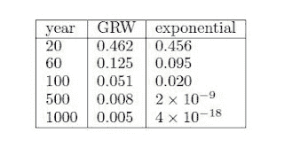

<!--yml
category: 未分类
date: 2024-05-18 07:08:40
-->

# Physics Perspective: Deep Discounting Errors?

> 来源：[http://physicsoffinance.blogspot.com/2011/05/deep-discounting-errors.html#0001-01-01](http://physicsoffinance.blogspot.com/2011/05/deep-discounting-errors.html#0001-01-01)

[One of the papers](http://ideas.repec.org/p/cwl/cwldpp/1719.html)

currently on my list of "Breaking Research" (see right sidebar) has the potential to be unusually explosive; perhaps world-changing. It's conclusions represent dynamite for everyone involved in the economic assessment (i.e. cost-benefit analysis) of various proposals for measures to respond to climate change or environmental degradation more generally. All this from a bit of algebra (and good thinking). Here's why.

Five years ago, the British Government issued the so-called

[Stern Review](http://www.hm-treasury.gov.uk/d/CLOSED_SHORT_executive_summary.pdf)

of the economics of climate change, authored by economist Nicholas Stern. The review had strong conclusions:

> “If we don’t act, the overall costs and risks of climate change will be equivalent to losing at least 5% of global GDP each year, now and forever. If a wider range of risks and impacts is taken into account, the estimates of damage could rise to 20% of GDP or more.”

The review recommended that governments take fast action to reduce greenhouse-gas emissions.

In response, many economists -- most prominently William Nordhaus of Yale University -- have countered the Stern Review by criticizing the way it "discounted" the value of consequences in the future. They said it didn't discount the future strongly enough. In

[this essay](http://nordhaus.econ.yale.edu/nordhaus_stern_science.pdf)

in

*Science*

in 2007, for example, Nordhaus argued that the value of future economic losses attributed to climate change (or any other concerns about the environment) should be discounted at about 7% per year, far higher than the value of 1.4% used in the Stern Review. Here is his comment on this difference, providing some context:

> In choosing among alternative trajectories for emissions reductions, the key economic variable is the real return on capital, r, which measures the net yield on investments in capital, education, and technology. In principle, this is observable in the marketplace. For example, the real pretax return on U.S. corporate capital over the last four decades has averaged about 0.07 per year. Estimated real returns on human capital range from 0.06 to > 0.20 per year, depending on the country and time period (7). The return on capital is the “discount rate” that enters into the determination of the efficient balance between the cost of emissions reductions today and the benefit of reduced climate damages in the future. A high return on capital tilts the balance toward emissions reductions in the future, whereas a low return tilts reductions toward the present. The Stern Review’s economic analysis recommended immediate emissions reductions because its assumptions led to very low assumed real returns on capital.

Of course, one might wonder if four decades of data is enough to project this analysis safely into untold centuries in the future (think sub-prime crisis and the widespread belief that average housing prices in the US have

*never*

fallen, based on a study going back 30 years or so). That to one side, however, there may be something much more fundamentally wrong with Nordhaus's critique, as well as with the method of discounting used by Stern in his review and by most economists today in almost every cost benefit analysis involving the projections into future.

The standard method of economic discounting follows an exponential decay. Using the 7% figure, each movement of roughly 10 years into the future implies a decrease in current value by a factor of 2\. With a discounting rate r, the discount factor applied at time T in the future is exp(-rT). Is this the correct way to do it? Economists have long argued that it is for several reasons. To be "rational", in particular, discounting should obey a condition known as "time consistency" -- essentially that subsequent periods of time should all contribute to the discounting in an equal way. This means that a discount over a time A+B should be equal to a discount over time A multiplied by a discount over time B. If this is true -- and it seems sensible that it should be -- then it's possible to show that exponential discounting is the only possibility. It's the rational way to discount.

That would seem beyond dispute, although it doesn't settle the question of which discount rate to use. But not so fast. Physicist Doyne Farmer and economist John Geanakoplos

[have taken another look at the matter](http://ideas.repec.org/p/cwl/cwldpp/1719.html)

in the case in which the discount rate isn't fixed, but varies randomly through time (as indeed do interest rates in the market). This blog isn't a mathematics seminar so I won't get into details, but their analysis concludes that in such a (realistically) uncertain world, the exponential discounting function no longer satisfies the time consistency condition. Instead, a different mathematical form is the natural one for discounting. The proper or rational discounting factor D(T) has the form D(T) = 1/(1 + αT)^β, where α and β are constants (here ^ means "raised to the power of"). For long times T, this form has a power law tail proportional to T^-β, which falls off far more slowly than an exponential. Hence, the value of the future isn't discounted to anywhere near the same degree.

Farmer and Geanakoplos illustrate the effect with several simple models. You might take the discount rate at any moment to be the current interest rate, for example. The standard model in finance for interest rate movements in the geometric random walk (the rate gets multiplied or divided at each moment by a number, say 1.1, to determine the next rate). With discount rates following this fluctuating random process, the average effective discount after a time T isn't at all like that based on the current rate projected into the future. Taking the interest rate as 4%, with a volatility of 15%, the following figure taken from their paper compares the resulting discount factors as time increases:

For the first 100 years, the numbers aren't too different. But at 500 years the exponential is already discounting values about one million times more strongly than the random process (GRW), and it gets worse after that. This is truly a significant hole in the analyses performed to date on climate policy (or steps to counter other problems where costs come in the future).

Farmer and Geanakoplos don't claim that this geometric random walk model is THE correct one, it's only illustrative (but also isn't obviously unreasonable). But the point is that everything about discounting depends very sensitively on the kinds of assumptions made, not only about the rate of discounting but the very process it follows through time. As they put it:

> What this analysis makes clear, however, is that the long term behavior of valuations depends extremely sensitively on the interest rate model. The fact that the present value of actions that affect the far future can shift from a few percent to infinity when we move from a constant interest rate to a geometric random walk calls seriously into question many well regarded analyses of the economic consequences of global warming. ... no fixed discount rate is really adequate – as our analysis makes abundantly clear, the proper discounting function is not an exponential.

It seems to me this is a finding of potentially staggering importance. I hope it quickly gets the attention it deserves. It's incredible that what are currently considered the best analyses of some of the world's most pressing problems hinge almost entirely on quite arbitrary -- and possible quite mistaken -- techniques for discounting the future, for valuing tomorrow much less than today.  But it's true. In his essay in

*Science*

criticizing the Stern Review, Nordhaus makes the following quite amazing statement, which is nonetheless taken by most economists, I think, as "obviously" sensible:

> In fact, if the Stern Review’s methodology is used, more than half of the estimated damages “now and forever” occur after 2800.

Can you imagine that? Most of the damage could accrue after 2800 -- i.e., in that semi-infinite expanse of the future leading forward into eternity, rather than in the 700 years between now and then? Those using standard economics are so used to the idea that the future should receive very little consideration find this kind of idea crazy. But their logic looks to me seriously full of holes.