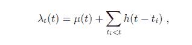
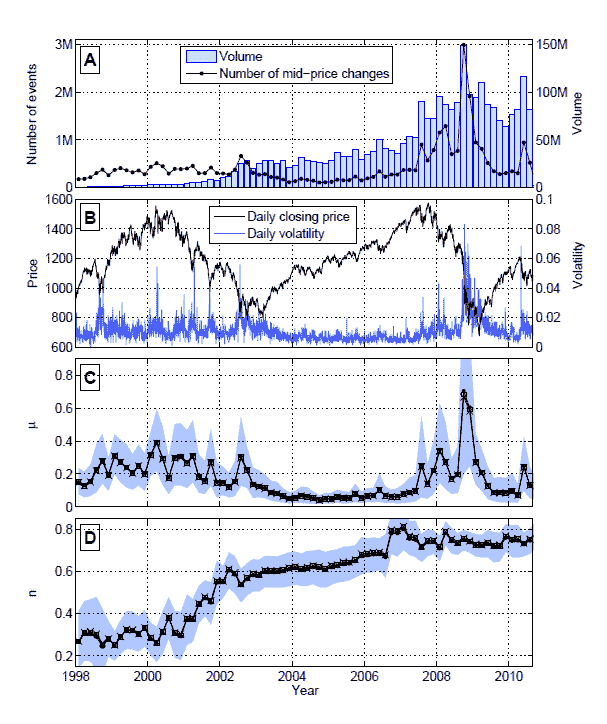
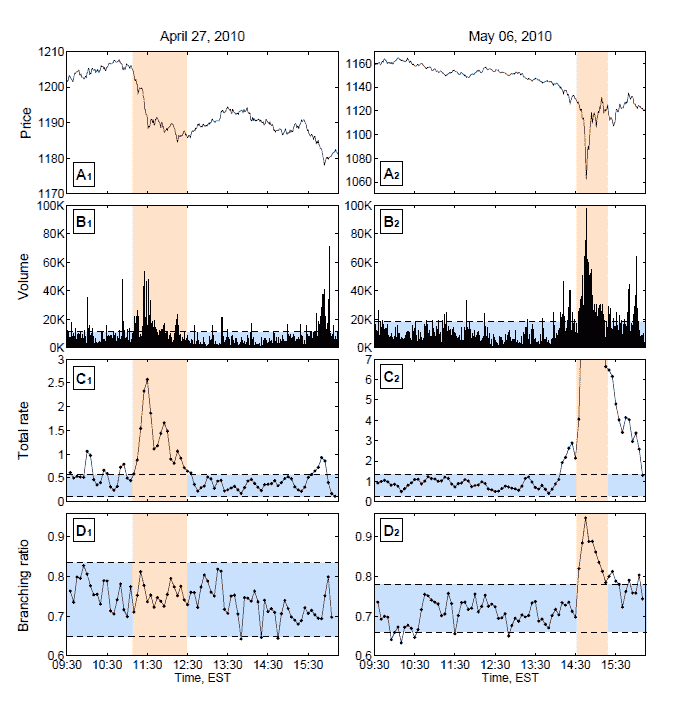

<!--yml
category: 未分类
date: 2024-05-18 07:01:30
-->

# Physics Perspective: Markets -- increasingly complex dynamics over the past decade

> 来源：[http://physicsoffinance.blogspot.com/2012/01/markets-increasingly-complex-dynamics.html#0001-01-01](http://physicsoffinance.blogspot.com/2012/01/markets-increasingly-complex-dynamics.html#0001-01-01)

Didier Sornette is among the most creative scientists I know, and always seems to come up with an approach to problems that is more or less orthogonal to what anyone has done before. [In a paper just out](http://www.unifr.ch/econophysics/paper/show/id/1201.3572) (as a preprint), he and Vladimir Filimonov offer a really novel analysis on the old question about whether market movements are caused by A. external influences such as news (exogenous causes) or B. influences internal to the market itself such as emotions, avalanches of belief and opinion, etc. (endogenous causes). This matter, of course, touches directly on the infamous efficient markets hypothesis, which insists on interpretation A (all A, no B).I've written before ([here](http://physicsoffinance.blogspot.com/2011/10/what-moves-markets-part-ii.html) and [here](http://physicsoffinance.blogspot.com/2011/10/private-information-and-jumps-in-market.html), for example) about various studies trying to match up news feeds with big market moves to see if the latter can be explained by the former. Generally, the evidence suggests no, implying some mixture of A and B. Sornette and Filimonov now take a very different approach, which is an attempt to use mathematics to directly measure how much of the dynamics of a time series can be attributed to endogenous, internal causes. The mathematical technique is itself interesting. If it can be trusted, then the results suggest that markets in the past decade have become much more strongly driven by internal, endogenous dynamics than they were before. As the authors point out, this could well reflect the explosion of algorithmic trading, as computers interact with one another in lots of complex feedback loops.

The authors envision their technique as a device for measuring the amount of "reflexivity" in the market, referring to the term used by George Soros to describe how human perceptions and misperceptions interact in the market to drive changes. This is a fascinating idea if it can be done. Here's how it works. Sornette and Filiminov model price time series as being generated by a statistical "point process" -- the idea is to generate price dynamics by modelling the arrival of actual buy and sell orders in the market. The simplest way to do this is to use a Poisson process, with equal probability at all times. This gives a random time series of price movements, but an unrealistic one that lacks the most interesting properties of real markets -- fat tails in the distribution of returns, and long term memory in the volatility (and also volume fluctuations). To get realistic time series, it's possible to let the arrival of buy and sell orders have strong correlations in time, as they in fact do in real markets. This technique is referred to as a "self-excited Hawkes model."

Another way to put this is as follows. In an ordinary Poisson process, the average number of events striking in an interval dt (say, 1 second) is a constant, λ. In the richer process with correlations, this will now be a function of time λ(t). The key to the analysis here is expressing this quantity (essentially, the rate of buy and sell orders hitting to book around time t) as the sum of two very different processes -- 1\. a background contribution due to external events such as news, which drive the market, and 2\. a feedback contribution coming from the tendency for orders now to have consequences, leading to further orders in the future. The result is eq.(1) of the paper:

Here the first term on the right is the background (which drives the exogenous dynamics) and the second term is the feedback, with h being some function that reflects the likelihood that an event at time t[i] generates another one at time t later. The first term creates a steady stream of events, the second one creates events which create events which create events, a branching stream of further consequences.  Now, the task of fitting time series generated by such processes to real financial data is more involved and relies on some standard maximum likelihood techniques. The authors also assume for simplicity that the function h has an exponential form (events tend to cause others soon after, and less so with increasing time). The key parameter emerging out of such fits is n, which can be interpreted as the fraction of events of endogenous origin, or in effect, the fraction of market activity due to internal dynamics. The statistical fit also estimates μ, this being the background level of exogenous shocks, which also rises and falls with time. Sornette and Filimonov use data on E-mini futures on a second by second basis over about 12 years to run the analysis, the key results of which come out in the figure below.  The four parts going downward show volume and price, and then the estimated background and the fraction of events caused by internal dynamics, n. The most interesting feature is the general rise in n over the decade showing an increasing influence of internal dynamics, or events which causes further events through internal market mechanisms. In contrast, the background of exogenous shocks -- information driven dynamics -- remains more constant (except with a spike around the time of the Lehman Bros collapse). From this the authors offer a few comments:

> The first important observation is that, since 2002, n has been consistently above 0.6 and, since 2007, between 0.7 and 0.8 with spikes at 0.9\. These values translate directly into the conclusion that, since 2007, more than 70% of the price moves are endogenous in nature, i.e., are not due to exogenous news but result from positive feedbacks from past price moves. The second remarkable fact is the existence of four market regimes over the period 1998-2010:
> (i) In the period from Q1-1998 to Q2-2000, the final run-up of the dotcom bubble is associated with a stationary branching ratio n fluctuation around 0.3.
> (ii) From Q3-2000 to Q3-2002, n increases from 0.3 to 0.6\. This regime corresponds to the succession of rallies and panics that characterized the aftermath of the burst of the dot-com bubble and an economic recession.
> (iii) From Q4-2002 to Q4-2006, one can observe a slow increase of n from 0.6 to 0.7\. This period corresponds to the “glorious years” of the twin real-estate bubble, financial product CDO and CDS bubbles, stock market bubble and commodity bubbles.
> (iv) After Q1-2007 the branching ratio stabilized between 0.7 and 0.8 corresponding to the start of the problems of the subprime financial crisis (first alert in Feb. 2007), whose aftershocks are still resonating at the time of writing.

It should be emphasized that the analysis here is only sensitive to endogenous dynamics over timescales of only around 10 minutes or less. This stems from some assumptions necessary to deal with the highly non-stationary character of the data, as trading volume has exploded over the decade. Hence, the lower values of n earlier in the decade could reflect the failure of this analysis to detect important endogenous feedbacks operating on longer timescales (in the burst of the dot-com bubble, for example).  Now for what is perhaps the most fascinating thing coming out of this paper -- the idea that this analysis may be able to distinguish big markets movements caused by real news or other fundamental changes from those more akin to bubbles and caused purely by human behaviour (panics and the like) or algorithmic feedbacks. Sornette and Filimonov looked at two specific events, on 27 April and 6 May 2010, where markets moved suddenly and in a dramatic way. The first was caused by S&P downgrading Greece's debt rating, the second is, of course, the Flash Crash. The same analysis using their method shows strikingly different results for these two events:   The "branching ratio" here is just the n we've been talking about -- the fraction of market dynamics caused by internal dynamics. The most significant finding is that while the first event of 27 April showed absolutely no change in this value, expected given the apparently clear origin of this event in external information, the 6 May Flash Crash shows a sudden spike in the internal dynamics. Hence, based on this example, it appears that this parameter n acts like a flag, identifying events caused by powerful internal feedbacks. As the authors put it,

> The top four panels of Fig. 3 show that the two extreme events of April 27 and May 6, 2010 have similar price drops and volume of transactions. In particular, we find that the volume was multiplied by 4.7 for April 27, 2010 and by 5.3 times for May 6, 2010 in comparison with the 95% quantile of the previous days’ volume. The main difference lies in the trading rates and in the branching ratio. Indeed, the event of April 27, 2010 can be classified according to our calibration of the Hawkes model as a pure exogenous event, since the branching ratio n (fig. 3D1) does not exhibit any statistically significant change compared with previous and later periods. In contrast, for the May 6, 2010 flash crash, one can observe a statistically significant increase of the level of endogeneity n (fig. 3D2). At the peak, n reaches 95% from a previous average level of 72%, which means that, at the peak (14:45 EST), more than 95% of the trading was due to endogenous triggering effects rather than genuine news.

Do you believe it? It sounds plausible to me. I guess the thing that would be good to see is some thorough tests of the method applied to time series for which we know the origin of the dynamics. That is, take something like a chaotic oscillator and drive it with some external noise with a controllable level and see if this method generally gives reliable results in teasing out how much of what happens is driven by the noise, and how much by the internal dynamics. Perhaps this has already been done in some of the papers describing the development of the self-excited Hawkes model. I'll try to check on this.  In any event, I think this is certainly a provocative and interesting new approach to this old question of internal vs external dynamics in markets. And I actually don't find the result surprising at all that n has increased markedly over the past decade. This is precisely what one would expect as trading moves over to algorithms that react to what other algorithms do on a sub second basis.