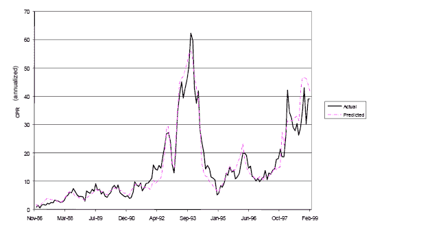

<!--yml
category: 未分类
date: 2024-05-18 06:57:23
-->

# Physics Perspective: Mortgage dynamics

> 来源：[http://physicsoffinance.blogspot.com/2013/04/mortgage-dynamics.html#0001-01-01](http://physicsoffinance.blogspot.com/2013/04/mortgage-dynamics.html#0001-01-01)

My latest Bloomberg column should appear sometime Sunday night 7 April. I've written about

[some fascinating work](http://papers.ssrn.com/sol3/papers.cfm?abstract_id=2018375)

that explores the origins of the housing bubble and the financial crisis by using lots of data on the buying/selling behaviour of more than 2 million people over the period in question. It essentially reconstructs the crisis

*in silico*

and tests which factors had the most influence as causes of the bubble, i.e. leverage, interest rates and so on.

I think this is a hugely promising way of trying to answer such questions, and I wanted to point to one interesting angle in the history of this work: it came out of efforts on Wall St. to build better models of mortgage prepayments, using any technique that would work practically. The answer was detailed modelling of the actual actions of millions of individuals, backed up by lots of good data.

First, take a look at the figure below:

This figure shows the actual (solid line) rate of repayment of a pool of mortgages that were originally issued in 1986\. It also shows the predictions (dashed line) for this rate made by an agent-based model of mortgage repayments developed by John Geanakoplos working for two different Wall St. firms. There are two things to notice. First, obviously, the model works very well over the entire period up to 1999\. The second, not obvious, is that the model works well even over a period for which it was not designed, by the data, to fit. The sample of data used to build the model went from 1986 through early 1996\. The model continues to work well even out of sample over the final three years of this period, roughly 30% beyond the period of fitting. (The model did not work in subsequent years and had to be adjusted due to a major changes in the market itself, after 2000, especially new possibilities to refinance and take cash out of mortgages that were not there before.).

How was this model built? Almost all mortgages give the borrower the right in any month to repay the mortgage in its entirely. Traditionally, models aiming to predict how many would do so worked by trying to guess or develop some function to describe the aggregate behavior of all the mortgage owners, reflecting ideas about individual behavior in some crude way in the aggregate. As Geanakoplos et al. put it:

> The conventional model essentially reduced to estimating an equation with an assumed functional form for prepayment rate... Prepay(t) = F(age(t), seasonality(t), old rate – new rate(t), burnout(t), parameters), where old rate – new rate is meant to capture the benefit to refinancing at a given time t, and burnout is the summation of this incentive over past periods. Mortgage pools with large burnout tended to prepay more slowly, presumably because the most alert homeowners prepay first. ...
> 
> Note that the conventional prepayment model uses exogenously specified functional forms to describe aggregate behavior directly, even when the motivation for the functional forms, like burnout, is explicitly based on heterogeneous individuals.

There is of course nothing wrong with this. It's an attempt to do something practically useful with the data then available (which wasn't generally detailed at the level of individual loans). The contrasting approach, seeks instead to start from the characteristics of individual homeowners and to model their behavior, as a population, as it evolves through time:

> the new prepayment model... starts from the individual homeowner and in principle follows every single individual mortgage. It produces aggregate prepayment forecasts by simply adding up over all the individual agents. Each homeowner is assumed to be subject to a cost c of prepaying, which include some quantifiable costs such as closing costs, as well as less tangible costs like time, inconvenience, and psychological costs. Each homeowner is also subject to an alertness parameter a, which represents the probability the agent is paying attention each month. The agent is assumed aware of his cost and alertness, and subject to those limitations chooses his prepayment optimally to minimize the expected present value of his mortgage payments, given the expectations that are implied by the derivatives market about future interest rates.
> 
> Agent heterogeneity is a fact of nature. It shows up in the model as a distribution of costs and alertness, and turnover rates. Each agent is characterized by an ordered pair (c,a) of cost and alertness, and also a turnover rate t denoting the probability of selling the house. The distribution of these characteristics throughout the population is inferred by fitting the model to past prepayments. The effects of observable borrower characteristics can be incorporated in the model (when they become available) by allowing them to modify the cost, alertness, and turnover.

By way of analogy, this is essentially modelling the prepayment behavior of a population of homeowners as an ecologist might model, say, the biomass consumption of some population of insects. The idea would be to  follow the density of insects as a function of their size, age and other features that influence how and when and how much they tend to consume. The more you model such features explicitly as a distribution of influential factors, the more likely your model will take on aspects of the real population, and the more likely it will be to make predictions about the future, because it has captured real aspects of the causal factors in the past.

Models of this kind also capture in a more natural way, with no extra work, things that have to be put in by hand when working only at the aggregate level. In this mortgage example, this is true of the "burnout" -- the gradual lessening of prepayment rates over time (other things being equal):

> ... burnout is a natural consequence of the agent-based approach; there is no need to add it in afterwards. The agents with low costs and high alertness prepay faster, leaving the remaining pool with slower homeowners, automatically causing burnout. The same heterogeneity that explains why only part of the pool prepays in any month also explains why the rate of prepayment burns out over time.

One other thing worth noting is that those developing this model found that to fit the data well they had to include an effect of "contagion", i.e. the spread of behavior directly from one person to another. When prepayment rates go up, it appears they do so not solely because people have independently made optimal decisions to prepay. Fitting the data well demands an assumption that some people become aware of the benefit of prepaying because they have seen or heard about others who have done so.

This is how it was possible, going back up to the figure above, to make accurate predictions of prepayment rates three years out of sample. In a sense, the lesson is that you do better if you really try to make contact with reality, modelling as many realistic details as you have access to. Mathematics alone won't perform miracles, but mathematics based on realistic dynamical factors, however crudely captured, can do some impressive things.

I suggest reading

[the original, fairly short paper](http://papers.ssrn.com/sol3/papers.cfm?abstract_id=2018375)

, which was eventually published in the American Economic Review. That alone speaks to at least grudging respect on the part of the larger economics community to the promise of agent based modelling. The paper takes this work on mortgage prepayments as a starting point and an inspiration, and tries to model the housing market in the Washington DC area in a similar way through the period of the housing bubble.