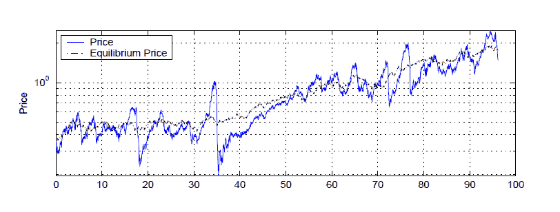

<!--yml
category: 未分类
date: 2024-05-18 07:01:38
-->

# Physics Perspective: Natural models of markets

> 来源：[http://physicsoffinance.blogspot.com/2012/01/natural-models-of-markets.html#0001-01-01](http://physicsoffinance.blogspot.com/2012/01/natural-models-of-markets.html#0001-01-01)

I've written quite a bit about the shortcomings of traditional economic models of markets. Most notably, such models -- typically characterized by rational agents the actions of whom lead (by assumption) to a market equilibrium of some sort -- generally fail to explain basic dynamical features of real markets. These include, most prominently, 1) a pronounced tendency in all markets to large price fluctuations reflected in

["fat tailed" distributions of returns](http://physicsoffinance.blogspot.com/2011/12/power-laws-in-finance.html)

, and 2) vigorous and persistent volatility with delicate long-memory features, which is closely linked to the way that episodes of volatility "cluster" in the market.

These phenomena show up in specific mathematical signatures in the statistics of price movements, and these signatures present some of the most obvious details that any decent model of markets ought to reproduce quite naturally. Models capable of doing this have only emerged in the past two decades, and only succeed by making a clear break with the neo-classical tradition of equilibrium.

[This short review](http://people.brandeis.edu/%7Eblebaron/wps/style.pdf)

from 2006 by economist Blake LeBaron gives a nice introduction to the motivation for this kind of work, which very much follows in the tradition of natural science (as opposed to much of modern economics) in pursuing explanations in models with make plausible assumptions and explore the conclusions which follow from them.

This is a topic I'll be writing about more in the next few months (in connection with a longer term project I'm working on). Le Baron's review is a little old (5 years) and needs updating, but he describes some crucial points very effectively. A few highlights are worth mentioning:

Le Baron first outlines some of what he calls the "major puzzles of financial markets," which are directly linked to the things I just mentioned. First is simply the existence of pronounced volatility:

> Volatility is the most obvious and probably the most important puzzle in finance. Why do financial prices and foreign exchange rates move around so much relative to other macro series both on a short term and long term basis? The difficulty of overall financial volatility was first demonstrated in Shiller (1981), and an update is in Shiller (2003). The issue has been that it is difficult to find financial or macro economic fundamentals that move around enough to justify the large swings observed in financial markets. As a potential policy problem, and an issue for long range investors, this might be the most important puzzle faced by financial modelers.

As Le Baron notes, lots of models (ARCH, GARCH, etc) have been produced which reproduce the mathematical character of volatility but without even attempting to understanding its origin. Moreover, most models in traditional economics, by sticking to the view that individuals are more or less identical and have rational expectations, simply shy away from the very phenomenon needing to be modeled:

> The persistence of volatility in many financial markets has led to an entire industry of models, and is an area of intense interest both in academic and commercial areas. However, although there is a lot of empirical activity, the underlying microeconomic motives for volatility persistence are still not well understood. There are very few models which have even tackled this problem. This is probably due to the fact that in a homogeneous agent framework this is simply a very difficult problem.

The second puzzle of markets that Le Baron lists is what I mentioned first above: the fat tails of market returns or  "excess kurtosis" in the statistical lingo:

> Financial returns at relatively high frequencies (less than one month) are not normally distributed. There is not much of a strong theoretical reason that they need to be, but the hope has often been that some form of the central limit theorem should drive returns close to normality when aggregated over time. Recently, a new field, Econophysics, has appeared which stresses that returns also have additional structure that can be described using power laws. The determination and testing of power laws remains a somewhat open area, and the set of processes that generate acceptable power law pictures is also not well understood.

Aside from the long memory of volatility and fat tailed returns, he also mentions the rich dynamics of trading volume, which is equally as interesting as those of prices. Unfortunately, when it comes to the dynamics of volume, Le Baron notes, "Most traditional financial models remain completely silent."

Le Baron rightly points out that these rich dynamics in time are almost certainly linked directly to two things: 1) the fact that different market participants have different expectations at any moment (indeed, it is such differences which drive trading) and 2) that these differences undergo perpetual evolution through time. This suggests that a decent explanation of the origin of these so-called "stylised facts" (and others like them) will likely emerge from models which attempt to follow and capture something about the dynamics of beliefs and expectations in a population of diverse interacting agents:

> Many of the most puzzling results from finance deal with problems of behavioral heterogeneity, and the dynamics of heterogeneity. The study of market heterogeneity as a kind of complicated dynamic state variable that needs to be modeled is probably one of the defining features of agent-based models. Empirical features such as trading volume are directly related to the amount of heterogeneity in the market, and demand models that can speak to this issue. Other empirical features are probably indirectly related. Large moves, excess kurtosis, and market crashes all probably stem from some type of strategy correlation that keeps the law of large numbers from functioning well across the market. These changing patterns can only be explored in a framework that allows agent strategies to adapt and adjust over time...

I think this point about the failure of the law of large numbers is, while obvious, still worth emphasizing. Something in the market ruins the simple picture of normal statistics, which would emerge from independent factors driving prices changes. Somehow the actions of different market participants must come to be correlated, thereby leading to non-normal fat tailed returns and long memory effects. In principle, of course, there may be many mechanisms contributing to this lack of independence (some participants following trends could be enough, for example).

Now, I doubt anyone actually working in finance would find this observation anything but banal. Yet many economists seem determined to continue modelling markets as if this were not the case. I don't know enough economic history to know why the homogeneous rational expectations view has such a following, but it seems very weird to me indeed.

The rest of Le Baron's review explores an example of the kind of model -- an agent based model for a market very much out of equilibrium -- which reproduces the above features quite naturally, at least qualitatively. The idea is simply to respect the fact that agents in a market are different and change their behaviour over time, adapting to what happens in the market. There is no presupposition that market prices must settle down to an equilibrium; the market does what it does as people interact and trade and try to profit as well as they can. The simple model explored here is one developed by Le Baron in 2002, but shares basic features with many other models developed by others. Agents can choose between a risky asset (a stock) and a risk free bond, and they use a variety of information to make their trading strategies:

> Agents chose over a set of portfolio strategies that map current asset market information into a recommended portfolio fraction of wealth in the risky asset. This fraction can vary from zero to one since short selling and borrowing are not allowed. Information includes lagged returns, dividend price ratios, and several trend indicators. Agents must evaluate rules using past performance, and it is in this dimension where they are assumed to be heterogeneous. Agents use differing amounts of past information to evaluate rules. In other words, they have different memory lengths when it comes to evaluating strategies. Some agents use 30 years worth of data, while others might use only 6 months. In this way this model implements to behavioral features. First, agents are clearly boundedly rational in that they do not attempt to determine the entire
> state space of the economy, which would be unwieldy if they attempted this. Also, they are assumed to have “small sample bias” since they don’t all choose to use as much data as possible.

The paper is an easy read so I won't get into much detail, but what emerges from the interaction of learning and adapting agents in a setting like this is immediately much more realistic and interesting than anything coming from traditional models. For example, the figure below shows the price of the risky asset as a function of time. In the model, there is a true equilibrium price which is made to fluctuate in a normal, Gaussian way (this price being linked to dividends). The actual price in the market is rarely at this equilibrium, but instead has large fluctuations around it, being some times far too high and at others too low, and often moving very rapidly from one point to another. 

Now there are some features of this time series that don't look realistic. There seems to be a periodicity of sorts, for example. But this is a very simple model and the exciting thing is what it gets right -- easily giving a model of a market which never settles down to a prices, has persisting volatility, fat tails in returns, rich dynamics for trading volume and so on. Details can be found in the paper.  

As Le Baron concludes the review,

> Agent-based models make more progress than other frameworks in explaining these features due to that fact that at their core is a world of people who process information differently, and try hard to continually adjust and adapt their behavior over time. This market may never reach anything that looks like an equilibrium efficient market, but it is in a continual struggle toward this. The range of facts these models explain, and the robustness of their explanations to different structures and parameters, is impressive. At the moment, no other models can capture this many facts with this kind of simplicity and style.

As I said, that was 5 years ago. The final statement remains very much true, however. I think it is becoming increasingly clear, even to most economists, that agent-based models present currently the best technique to go beyond the restricting and unrealistic assumption of equilibrium economics and to build models of markets which get their basic behaviour right.

I intend this post just to be a beginning of an exploration of what is currently happening in the development of more realistic non-equilibrium market models. The field is currently exploding and there are many interesting questions to tackle. For example, models of this kind often involve quite a large number of parameters describing agents strategies and so forth. Yet many models work very similarly despite large differences in such parameters. An open question is whether it may be possible to develop a kind of map of the space of possible models, showing a set of classes into which different models fall. Physicist Luciano Pietronero has done some interesting work in this direction.

In any event, I find it hard to understand why anyone today would go on studying homogeneous rational equilibrium, at least in application to the financial markets.