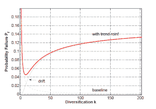

<!--yml
category: 未分类
date: 2024-05-18 07:07:57
-->

# Physics Perspective: Real steps on banking reform?

> 来源：[http://physicsoffinance.blogspot.com/2011/06/real-steps-on-banking-reform.html#0001-01-01](http://physicsoffinance.blogspot.com/2011/06/real-steps-on-banking-reform.html#0001-01-01)

Don't want to get too wildly optimistic. When it comes to banking regulations, disappointment always lies just around the corner and everything important happens behind the scenes. But a couple things today give me some cautious hope that regulators interpreting the new Basel III banking rules may actually take some real steps to curb systemic risks -- they may even take the structure of banking network interactions into account.

First, Simon Johnson

[gives an excellent summary](http://baselinescenario.com/2011/06/15/basel-tomato-and-mozzarella/#more-9094)

of recent developments in the US where banking lobbyists seem to have been caught flat-footed by recent steps taken by Federal Reserve governor Dan Tarullo. I hope this isn't just wishful thinking.

The banks are apparently pushing four key arguments to explain why it's a really horrific idea to make the banking system more stable, and why, especially, the world will probably end quite soon in a spectacular fiery cataclysm of the biggest and most well-connected banks are required to keep an additional few percentage points of capital. Johnson dissects these arguments quite effectively and suggests, encouragingly, that regulators at the Fed, charged with interpreting Basel III, aren't convinced either.

Elsewhere,

[this Bloomberg article](http://www.bloomberg.com/news/2011-06-16/basel-is-said-to-consider-3-5-percentage-point-fee-to-curb-growth-of-banks.html)

suggests -- and this really surprises me -- that the measures under consideration would...

> .. subject banks to a sliding scale depending on their size and ***links to other lenders.***

Now this is an interesting development. Someone somewhere seems to be paying at least a little attention to what we're learning about banking networks, and how some risks are tied more directly to network linkages, rather than to the health of banks considered individually. The density of network linkages itself matters.

Research

[I've written about here](http://physicsoffinance.blogspot.com/2011/06/so-quickly-we-forget.html)

suggests that there's essentially no way to safeguard a banking system unless we monitor the actual network of links connecting banks. It's certainly an encouraging step that someone is thinking about this and trying to find ways to bring density of linkages into the regulatory equation. I hope they're pondering the figure below from

[this study](http://centridiricerca.unicatt.it/scienze_cognitive_comunicazione_delligatti.pdf)

which shows how (in a model) the overall probability of a banking failure (the red line) at first falls with increasing diversification and linking between different banks, but then abruptly begins rising when the density gets too high.

The implication is that there's likely to be a sweet spot in network density (labeled in the figure as diversification, this being the number of links a bank has to other banks) from which we should not stray too far, whether the big banks like it or not.