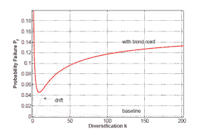

<!--yml
category: 未分类
date: 2024-05-18 07:02:47
-->

# Physics Perspective: Sharing risk can increase risk

> 来源：[http://physicsoffinance.blogspot.com/2011/10/sharing-risk-can-increase-risk.html#0001-01-01](http://physicsoffinance.blogspot.com/2011/10/sharing-risk-can-increase-risk.html#0001-01-01)

I have a column coming out in

[Bloomberg Views](http://www.bloomberg.com/view/bios/mark-buchanan/)

sometime this evening (US time). It touches on the European debt crisis and the issue of outstanding credit default swaps. This post is intended to provide a few more technical details on

[the study](http://www.nber.org/authors/stefano_battiston)

by Stefano Battiston and colleagues, which I mention in the column, showing that more risk sharing between institutions can, in some cases, lead to greater systemic risk. [Note: this work was carried out as part of an ambitious European research project called

[Forecasting Financial Crises](http://www.focproject.net/)

, which brings together economists, physicists, computer scientists and others in an effort to forge new insights into economic systems by exploiting ideas from other areas of science.]

The authors of this study start out by noting the obvious: that credit networks can both help institutions to pool resources to achieve things they couldn't on their own, and to diversify against the risks they face. At the same time, the linking together of institutions by contracts implies a greater chance for the propagation of financial stress from one place to another. The same thing applies to any network such as the electrical grid -- sharing demands among many generating stations makes for a more adaptive and efficient system, able to handle fluctuations in demand, yet also means that failures can spread across much of the network very quickly. New Orleans can be blacked out in a few seconds because a tree fell in Cleveland.

In banking, the authors note, Allen and Gale (references given in the paper) did some pioneering work on the properties of credit networks:

> ... in their pioneering contribution Allen and Gale reach the conclusion that if the credit network of the interbank market is a credit chain – in which each agent is linked only to one neighbor along a ring – the probability of a collapse of each and every agent (a bankruptcy avalanche) in case a node is hit by a shock is equal to one. As the number of partners of each agent increases, i.e. as the network evolves toward completeness, the risk of a collapse of the agent hit by the shock goes asymptotically to zero, thanks to risk sharing. The larger the pool of connected neighbors whom the agent can share the shock with, the smaller the risk of a collapse of the agent and therefore of the network, i.e. the higher network resilience. Systemic risk is at a minimum when the credit network is complete, i.e. when agents fully diversify individual risks. In other words, there is a monotonically decreasing relationship between the probability of individual failure/systemic risk and the degree of connectivity of the credit network.

This is essentially the positive story of risk sharing which is taken as the norm in much thinking about risk management. More sharing is better; the probability of individual failure always decreases as the density of risk-sharing links grows.

This is not what Battiston and colleagues find under slightly more general assumptions of how the network is put together and how institutions interact. I'll give a brief outline of what is different in their model in a moment; what comes out of it is the very different conclusion that...

> The larger the number of connected neighbors, the smaller the risk of an individual collapse but the higher systemic risk may be and therefore the lower network resilience. In other words, in our paper, the relationship between connectivity and systemic risk is not monotonically decreasing as in Allen and Gale, but hump shaped, i.e. decreasing for relatively low degree of connectivity and increasing afterwards.

 Note that they are making a distinction between two kinds of risk: 1\. individual risk, arising from factors specific to one bank's business and which can make it go bankrupt, and 2\. systemic risk, arising from the propagation of financial distress through the system. As in Allen and Gale, they find that individual risk DOES decrease with increasing connectivity: banks become more resistant to shocks coming from their own business, but that systemic risk DOES NOT decrease. The latter risk increases with higher connectivity, and can win out in determining the overall chance a bank might go bankrupt. In effect, the effort on the part of many banks to manage their own risks can end up creating a new systemic risk that is worse than the risk they have reduced through risk sharing.

There are two principle elements in the credit network model they study. First is the obvious fact that resilience of an institution in such a network depends on the resilience of those with whom it shares risks. Buying CDS against the potential default of your Greek bonds is all well and good as long as the bank from whom you purchased the CDS remains solvent. In the 2008 crisis, Goldman Sachs and other banks had purchased CDS from A.I.G. to cover their exposure to securitized mortgages, but those CDS would have been more or less without value had the US government not stepped in to bail out A.I.G.

The second factor model is very important, and it's something I didn't have space to mention in the Bloomberg essay. This is the notion that financial distress tends to have an inherently nonlinear aspect to it -- some trouble or distress tends to bring more in its wake. Battiston and colleagues call this "trend reinforcement, " and describe it as follows:

> ... trend reinforcement is also quite a general mechanism in credit networks. It can occur in at least two situations. In the first one (see e.g. in (Morris and Shin, 2008)), consider an agent A that is hit by a shock due a loss in value of some securities among her assets. If such shock is large enough, so that some of A’s creditors claim their funds back, A is forced to fire-sell some of the securities in order to pay the debt. If the securities are sold below the market price, the asset side of the balance sheet is decreasing more than the liability side and the leverage of A is unintentionally increased. This situation can lead to a spiral of losses and decreasing robustness (Brunnermeier, 2008; Brunnermeier and Pederson, 2009). A second situation is the one in which when the agent A is hit by a shock, her creditor B makes condition to credit harder in the next period. Indeed it is well documented that lenders ask a higher external finance premium when the borrowers’ financial conditions worsen (Bernanke et al., 1999). This can be seen as a cost from the point of view of A and thus as an additional shock hitting A in the next period. In both situations, a decrease in robustness at period t increases the chance of a decrease in robustness at period t + 1.

It is the interplay of such positive feedback with the propagation of distress in a dense network which causes the overall increase in systemic risk at high connectivity.

I'm not going to wade into the detailed mathematics. Roughly speaking, the authors develop some stochastic equations to follow the evolution of a bank's "robustness" R -- considered to be a number between 0 and 1, with 1 being fully robust. A bankruptcy event is marked by R passing through 0\. This is a standard approach in the finance literature on modeling corporate bankruptcies. The equations they derive incorporate their assumptions about the positive influences of risk sharing and the negative influences of distress propagation and trend reinforcement.

The key result shows up clearly in the figure (below), which shows the overall probability of a bank in the network to go bankrupt (a probability per unit of time) versus the amount of risk-sharing connectivity in the network (here given by k, the number of partners with which each bank shares risks). It may not be easy to see, but the figure shows a dashed line (labeled 'baseline') which reflects the classical result on risk sharing in the absence of trend reinforcement. More connectivity is always good. But the red curve shows the more realistic result with trend reinforcement or the positive feedback associated with financial distress taken into account. Now adding connectivity is only good for a while, and eventually becomes positively harmful. There's a middle range of optimal connectivity beyond which more connections only serve to put bank in greater danger.  

Finally, the authors of this paper make very interesting observations about the potential relevance of this model to globalization, which has been an experiment in risk sharing on a global scale, with an outcome -- at the moment -- which appears not entirely positive:

> In a broader perspective, this conceptual framework may have far reaching implications also for the assessment of the costs and benefits of globalization. Since some credit relations involve agents located in different countries, national credit networks are connected in a world wide web of credit relationships. The increasing interlinkage of credit networks – one of the main features of globalization – allows for international risk sharing but it also makes room for the propagation of financial distress across borders. The recent, and still ongoing, financial crisis is a case in point.
> 
> International risk sharing may prevail in the early stage of globalization, i.e. when connectivity is relatively ”low”. An increase in connectivity at this stage therefore may be beneficial. On the other hand, if connectivity is already high, i.e. in the mature stage of globalization, an increase in connectivity may bring to the fore the internationalization of financial distress. An increase in connectivity, in other words, may increase the likelihood of financial crises worldwide.

Which is, in part, why we're not yet out of the European debt crisis woods.