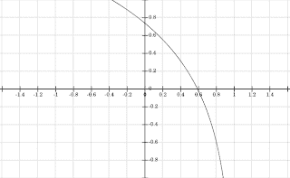

<!--yml
category: 未分类
date: 2024-05-18 07:00:00
-->

# Physics Perspective: Why expected value is a mistake

> 来源：[http://physicsoffinance.blogspot.com/2012/11/why-expected-value-is-mistake.html#0001-01-01](http://physicsoffinance.blogspot.com/2012/11/why-expected-value-is-mistake.html#0001-01-01)

I want to take a closer look at the very interesting work of Ole Peters I mentioned in

[my last post](http://physicsoffinance.blogspot.fr/2012/11/ergodicity-biggest-mistake-in-economics.html)

. He argues that the ensemble averages typically used in economics and finance to compute "expected" returns are, in many cases, inappropriate to making decisions in the real world; in particular, they severely underestimate risks. Peters begins with a simple gamble:

> Let’s say I offer you the following gamble: You roll a dice, and if you throw a six, I will give you one hundred times your total wealth. Anything else, and you have to give me all that you own, including your retirement savings and your favorite pair of socks. I should point out that I am fantastically rich, and you needn’t worry about my ability to pay up, even in these challenging times. Should you do it? ... The rational answer seems to be “yes”—the expected return on your investment is 1,583 1/3% in the time it takes to throw a dice. But what’s your gut feeling?

As he notes, almost no real person would take this bet. You have 5 chances out of 6 of being left destitute, one of being made very much wealthier. Somehow, most of us weight outcomes differently than the simple and supposedly "rational" perspective of maximizing expected return. Why is this? Are we making an error? Or is there some wisdom in this?

Peters' gamble is a variation on the famous St Petersburg "paradox" proposed originally by Nicolas Bernoulli, and later discussed by his brother Daniel. There the question is to determine how much a rational individual should be willing to pay to play a lottery based on a coin flip. In the lottery, if the first flip is heads, you win $1\. If the first is tails, you flip again. If the coin now comes up heads, you win $2, otherwise you flip again, and so on. The lottery pays out 2^n (^ meaning exponent) dollars if the head comes up on the nth roll. An easy calculation shows that the expected payout of the lottery is infinite -- given by a sum that does not converge (1*1/2 + 2*(1/2)^2 + 4*(1/2)^3 + ...) = (1/2 + 1/2 + 1/2 + ...). The "paradox" is again why real people do not find this lottery infinitely appealing and generally offer less than $10 or so to play.

This is a paradox, of course, only if you have some reason to think that people should act according to the precepts of maximizing expected return. Are there any such reasons? I don't know enough history of economics and decision theory to say if there are -- perhaps it can be shown that such behavior is rational in some specific sense, i.e. in accordance to some set of axioms? But if so, what the paradox really seems to establish, then, is the limited relevance of such rules to living in a real world (that such rules capture an ineffective version of rationality).

[Peters' resolution of the paradox](http://rsta.royalsocietypublishing.org/content/369/1956/4913.full.pdf)

shows why (at least for my money!).

His basic idea is that we live in time, and act in time, and have absolutely no choice in the matter. Hence, the most natural way to consider the likely payoff coming from any gamble is to imagine playing the gamble many times in a row (rather than many times simultaneously, as in the ensemble average). Do this indefinitely and you should encounter all the possible outcomes, both good and bad. Mathematically, this way of thinking leads Peters to consider the time average of the growth rate (log return) of the wealth of a player who begins with wealth W and plays the gamble over N periods, in the limit as N goes to infinity. In his paper he goes through a simple calculation and finds the formula for this growth rate:                

The third line here is explicitly for the St Petersburg lottery, while the second line holds more generally for any gamble with probability p_i of giving a return r_i (with the sum extending over all possible outcomes).

This immediately gives more sensible guidance on the St Petersburg paradox, as this expected growth rate is positive for cost c sufficiently low, and negative when c becomes too high. Most importantly, how much you ought to be willing to pay depends

***on your initial wealth w***

, as this determines how much you can afford to lose before going broke. Notice that this aspect doesn't figure in the ensemble average in any way. It's an initial condition that actually makes the gamble different for players of different wealth. Coincidentally, this result is identical to a solution to the paradox originally proposed by Daniel Bernoulli, who simply postulated a logarithmic utility and supposed that people try to maximize utility, not raw wealth. This idea reflects the fact that further riches tend to matter relatively less to people with more money. In contrast, Peters result emerges without any such arbitrary utility assumptions (plausible though they may be). It is simply the realistic expected growth rate for a person playing this game many times, starting with wealth W. Putting numbers in shows that the payoff becomes positive for a millionaire for a cost c less than around $10\. Someone with only $1000 shouldn't be willing to pay more than about $6.

It's also useful to go back and work things out for the simpler dice game. One thing to note about the formula is that the average growth rate is NEGATIVE INFINITE for any gamble in which a person stands to lose their entire wealth in one go, no matter how unlikely the outcome. This is true of the dice gamble as laid out before. I was wondering whether this really made any sense, but after some further exploration I now think it does. The secret is to again consider that the person playing has wealth W and that the cost of "losing" isn't the entire wealth, but some cost c. A simple calculation then shows that the time average growth rate for the dice game takes the form shown in the figure below, showing the growth rate versus the c/w, the cost as a fraction of the players' wealth.

Here you see that the payoff is positive, and the gamble worth taking, if the cost is less than about 60% of the player's wealth. If more than that, the time average growth rate is negative. And, if becomes strongly more negative as c/w approaches 1, with the original game recovered for c/w=1\. Again, everything makes more sense when a person's initial wealth is taken into account. This initial condition really matters and the question of the likely payoff of a gamble depends strongly on it, as lower wealth means higher chance of going bankrupt quicker and then being out of the game entirely. The possibility of losing all your wealth on one turn, no matter how unlikely, becomes decisive because this becomes certain in the long run.

Again, this way of thinking likely has significance far beyond this paradox. It's really pointing out that ensemble averages are very misleading as guides to decision making, especially when the quantities in question, potential gains and losses, become larger. If they remain small compared to the overall wealth of a person (or a portfolio), then the ensemble and time averages turn out to be the same, giving a formula in which initial wealth doesn't matter. But when potential gains/losses become large, then the initial condition really does matter and the ensemble average is dangerous. These points are made very well in this

[Towers Watson article](http://www.towerswatson.com/assets/pdf/8271/The-Irreversibility-of-Time.pdf)

I mentioned in an earlier post.

Which brings me to one final point. Ivan in comments suggested that perhaps Peters has changed the initial problem by looking at the time average rather than the ensemble average, and so has not actually resolved the St Petersburg paradox. I'm not yet entirely sure what I think about this. The paradox, if I'm right, is why people don't act in accordance with the precepts of expected return calculated using the ensemble average. To my mind, Peters' perspective resolves this entirely as it shows that this ensemble average simply gives very poor advice on many occasions. In particular, it makes it seem that a person's initial wealth should have no bearing on the question. If you face gambles, and face them repeatedly as we all do throughout life in one form or another, then thinking of facing them sequentially, as we do, makes sense. But that's not, as I say, my final view..... this is one of those things that gets deeper and deeper the more you mull it over....