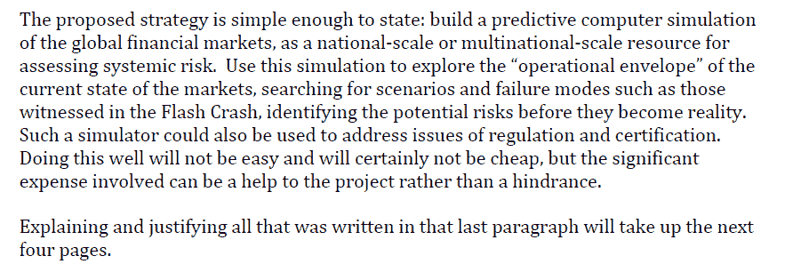

<!--yml
category: 未分类
date: 2024-05-18 07:01:47
-->

# Physics Perspective: Why we need to simulate global financial markets

> 来源：[http://physicsoffinance.blogspot.com/2012/01/why-we-need-to-simulate-global.html#0001-01-01](http://physicsoffinance.blogspot.com/2012/01/why-we-need-to-simulate-global.html#0001-01-01)

I highly recommend

[this essay](http://www.cs.bris.ac.uk/home/dc/cliff_wtf_transcript_final.pdf)

by computer scientist Dave Cliff on the complexity of today's global markets, their inherent dependence on technology and potential for catastrophic breakdown. This is based on a presentation he made to the UK government not long after the Flash Crash of 6 May 2010\. He offers a valuable perspective as someone who has been both closely involved with developing automated trading algorithms, and thought a great deal about the stability and potential for breakdown in large scale socio-technological systems -- that is, systems in which people and technology interact on a vast scale.

Most importantly, Cliff argues that we're facing a crisis of uncontrolled complexity that we really lack an ability to understand. Blind faith in the self-regulation of the financial system is totally unwarranted, and the only way to avoid potential catastrophes is probably to use technology itself -- through very large scale simulations -- to try to foresee the kinds of problems likely to emerge. A few highlights of the argument:

 In a more general discussion, Cliff also argues that the growth of computing technology has led us toward an era of crises through a fundamental dynamic, as our ability to build and depend on complex systems is vastly outpacing out ability to understand and manage such systems. This I think is beyond dispute. Cliff illustrates it with a suggestive graph, below:  

 Given this problem and it's obvious special relevance to finance (in view of the transformation of HFT over the past decade), Cliff then spends the rest of the text outlining a plausible approach to doing something about it. Mainly, he argues that economics and finance really need to turn to the approach that has been used already in the rest of science and engineering. That is, building plausible large scale simulation models to gain some insight into complex systems (such as the weather). As he notes, computation is widely used in finance, but usually to do things like pricing options, and less frequently to modelling entire markets. This is slowly changing, however, despite the resistance of the traditional economics community.

Cliff's basic suggestion:

I've argued similar things elsewhere (in less detail and not as convincingly). The question is whether governments on a global scale have the will to do this in the face of the financial industry, which seems to quite enjoy there being less understanding of global risks rather than more.