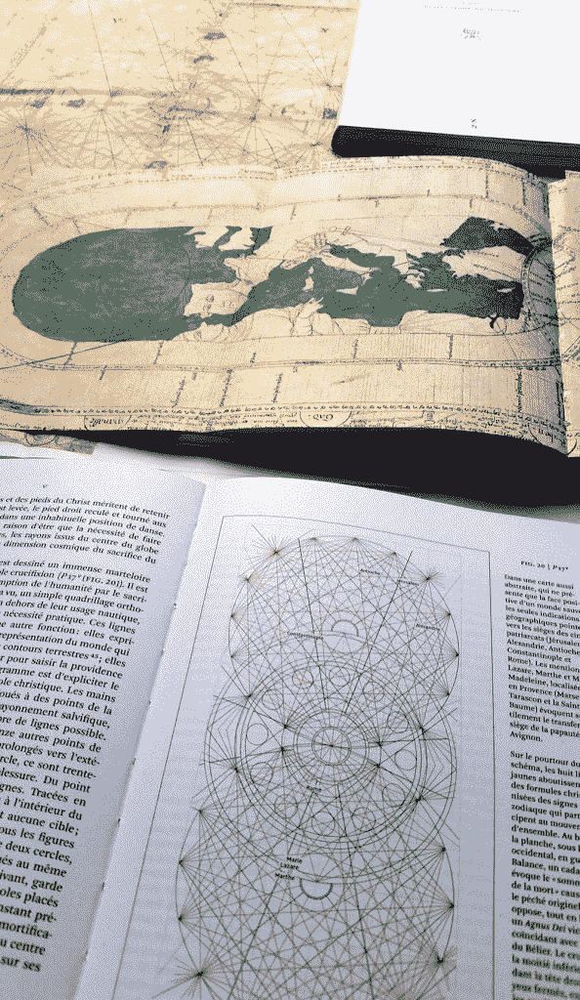
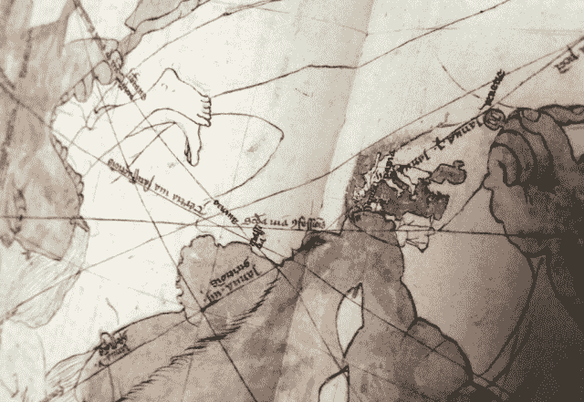
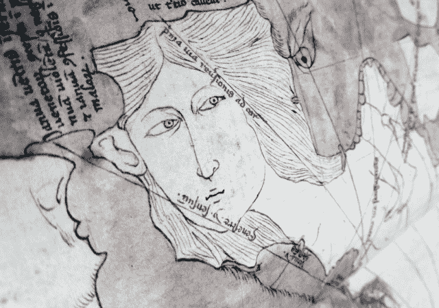
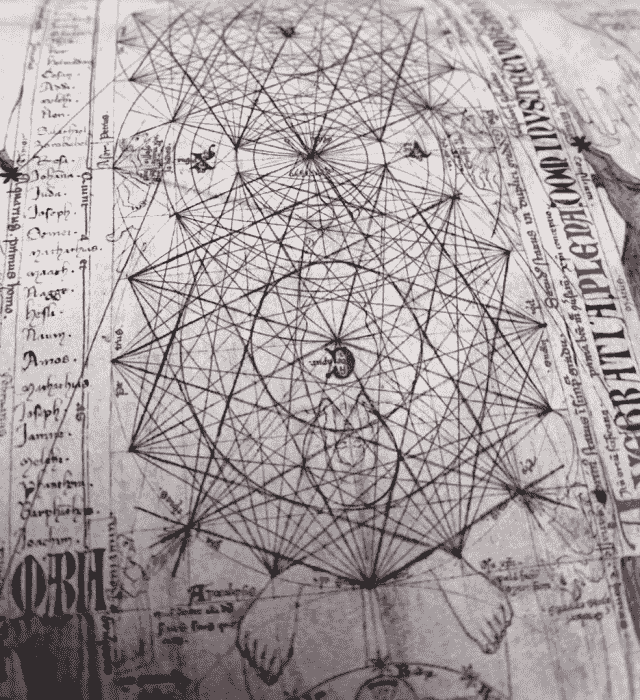
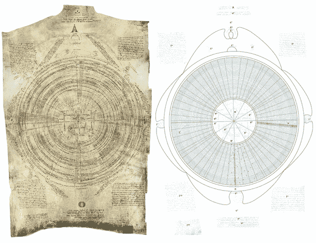
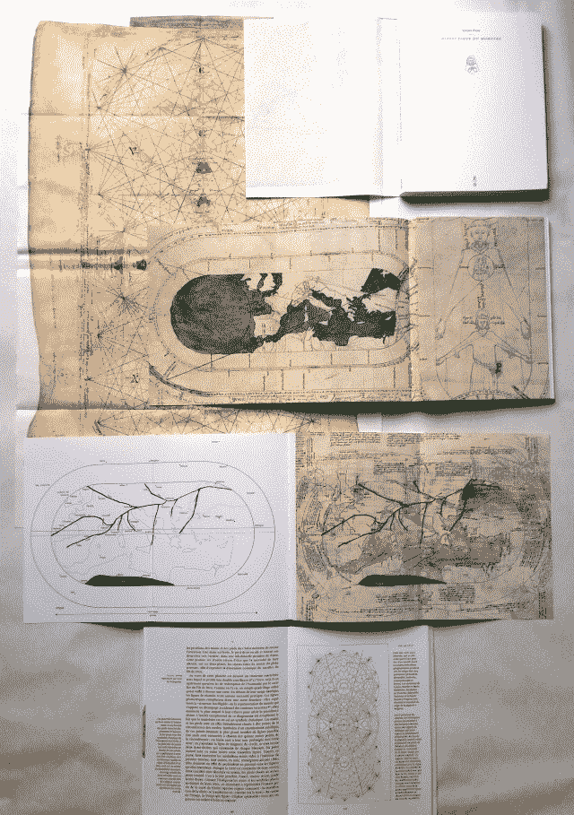
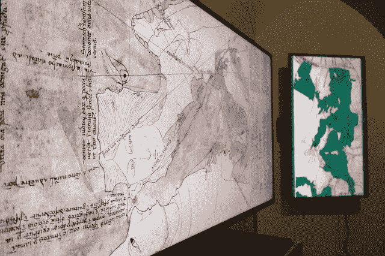

<!--yml
category: 未分类
date: 2024-05-18 14:13:46
-->

# Please meet Opicino – Sniper In Mahwah & friends

> 来源：[https://sniperinmahwah.wordpress.com/2015/10/22/please-meet-opicino/#0001-01-01](https://sniperinmahwah.wordpress.com/2015/10/22/please-meet-opicino/#0001-01-01)

This quick post has nothing to do with high-frequency trading (HFT) or market structure at all. But without HFT, this would not have existed. This, is *Dialectique du monstre*, the new book published by my book company (apart from working – a little – on market structure, teaching in an art school and designing some books for other publishers, I am a book publisher since 1998 and have published more than 75 books). When my [own book](http://www.zones-sensibles.org/livres/6-5/) on HFT was released in 2013, it attracted attention from various people in the market industry and I had a very interesting talk with the CEO of a French hedge fund who was interested by some old medieval philosophers who wrote a lot on what we call now “market microstructure” (I’ll post later this year about those philosophers). That’s how I met Sylvain Piron, a medievalist who translated in French and edited one of the most interesting medieval texts on market and contracts, *De contractibus*, by Pierre de Jean-Olivi (I briefly mentioned Olivi in a previous [post](https://sniperinmahwah.wordpress.com/2014/03/30/iex-de-contractibus/) about IEX). Sylvain and I had a lot of discussions about market, exchanges, fairness, contracts, religion and so on. Then we met again later in other (sad) circumstances, at Jacques Le Goff’s funeral. Jacques Le Goff was not also our common friends, but above all one of the best medievalists ever. Just after that we started to think about a possible book on Opicino de Canistris, and in the end we produced a book quite unusual, *Dialectique du monstre*. *Enquête sur Opicino de Canistris* (*Dialectic of the monster. Enquiry on Opicino de Canistris*), which is released today in French.

I could write thousands of words on the fascinating work/world of Opicino de Canistris, but let’s be brief. Opicino (1296-1535) was a medieval Italian priest from Lombardia who probably suffered from mental disorders (he was probably psychotic). He had moral issues with what should have been the Church in his days, and mainly worked as a scribe for the Pontifical prison in Avignon (France). But he also produced two fascinating manuscripts (now at the Vatican Library) filled with very beautiful and strange drawings – a mix between texts and drawings, to be precise. It is likely that he produced them for himself only, and it is highly probable that no one has seen them during his lifetime; the two manuscripts have been kept in the Vatican Library, untouched, until the end of the 19th century, when some of the first art historians started to be intrigued by those bizarre drawings (the fact the manuscripts were untouched for centuries explains why they were well preserved from light). Rediscovered a century ago, the work of Opicino have fascinated a lot of people since then. But surprisingly, until today there were no books in the world dedicated to Opicino de Canistris (there are some books about him, two in French and one in English, but those books don’t give a fair and large view on the work of Opicino; the two French books were cowritten by a psychoanalyst who made a lot of mistakes (euphemism), and the English [book](http://www.brepols.net/Pages/ShowProduct.aspx?prod_id=IS-9780888441867-1) is about his cartographic work only). Thus, our book is the first to give to the reader an introduction to Opicino: who was him? how did he produce his drawings? which was the issues with the Church and his family? how can we read its texts? and what did he think about when he designed the drawings?

Here are some pictures of the book:

An anthropomorphic map of Europe with a mini-Europe in the foetus, streaked with blood and violated by the finger of a monster:

A plate where Opicino asks himself: “*Qui sum ego?*”, “Who am I?”:

Another cartographic drawing confronting Europe and the Maghreb:

The face of Europe (Spain):

Some complex diagrams, with two Christ:

His incredible autobiography (each concentric circle is a year), redesigned and translated in the book:

A last one (colors are wrong but you can realize the work Sylvain and I did – the book as a large folded sleeve reproducing one of the most spectacular plate, and we also included in the book several “leaflets”):

We pay a fortune the Vatican Library to get the best photographies of the plates, and worked hard to print the drawings with the best possible quality (thanks to, among others, stochastic screenings). We worked on that book for months, and I spent dozens of hours do re-draw some of the plates in order to understand how Opicino designed them (surimpositions, errors, retraits, words, details…). I can’t detail here what you can see in those drawings, but they are an unique mix of religion, hard sexuality, history, the Church, marine monsters, cartographic art, his own life, and so on. There’s no other medieval artist as fascinating as Opicino de Canistris. Working on such an artist was faaaar more interesting that working on algorithms.

We decided to dedicate a website of the book, [dialectiquedumonstre.net](http://dialectiquedumonstre.net) (where you can find other pictures, the full first chapter and all the texts by Opicino himself we translated from Latin and put in the book). Given that this is the really first introduction to Opicino, translations of the book should appear soon in English, Italian, etc. The complex graphic world of Opicino de Canistris was well worth such a book.

