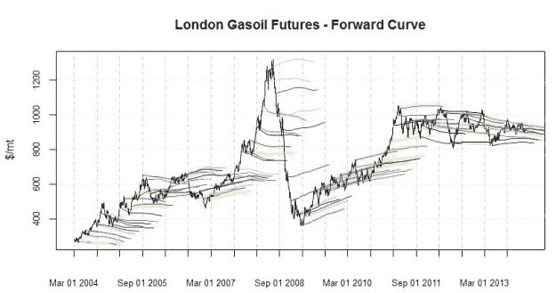

<!--yml
category: 未分类
date: 2024-05-18 08:08:00
-->

# Plotting forward curves with R | Quant Corner

> 来源：[https://quantcorner.wordpress.com/2014/03/23/plotting-forward-curves-with-r/#0001-01-01](https://quantcorner.wordpress.com/2014/03/23/plotting-forward-curves-with-r/#0001-01-01)

We wanted to have an idea of the general form of the **forward curve** for **London ICE gasoil futures** contracts along the year.

The **R** code below plot a forward curve for each month throughout the time series.

Data were downloaded from [Quandl](quandl.com "Quandl"), but we didn’t use the API available.

The result is shown below.

```
#############################################################
# Edouard TALLENT @TaGoMa . Tech, March, 2014               #
# Plot forward curves - March, 2014                         #
# QuantCorner @ https://quantcorner.wordpress.com            #
#############################################################

# Source file
file <- '[path to file]'    # The dataset partillya reproduced below was saved
                            # in a *.csv file

# Read the file and create a table from data
raw <- read.table(file = file, sep = ',', header=TRUE, na.strings = 'NA') # Create the data object from file

# Create a xts object from the data object
require(xts)                                                # Load xts
dat <- as.xts(raw[ , 2:13], order.by = as.Date(raw[ , 1],   # Create the xts object
                format = '%d/%m/%Y'))

# Extract the 1st data of each month in the series
# as we wish to plot 1 forward curve for each month
# through the original time series
f_of_m <- dat[xts:::startof(dat, "months")]

# Plot the 1st nearby series
df <- dat[ , 1]
plot.xts(df, auto.grid = TRUE, major.ticks = 'quarters',
        minor.ticks = FALSE, cex.axis = 0.8,
        main = 'London Gasoil Futures - Forward Curve',
        ylab = '$/mt')

for (y in 1:length(index(f_of_m))){
    # Instantiate empty vectors / reset existing vectors
    values <- NULL
    dates <- NULL
    fwd <- NULL
    for (n_val in 1:12){    # '12' as our data set contains the first 12 nearbys
        values <- append(x = values,
                values = coredata(f_of_m[y])[n_val])
        dates <- append(x = dates,
                values = as.yearmon(x = index(f_of_m)[y], '%d/%m/%Y') - 1/12 + n_val/12)
        fwd <- as.xts(values, order.by = as.Date(dates, format = '%d/%m/%Y'))
    }
    lines(x = fwd, col = runif(n = 1, min = 1, max = 657))  # Use lines to add a new forward curve
                                                            # throughout the loop
                                                            # runif is used to pick up colors randomly
}

'
# Dataset
Date,LGOc1,LGOc2,LGOc3,LGOc4,LGOc5,LGOc6,LGOc7,LGOc8,LGOc9,LGOc10,LGOc11,LGOc12
31/01/2014,917,911.75,906.5,902.5,899,897,895.25,893.75,891.75,889.5,887.25,884.5
30/01/2014,924,918.5,913.5,909.25,905.75,903.5,901.5,899.75,897.5,895.25,893,890
26.5,1322.5,1318.5,1314.25

...

02/03/2004,283.25,278.5,274.5,271,268.75,268.25,268.25,268.25,268,266.75,264.5,260.25
01/03/2004,279.75,274,270,266.75,265,264.5,264.5,264.5,264,262.75,260,256.25
'
```

[](https://quantcorner.wordpress.com/wp-content/uploads/2014/03/lgo_fwd_curve.jpg)

London Gasoil Forward Curve plot