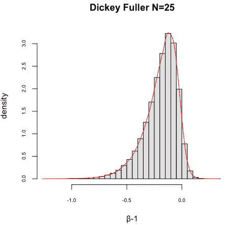

<!--yml
category: 未分类
date: 2024-05-18 15:34:43
-->

# Poor Man’s Knot Reduction | Tr8dr

> 来源：[https://tr8dr.wordpress.com/2010/01/18/poor-mans-function-approximator/#0001-01-01](https://tr8dr.wordpress.com/2010/01/18/poor-mans-function-approximator/#0001-01-01)

There are many great implementations of **unit-root** tests in packages such as R, SAS, etc.  For various reasons I need to implement this in Java.   Probably the best known test of this sort is the Augmented Dickey Fuller test.   This is most often used in determining whether a process is non-stationary or rejecting in favor of stationarity.

Loosely speaking, to say a process is stationary implies that all of its moments are largely time invariant.   So for example the mean and variance of a stationary process would be (largely) constant across time.

We know that AR(1) processes with AR coefficient α = 1 have unbounded variance that grows with time.  This can be seen by evaluating its variance:

The ADF test therefore tests the hypothesis that a given series expressed as a AR(p) process has a coefficient of 1 (ie unit root).   The ADF expands upon the original Dickey Fuller test to allow for additional AR lags:

The null hypothesis is that β = 0 (non-stationary process) and alternative hypothesis (may be stationary) otherwise.   Note that  β = 0 in this differenced equation is equivalent to α = 1 in the non-differenced AR(1) equation.

Samples (i.e. the difference between the observed and null hypothesis value) in hypothesis testing often follow a student-t distribution.   In the case of the Dickey Fuller test the distribution is not student-t and therefore presents a problem.  To calculate the p-value for the ADF hypothesis, one must refer to special Dickey-Fuller tables, as there is no known closed form method to calculate this (that I am aware of).

The p-value, we know to be the probability of obtaining a result at least as extreme (far away from the hypothesis value) as the one obtained in our sample.  Basically this involves calculating:

Then to determine the p-value for the ADF, we need to determine the distribution of values around hypothesis β = 0\.  The tables provide precalculated mappings between test values and the cumulative probability.

**Problem
The Dickey-Fuller tables are sparse, particularly at the tails.   For my problem I was interested in the relative “stationarity” of many different series.   For this, I the needed to calculate the Dickey-Fuller pdf on my own with a Monte-Carlo simulation.**

Here is one configuration of the pdf for the Dickey-Fuller hypothesis (produced from a monte-carlo simulation):

Of course monte-carlo simulations are not practical on each evaluation of the ADF test.   The results from the MC simulation generate a high resolution density function as a series of (x,y) points.   I could generate distributions for a number of configurations and store a very large 3D table of function values, but is impractical and unnecessary.

I started thinking about an approximating function for the distribution.   Aside from finding functional form for the distribution through trial and error, a general automated approach is to use splines.   A natural spline will fit the function and be piecewise continuous.

Splines, however, do not reduce the dimensionality of the problem.  A natural spline requires the complete set of knot points to reconstitute the function.   I then started thinking about knot reduction techniques.   With knot reduction the idea is: what is the minimum set of knots required to reproduce the target function within some (small) error range.   So if my function currently has 2000 (x,y) points, perhaps I could reduce it to ~10 points?

There have been many papers written on this topic, often involving very complex algorithms.   As I wanted to keep this simple, decided to come up with a “poor man’s algorithm” for knot reduction.

**Algorithm
The algorithm starts with a spline consisting of the 2 end-points  and gradually adding knots at specific positions, iteratively reducing the error between the “reduced spline” and the target function.   The new knots are chosen based on the maximum distance from the target function.**

**The algorithm is not guaranteed to be optimal in that it may have more knot points than the smallest possible reproducing set.  However, it is very fast and is often close to optimal, depending on the function.   The algorithm is as follows:**

1.  start with a spline consisting of 2 points (the start and end point)
2.  loop while R^2 < (1 – eps)
    1.  add knot at point with maximum distance from target function
    2.  compute new spline and R^2 fit metric
3.  at end of loop, set of knots now matches function within epsilon

The effectiveness of the approach can be enhanced by using a better basis function than the hermite cubic and/or by adjusting tensions in addition to knots.

Here is an example of the function to epsilon = 1e-8\.  I’ve slowed this down to 1 iteration per second so you can see how it works.   In practice this involves a few micro-seconds:

 [https://www.youtube.com/embed/bu-tYr4onJc?version=3&rel=1&showsearch=0&showinfo=1&iv_load_policy=1&fs=1&hl=en&autohide=2&wmode=transparent](https://www.youtube.com/embed/bu-tYr4onJc?version=3&rel=1&showsearch=0&showinfo=1&iv_load_policy=1&fs=1&hl=en&autohide=2&wmode=transparent)

VIDEO