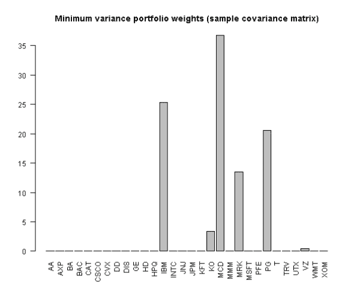
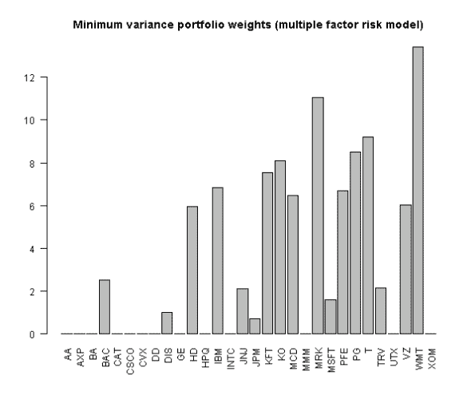

<!--yml
category: 未分类
date: 2024-05-18 14:42:31
-->

# Portfolio Optimization – Why do we need a Risk Model | Systematic Investor

> 来源：[https://systematicinvestor.wordpress.com/2012/02/26/portfolio-optimization-why-do-we-need-a-risk-model/#0001-01-01](https://systematicinvestor.wordpress.com/2012/02/26/portfolio-optimization-why-do-we-need-a-risk-model/#0001-01-01)

In the last post, Multiple Factor Model – Building Risk Model, I have shown how to build a multiple factor risk model. In this post I want to explain why do we need a risk model and how it is used during portfolio construction process.

The covariance matrix is used during the [mean-variance portfolio optimization](http://en.wikipedia.org/wiki/Modern_portfolio_theory) to estimate portfolio risk. The sample covariance matrix can estimated using historical asset’s returns, but the use of the sample covariance matrix becomes problematic when the number of assets (N) is of the same order of magnitude or larger than the number of observations (T). In typical applications, there can be over a thousand stocks to choose from, but rarely more than ten years of monthly data (i.e. N = 1,000 and T = 120). I recommend following references for a detailed discussion:

One possible solution to estimating a covariance matrix is to model risk by a low-dimensional multiple factor model. Another advantage of using a multiple factor model to describe covariances between assets is that portfolio optimization algorithm works faster because the covariance matrix is quite sparse and well structured. For a detailed discussion please read: [Portfolio Optimization with Factors, Scenarios, and Realistic Short Positions by B. Jacobs, K. Levy, and H. Markowitz (2005)](http://www.jlem.com/articles/jlem/portfolioOptimization.pdf) [In problems with a large number of securities, computation time may differ by orders of magnitude between using a dense covariance matrix(sample covariance matrix) and using the diagonal or nearly diagonal covariance matrices permitted by a multiple factor model of covariance.]

The outline of this post:

*   Construct minimum variance portfolio using the sample covariance matrix
*   Construct minimum variance portfolio using the multiple factor risk model we created in the prior post

Let’s start by loading the multiple factor risk model we saved at the end of the [prior post](https://systematicinvestor.wordpress.com/2012/02/21/multiple-factor-model-building-risk-model/). [If you are missing risk.model.Rdata file, please execute fm.risk.model.test() function first to create and save multiple factor risk model.] Next, I will construct minimum variance portfolio using the historical covariance matrix.

```

###############################################################################
# Load Systematic Investor Toolbox (SIT)
# https://systematicinvestor.wordpress.com/systematic-investor-toolbox/
###############################################################################
con = gzcon(url('http://www.systematicportfolio.com/sit.gz', 'rb'))
    source(con)
close(con)
	#*****************************************************************
	# Load data
	#****************************************************************** 
	load.packages('quantmod')	

	# Load factor data that we saved at the end of the fm.all.factor.test function
	load(file='data.factors.Rdata')
		nperiods = nrow(next.month.ret)
		n = ncol(next.month.ret)
		tickers = colnames(next.month.ret)

	# Load multiple factor risk model data that we saved at the end of the fm.risk.model.test function	
	load(file='risk.model.Rdata')

	#*****************************************************************
	# Construct minimum variance portfolio using the sample covariance matrix
	#****************************************************************** 
	load.packages('quadprog,corpcor')

	#--------------------------------------------------------------------------
	# Create Covariance matrix based on the last 24 months of returns
	#--------------------------------------------------------------------------
	temp = last(mlag(next.month.ret),24)
	cov.temp = cov(temp, use='complete.obs', method='pearson')	
	hist.cov = cov.temp

	#--------------------------------------------------------------------------
	# Adjust Covariance matrix
	#--------------------------------------------------------------------------
	if(!is.positive.definite(cov.temp)) {
		cov.temp <- make.positive.definite(cov.temp, 0.000000001)
	}	

	#--------------------------------------------------------------------------
	# Create constraints
	#--------------------------------------------------------------------------
	# set min/max wgts for individual stocks: 0 =< x <= 1
	constraints = new.constraints(n, lb = 0, ub = 1)

	# wgts must sum to 1 (fully invested)
	constraints = add.constraints(rep(1,n), 1, type = '=', constraints)

	#--------------------------------------------------------------------------
	# Solve QP problem
	#--------------------------------------------------------------------------		
	sol = solve.QP.bounds(Dmat = cov.temp, dvec = rep(0, nrow(cov.temp)) , 
		Amat=constraints$A, bvec=constraints$b, constraints$meq,
		lb = constraints$lb, ub = constraints$ub)

	#--------------------------------------------------------------------------
	# Plot Portfolio weights
	#--------------------------------------------------------------------------		
	x = round(sol$solution,4)
		x = iif(x < 0, 0, x)
		names(x) = colnames(next.month.ret)
	hist.min.var.portfolio = x

	# plot
	barplot(100*x,las = 2, 
		main = 'Minimum variance portfolio weights (sample covariance matrix)')		

```

[](https://systematicinvestor.wordpress.com/wp-content/uploads/2012/02/plot1-small3.png)

To minimize portfolio risk computed under risk model framework we have to combine specific risk and factor covariance matrix into one covariance matrix. This process is described on pages 4-5 of the [Portfolio Optimization with Factors, Scenarios, and Realistic Short Positions by B. Jacobs, K. Levy, and H. Markowitz (2005)](http://www.jlem.com/articles/jlem/portfolioOptimization.pdf).

Let K be the number of factors in the risk model. We introduce K additional variables that represent portfolio’s factor exposure to each factor. Let’s add K constraints:

```
X1...Xn * factor.exposures = Xn+1...Xn+k
```

The new covariance matrix:

```
[specific.risk  0                 ]
[0              factor.covariance ]
```

Next, I will construct minimum variance portfolio using the the multiple factor risk model we created in the prior post.

```

	#*****************************************************************
	# Construct minimum variance portfolio using the multiple factor risk model
	#****************************************************************** 
	t = nperiods	
	factor.exposures = all.data[t,,-1]	
		nfactors = ncol(factor.exposures)

	#--------------------------------------------------------------------------
	# Create constraints
	#--------------------------------------------------------------------------
	# set min/max wgts for individual stocks: 0 =< x <= 1
	constraints = new.constraints(n, lb = 0, ub = 1)

	# wgts must sum to 1 (fully invested)
	constraints = add.constraints(rep(1,n), 1, type = '=', constraints)

	# adjust prior constraints, add v.i
	constraints = add.variables(nfactors, constraints)

	# BX - Xnew = 0
	constraints = add.constraints(rbind(factor.exposures, -diag(nfactors)), rep(0, nfactors), type = '=', constraints)

	#--------------------------------------------------------------------------
	# Create Covariance matrix
	# [Qu  0]
	# [ 0 Qf]
	#--------------------------------------------------------------------------
	temp = diag(n)
		diag(temp) = specific.variance[t,]^2
	cov.temp = diag(n + nfactors)
		cov.temp[1:n,1:n] = temp
	cov.temp[(n+1):(n+nfactors),(n+1):(n+nfactors)] = factor.covariance[t,,]

	#--------------------------------------------------------------------------
	# Solve QP problem
	#--------------------------------------------------------------------------
	load.packages('quadprog')

	sol = solve.QP.bounds(Dmat = cov.temp, dvec = rep(0, nrow(cov.temp)) , 
		Amat=constraints$A, bvec=constraints$b, constraints$meq,
		lb = constraints$lb, ub = constraints$ub)

	#--------------------------------------------------------------------------
	# Plot Portfolio weights
	#--------------------------------------------------------------------------		
	x = round(sol$solution,4)[1:n]
		x = iif(x < 0, 0, x)
		names(x) = colnames(next.month.ret)
	risk.model.min.var.portfolio = x

	# plot
	barplot(100*x,las = 2, 
		main = 'Minimum variance portfolio weights (multiple factor risk model)')

```

[](https://systematicinvestor.wordpress.com/wp-content/uploads/2012/02/plot2-small4.png)

The minimum variance portfolio computed under the risk model is more diversified. Also for a larger stock universe (i.e. 1000-2000 stocks) solving quadratic problem will take less time using a factor risk model that results in a sparse covariance matrix.

To view the complete source code for this example, please have a look at the [fm.risk.model.test() function in factor.model.test.r at github](https://github.com/systematicinvestor/SIT/blob/master/R/factor.model.test.r).