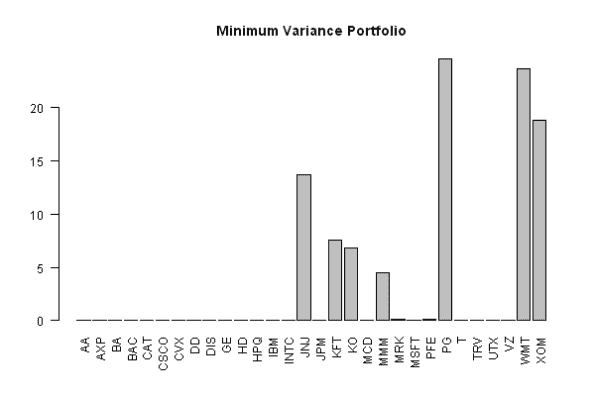
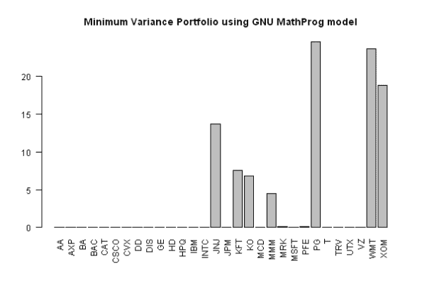
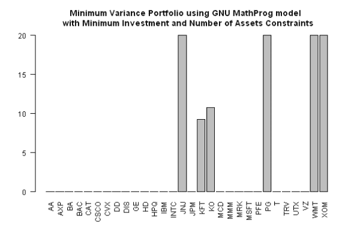
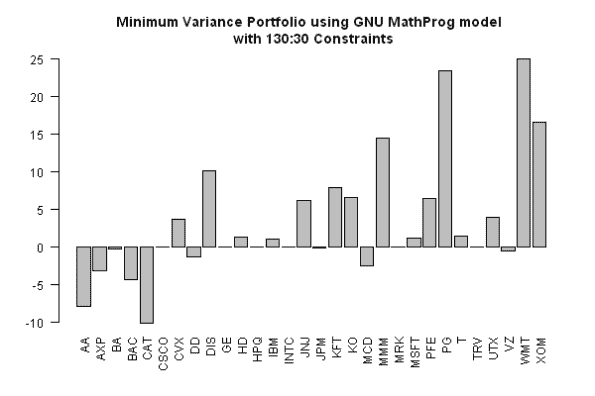
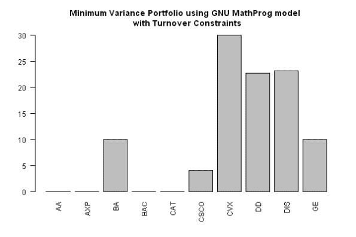

<!--yml
category: 未分类
date: 2024-05-18 14:42:01
-->

# Portfolio Optimization: Specify constraints with GNU MathProg language | Systematic Investor

> 来源：[https://systematicinvestor.wordpress.com/2012/03/14/portfolio-optimization-specify-constraints-with-gnu-mathprog-language/#0001-01-01](https://systematicinvestor.wordpress.com/2012/03/14/portfolio-optimization-specify-constraints-with-gnu-mathprog-language/#0001-01-01)

I have previously described a few examples of portfolio construction:

I created a number of helper functions to simplify process of making the constraints( i.e. minimum / maximum investment constraints, fully invested constraint – weights must sum to 1, and etc.)

*   new.constraints
*   add.constraints
*   add.variables

However, even with help of these functions, the process of describing the constraints is not simple and user-friendly. Fortunately, there is an alternative way to specify linear constraints using [GNU MathProg language](http://en.wikibooks.org/wiki/GLPK/GMPL_%28MathProg%29). MathProg resembles a subset of [AMPL](//en.wikipedia.org/wiki/AMPL). To find more about [GNU MathProg language](http://en.wikibooks.org/wiki/GLPK/GMPL_%28MathProg%29), I recommend reading following resources:

Let’s start by solving a simple portfolio construction problem using helper functions to specify the constraints.

```

###############################################################################
# Load Systematic Investor Toolbox (SIT)
# https://systematicinvestor.wordpress.com/systematic-investor-toolbox/
###############################################################################
con = gzcon(url('http://www.systematicportfolio.com/sit.gz', 'rb'))
    source(con)
close(con)

	#*****************************************************************
	# Load packages
	#****************************************************************** 
	load.packages('quantmod,quadprog,corpcor')

	#--------------------------------------------------------------------------
	# Create historical input assumptions
	#--------------------------------------------------------------------------
	tickers = dow.jones.components()
	ia = aa.test.create.ia.custom(tickers, dates = '2000::2010')	

	#--------------------------------------------------------------------------
	# Create Constraints & Solve QP problem
	#--------------------------------------------------------------------------
	n = ia$n		

	# 0 <= x.i <= 1 
	constraints = new.constraints(n, lb = 0, ub = 1)

	# SUM x.i = 1
	constraints = add.constraints(rep(1, n), 1, type = '=', constraints)		

	# Solve QP problem
	x = min.var.portfolio(ia, constraints)	

	# plot weights
	barplot(100*x, las=2, main='Minimum Variance Portfolio')

```

[](https://systematicinvestor.wordpress.com/wp-content/uploads/2012/03/plot1-small2.png)

Now let’s create a GNU MathProg language model that will impose the same constraints. Please copy and save the following model description in the “model1.mod” file:

```

###############################################################################
set SYMBOLS ;

# set min/max weights for individual stocks
var weight{i in SYMBOLS} >= 0, <= 1 ;

# objective function, NOT USED
minimize alpha : sum{i in SYMBOLS} weight[i] ;

# weights must sum to 1 (fully invested)
subject to fully_invested : sum{i in SYMBOLS} weight[i] = 1 ;

data;

set SYMBOLS :=  AA AXP BA BAC CAT CSCO CVX DD DIS GE HD HPQ IBM INTC JNJ JPM KFT KO MCD MMM MRK MSFT PFE PG T TRV UTX VZ WMT XOM ;
###############################################################################

```

Next, let’s use this model to find minimum variance portfolio.

```

	#*****************************************************************
	# Load packages
	#****************************************************************** 
	# load Rglpk to read GNU MathProg files
	load.packages('Rglpk')

	#--------------------------------------------------------------------------
	# Read GNU MathProg model/Setup constraints/Solve QP problem
	#--------------------------------------------------------------------------	
	model.file = 'model1.mod'

	# read model
	model = Rglpk.read.model(model.file,type = 'MathProg') 	

	# convert GNU MathProg model to constraint used in solve.QP
	constraints = Rglpk.create.constraints(model)$constraints	

	# Solve QP problem
	x = min.var.portfolio(ia, constraints)	

	# plot weights
	barplot(100*x, las=2, main='Minimum Variance Portfolio using GNU MathProg model')

```

[](https://systematicinvestor.wordpress.com/wp-content/uploads/2012/03/plot2-small2.png)

Next, let’s describe the problem from the [Minimum Investment and Number of Assets Portfolio Cardinality Constraints](https://systematicinvestor.wordpress.com/2011/10/20/minimum-investment-and-number-of-assets-portfolio-cardinality-constraints/) post. Please copy and save the following model description in the “model2.mod” file:

```

###############################################################################
set SYMBOLS ;

# set min/max weights for individual stocks
var weight{i in SYMBOLS} >= 0, <= 1 ;

# add binary, 1 if held, 0 if not held
var held{SYMBOLS} binary;

# objective function, NOT USED
minimize alpha : sum{i in SYMBOLS} weight[i] ;

# weights must sum to 1 (fully invested)
subject to fully_invested : sum{i in SYMBOLS} weight[i] = 1 ;

# min weight constraint for individual asset
subject to MinWgt {i in SYMBOLS} : weight[i] >= 0.025 * held[i];

# max weight constraint for individual asset
subject to MaxWgt {i in SYMBOLS} : weight[i] <= .20 * held[i] ;

# number of stocks in portfolio
subject to MaxAssetsLB : 0 <= sum {i in SYMBOLS} held[i] ;
subject to MaxAssetsUB : sum {i in SYMBOLS} held[i] <= 6 ;

data;

set SYMBOLS :=  AA AXP BA BAC CAT CSCO CVX DD DIS GE HD HPQ IBM INTC JNJ JPM KFT KO MCD MMM MRK MSFT PFE PG T TRV UTX VZ WMT XOM ;
###############################################################################

```

Next, let’s use this model to find minimum variance portfolio.

```

	#--------------------------------------------------------------------------
	# Read GNU MathProg model/Setup constraints/Solve QP problem
	#--------------------------------------------------------------------------	
	model.file = 'model2.mod'

	# read model
	model = Rglpk.read.model(model.file,type = 'MathProg') 	

	# convert GNU MathProg model to constraint used in solve.QP
	constraints = Rglpk.create.constraints(model)$constraints	

	# Solve QP problem
	x = min.var.portfolio(ia, constraints)	

	# plot weights
	barplot(100*x, las=2, main='Minimum Variance Portfolio using GNU MathProg model \n with Minimum Investment and Number of Assets Constraints')

```

[](https://systematicinvestor.wordpress.com/wp-content/uploads/2012/03/plot3-small2.png)

I described another interesting portfolio construction problem in the [130/30 Portfolio Construction](https://systematicinvestor.wordpress.com/2011/10/18/13030-porfolio-construction/) post. Please copy and save the following model description in the “model3.mod” file:

```

###############################################################################
set SYMBOLS ;

# set min/max weights for individual stocks
var long {i in SYMBOLS} >= 0, <= 0.8 ;
var short{i in SYMBOLS} >= 0, <= 0.5 ;

# add binary, 1 if long, 0 if short
var islong{SYMBOLS} binary;

# objective function, NOT USED
minimize alpha : sum{i in SYMBOLS} long[i] ;

# weights must sum to 1 (fully invested)
subject to fully_invested : sum{i in SYMBOLS} (long[i] - short[i]) = 1 ;

# leverage is 1.6 = longs + shorts
subject to leverage : sum{i in SYMBOLS} (long[i] + short[i]) = 1.6 ;

# force long and short to be mutually exclusive (only one of them is greater then 0 for each i)
subject to long_flag  {i in SYMBOLS} : long[i]  <= islong[i] ;
subject to short_flag {i in SYMBOLS} : short[i] <= (1 - islong[i]) ;

data;

set SYMBOLS :=  AA AXP BA BAC CAT CSCO CVX DD DIS GE HD HPQ IBM INTC JNJ JPM KFT KO MCD MMM MRK MSFT PFE PG T TRV UTX VZ WMT XOM ;
###############################################################################

```

Next, let’s use this model to find minimum variance portfolio.

```

	#--------------------------------------------------------------------------
	# Read GNU MathProg model/Setup constraints/Solve QP problem
	#--------------------------------------------------------------------------	
	model.file = 'model3.mod'

	# read model
	model = Rglpk.read.model(model.file,type = 'MathProg') 	

	# convert GNU MathProg model to constraint used in solve.QP
	constraints = Rglpk.create.constraints(model)$constraints	

	# Solve QP problem, modify Input Assumptions to include short positions
	x = min.var.portfolio(aa.test.ia.add.short(ia), constraints)	

	# Compute total weight = longs - short
	x = x[1:ia$n] - x[-c(1:ia$n)]

	# plot weights
	barplot(100*x, las=2, main='Minimum Variance Portfolio using GNU MathProg model \n with 130:30 Constraints')

```

[](https://systematicinvestor.wordpress.com/wp-content/uploads/2012/03/plot4-small2.png)

Another interesting portfolio construction problem is limiting portfolio turnover, or limiting minimum trade size and number of trades. Following model is restricting the trade size to be between 5% and 20% and no more than 8 trades. Please copy and save the following model description in the “model4.mod” file:

```

###############################################################################
set SYMBOLS ;

param CurWgt{SYMBOLS} ;

# set min/max weights for individual stocks
var weight{i in SYMBOLS} >= 0, <= 1 ;

# TradePos[i] - TradeNeg[i] = CurWgt[i] - weight[i]
var TradePos{i in SYMBOLS} >= 0 ;
var TradeNeg{i in SYMBOLS} >= 0 ;

# Only one of TradePos or TradeNeg is > 0
var TradeFlag{SYMBOLS} binary;

# add binary, 1 if traded, 0 if not traded
var trade{SYMBOLS} binary;

# objective function, NOT USED
minimize alpha : sum{i in SYMBOLS} weight[i] ;

# weights must sum to 1 (fully invested)
subject to fully_invested : sum{i in SYMBOLS} weight[i] = 1 ;

# setup Trades for individual asset
subject to TradeRange {i in SYMBOLS} : (CurWgt[i] - weight[i]) = (TradePos[i] - TradeNeg[i]) ;

# Only one of TradePos or TradeNeg is > 0
subject to TradeFlagPos {i in SYMBOLS} : TradePos[i] <= 100 * TradeFlag[i];
subject to TradeFlagNeg {i in SYMBOLS} : TradeNeg[i] <= 100 * (1 - TradeFlag[i]);

# min trade size constraint for individual asset
subject to MinTradeSize {i in SYMBOLS} : (TradePos[i] + TradeNeg[i]) >= 0.05 * trade[i];
subject to MaxTradeSize {i in SYMBOLS} : (TradePos[i] + TradeNeg[i]) <= .20 * trade[i] ; 

# number of trades in portfolio
subject to MaxTrade : sum {i in SYMBOLS} trade[i] <= 8 ;

data;

set SYMBOLS :=  AA AXP BA BAC CAT CSCO CVX DD DIS GE ;

param : CurWgt:=
AA	0.1
AXP	0.1
BA	0.1
BAC	0.1
CAT	0.1
CSCO	0.1
CVX	0.1
DD	0.1
DIS	0.1
GE	0.1
; 
###############################################################################

```

Next, let’s use this model to find minimum variance portfolio.

```

	#--------------------------------------------------------------------------
	# Read GNU MathProg model/Setup constraints/Solve QP problem
	#--------------------------------------------------------------------------	
	model.file = 'model4.mod'

	# reduce problem size
	ia = aa.test.create.ia.custom(tickers[1:10], dates = '2000::2010')

	# read model
	model = Rglpk.read.model(model.file,type = 'MathProg') 	

	# convert GNU MathProg model to constraint used in solve.QP
	constraints = Rglpk.create.constraints(model)$constraints	

	# Solve QP problem
	x = min.var.portfolio(ia, constraints)	

	# plot weights
	barplot(100*x, las=2, main='Minimum Variance Portfolio using GNU MathProg model \n with Turnover Constraints')

```

[](https://systematicinvestor.wordpress.com/wp-content/uploads/2012/03/plot5-small.png)

BA and GE are held constant at 10% and other 8 stocks are traded with trade size at least 5% and no more than 20%.

Please let me know what other type of constraints you like to impose during portfolio construction process.

To view the complete source code for this example, please have a look at the [portopt.mathprog.test() function in aa.gmpl.r at github](https://github.com/systematicinvestor/SIT/blob/master/R/aa.gmpl.r).