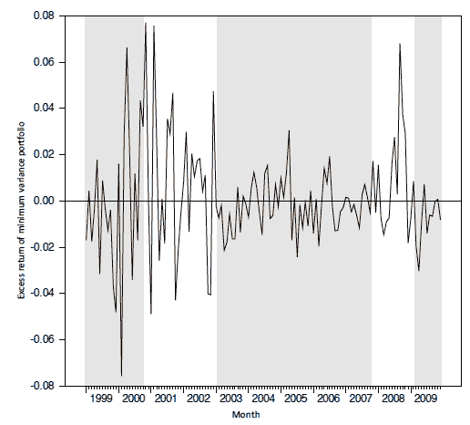

<!--yml
category: 未分类
date: 2024-05-18 13:52:19
-->

# Portfolio Theory is Dead, Now What? | Quantivity

> 来源：[https://quantivity.wordpress.com/2011/04/10/portfolio-theory-is-dead-now-what/#0001-01-01](https://quantivity.wordpress.com/2011/04/10/portfolio-theory-is-dead-now-what/#0001-01-01)

Readers often ask what Quantivity thinks of *long-term* quantitative strategies, and thus corresponding relevance of [modern portfolio theory](http://en.wikipedia.org/wiki/Modern_portfolio_theory) and [asset allocation](http://en.wikipedia.org/wiki/Asset_allocation) (strategic and [tactical](http://en.wikipedia.org/wiki/Tactical_asset_allocation)). In short, Quantivity is *not a fan*.

That said, holistic understanding of *how* and *why* these theories are wrong is insightful and relevant for both short- and long-term quantitative strategies. This perspective is informed by standard institutional and retail portfolio management as exemplified by [Grinold and Kahn](http://books.google.com/books?id=a1yB8LTQnOEC) and [Faber](http://www.theivyportfolio.com/), along with academic background in both economics and finance.

Despite intellectual tradition, the mountain of contrary evidence is simply too overwhelming:

*   Decades of counterexamples to [CAPM](http://en.wikipedia.org/wiki/Capital_asset_pricing_model)
*   Increasing cross-asset correlations worldwide, dramatically reducing [diversification](http://en.wikipedia.org/wiki/Diversification_%28finance%29) efficacy
*   Two market bubbles, amply validating [behavioral finance](http://en.wikipedia.org/wiki/Behavioral_economics) to those working in tech and finance
*   Quantification across many marketplaces, rapidly accelerating since 2007
*   Rise of “volatility” as a proposed asset class, going back to [Derman](http://www.ederman.com/new/docs/gaim-trading_volatility.pdf) in 2003

Even Kahn was moved to comment last year in [Quantitative Equity Investing: Out of Style?](https://www2.blackrock.com/webcore/litService/search/getDocument.seam?ContentID=1111105185)

All these speak to arguably the fundamental conjecture of financial economics: accepting incremental “risk” demands compensation by commensurately higher return. Or, in jargon: the [risk premium](http://en.wikipedia.org/wiki/Risk_premium) is non-negative and increasing. This conjecture underlies justification for mean-variance optimization, diversification, benchmarking, index investing, and thus much of modern retail investing.

Yet, *evidence strongly indicates this conjecture is false*.

Given that, the pertinent question is what are the *relevant practical implications* for quantitative strategies due to falsity of this conjecture. Several aspects to consider, depending upon your horizon:

*   Long-term: [portfolio optimization](http://en.wikipedia.org/wiki/Portfolio_optimization), bubbles, envy utility functions, and lottery stocks
*   Short-term: volatility bias, variance minimization, symmetric loss, and regime indicators

Follow-on posts will expand upon these considerations, beginning with minimum variance portfolios (MVPs).

To motivate this topic, both [Falkenblog](http://falkenblog.blogspot.com/) and [Estimation Risk](http://estimationrisk.blogspot.com/) are outspoken advocates from the blogosphere. On the institutional side, [Clarke](https://www.aninvestor.com/analytic-people/index.aspx#8) and [de Silva](https://www.aninvestor.com/analytic-people/index.aspx#8) from [Analytic Investors](https://www.aninvestor.com) and Pim van Vliet from [Robeco](http://www.robeco.com/) are actively publishing. MSCI Barra is offering indices on [global minimum volatility](http://www.msci.com/products/indices/stategy/minimum_volatility/).

This topic also speaks to the ongoing Quantivity theme of [market regimes](https://quantivity.wordpress.com/2009/12/31/market-regime-trading-redux/), as exemplified by [Scherer](http://papers.ssrn.com/sol3/papers.cfm?abstract_id=1681306) (2010, p. 6):

> Evidence for the existence of two equity market regimes. Both are normally distributed on their own, but non-normal in combination. Sharpe ratios for this period are close to zero because of the negative impact of the credit crisis on both time series.

If indeed true, then *past* performance of MVPs hold interesting potential as an *ex-ante* market *regime indicator*. Again, from [Scherer](http://papers.ssrn.com/sol3/papers.cfm?abstract_id=1681306) (2010, p. 5):

The following articles are worth consideration by readers interested in the refuting literature, which recently converged onto minimum variance as a guiding principle for portfolio composition preferential to [Markowitz](http://en.wikipedia.org/wiki/Harry_Markowitz)-derived models:

*   [The Efficient Market Inefficiency of Capitalization–Weighted Stock Portfolios](http://www.iijournals.com/doi/abs/10.3905/jpm.1991.409335), by Haugen and Baker (1991)
*   [Mutual Funds, Idiosyncratic Variance, and Asset Returns](http://www.efalken.com/papers/EF%20Dissertation.pdf), by Falkenstein (1994)
*   [Asymmetric Volatility and Risk in Equity Markets](http://ideas.repec.org/p/nbr/nberwo/6022.html), by Bekaert and Wu (1997)
*   [On Portfolio Optimization: Forecasting Covariances and Choosing the Risk Model](http://bear.warrington.ufl.edu/karceski/research%20papers/rfs%20winter%201999.pdf), by Karceski *et al.* (1999)
*   [Risk Reduction in Large Portfolios: Why Imposing the Wrong Constraints Helps](http://papers.ssrn.com/sol3/papers.cfm?abstract_id=424756), by Jagannathan and Ma (2002)
*   [The Cross-Section of Volatility and Expected Returns](http://www.afajof.org/afa/forthcoming/ang1.pdf), by Ang *et al.* (2004)
*   [Minimum-Variance Portfolios in the U.S. Equity Market](http://www.iijournals.com/doi/abs/10.3905/jpm.2006.661366), by Clarke, De Silva, and Thorley (2006)
*   [The Cross-Section of Volatility and Expected Returns](http://www0.gsb.columbia.edu/faculty/rhodrick/crosssection.pdf), by Ang *et al.* (2006)
*   [Aggregate Idiosyncratic Risk and Market Returns](http://papers.ssrn.com/sol3/papers.cfm?abstract_id=947873), by Bali and Cakici (2006)
*   [Estimating the Global Minimum Variance Portfolio](http://papers.ssrn.com/sol3/papers.cfm?abstract_id=940367), by Memmel and Kempf (2006)
*   [The Volatility Effect: Lower Risk Without Lower Return](https://www.robeco.com/com/eng/images/blitz-vliet_jpm_robeco_2007_tcm633-252202.pdf), by Blitz and van Vliet (2007)
*   [Risk and Return in General: Theory and Evidence](http://papers.ssrn.com/sol3/papers.cfm?abstract_id=1420356), by Falkenstein (2010)
*   [Optimal versus Naive Diversification: How Inefficient is the 1/N Portfolio Strategy](http://faculty.london.edu/avmiguel/DeMiguel-Garlappi-Uppal-RFS.pdf), by DeMiguel *et al* (2009)
*   [Portfolio Selection with Robust Estimation](http://www.est.uc3m.es/fjnm/esp/papers/RobustPortfolios.pdf), by DeMiguel and Nogales (2009)
*   [A Generalized Approach to Portfolio Optimization: Improving Performance By Constraining Portfolio Norms](http://www.est.uc3m.es/fjnm/esp/papers/DGNU.pdf), by DeMiguel *et al.* (2009)
*   [The Pricing of Volatility and Skewness: A New Interpretation](http://www.iijournals.com/doi/abs/10.3905/JOI.2009.18.3.027), by Bradford (2009)
*   [The Properties of Equally Weighted Risk Contribution Portfolios](http://www.iijournals.com/doi/abs/10.3905/jpm.2010.36.4.060), by Maillard, Roncalli , and Teïletche (2010)
*   [Minimum Variance Portfolio Composition](http://papers.ssrn.com/sol3/papers.cfm?abstract_id=1549949), by Clarke, De Silva, and Thorley (2010)
*   [A New Look at Minimum Variance Investing](http://papers.ssrn.com/sol3/papers.cfm?abstract_id=1681306), by Scherer (2010)
*   [Stock Return Serial Dependence and Out-of-Sample Portfolio Performance](http://papers.ssrn.com/sol3/papers.cfm?abstract_id=1572526), by DeMiguel *et al* (2010)
*   [Betting Against Beta](http://www.utahwfc.org/2011_papers/betting.pdf), by Frazzini and Pedersen (2010)
*   [Variations on Minimum Variance](http://qwafafew.org/images/uploads/2011-03-16-ny-Falk.ppt), by Falk (2011)
*   [Expected Idiosyncratic Skewness](http://papers.ssrn.com/sol3/papers.cfm?abstract_id=1541002) , by Boyer, Mitton, and Vorkink
*   [The Puzzling Relationship Between Risk and Return](http://qwafafew.org/images/uploads/2011-03-16-ny-Luo.pdf), by Luo *et al.* (2011)
*   Minimum Variance: Exposing the “Magic”, by Alvarez *et al.* (2011)
*   [Improving Portfolio Selection Using Option-Implied Volatility and Skewness](http://papers.ssrn.com/sol3/papers.cfm?abstract_id=1474212), by DeMiguel *et al.* (2011)
*   [Benchmarks as Limits to Arbitrage: Understanding the Low-Volatility Anomaly](http://people.hbs.edu/mbaker/cv/papers/Benchmarks_as_Limits_unpub_01_14_10_faj.v67.n1.4.pdf), by Baker (2011)